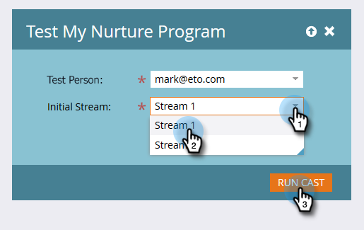

# エンゲージメントストリームのテスト {#test-an-engagement-stream}

すべてのコンテンツをストリームに追加したら、一度に1つずつテストできます。

>[!NOTE]
>
>**FYI**
>
>Marketoは現在、すべての購読で言語を標準化しているので、購読およびdocs.marketo.comの人物/人物にリード/リードを表示できます。 これらの用語は同じことを意味し、記事の説明には影響しません。 他にも変化がある。 [詳細情報](http://docs.marketo.com/display/DOCS/Updates+to+Marketo+Terminology)。

1. 「 **マーケティングアクティビティ**」に移動します。

   

1. アクションプログラムを選択します。

   

1. 「**プログラムアクション**」をクリックし、「 **テストストリーム**」を選択します。

   

1. 「**テスト担当者**」ドロップダウンから人物を選択します。 コンテンツは実際には外に出るので、選択の際はその点に注意してください。

   

   >[!CAUTION]
   >
   >テスト担当者が一意で、データベースに重複が含まれていないことを確認します。

   >[!TIP]
   >
   >探しているテスト担当者が存在しない場合は、「人物を **作成** 」オプションを使用して、その場で作成します。

   「初期ストリーム」をクリックし、テストするストリームを選択し、「キャストを実行」をクリックします。
   

1. ユーザーが以前に設定した [トランジションルールを実行したら](transition-people-between-engagement-streams.md) 、更新アイコンをクリックします。

   

1. 新しいストリームが表示され、テストが成功したことを示します。

   

   お疲れさまでした！

   >[!NOTE]
   >
   >「**キャストを実行**」を再度クリックしない限り、他のコンテンツは送信されません。

