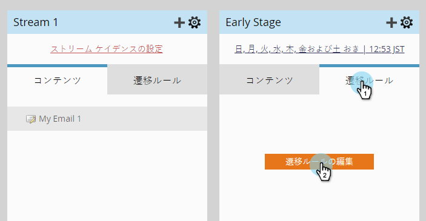
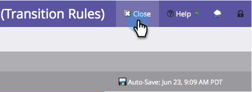

# エンゲージメントストリーム間のトランジションユーザー{#transition-people-between-engagement-streams}

エンゲージメントプログラムは複数のストリームを持つことができます。 [ストリーム](/help/marketo/product-docs/email-marketing/drip-nurturing/creating-an-engagement-program/add-a-stream.md)を追加する場合は、人々があるストリームから別のストリームに移動する方法を定義する必要があります。 これらは&#x200B;**トランジション規則と呼ばれます。**

1. **マーケティングアクティビティ**&#x200B;に移動します。

   

1. マルチストリームエンゲージメントプログラムを選択し、**Streams**&#x200B;に移動します。

   

1. 他のストリームから取り込むストリームの&#x200B;**トランジションルール**&#x200B;をクリックし、**トランジションルールの編集**&#x200B;をクリックします。

   

   >[!NOTE]
   >
   >トランジションルールはストリームに引き込まれ、取り込むストリームに対して、常にルールを定義します。

   トランジションルールウィンドウが開いたら、選択したトリガー内で探してドラッグします。 この場合、オポチュニティに追加されたユーザーを中段階に移行させます。

   

1. 演算子を&#x200B;**はany**&#x200B;に設定し、追加されたオポチュニティに人々が移動できるようにします。

   

   >[!TIP]
   >
   >1つのトランジションルールに複数のトリガーとフィルターを追加できますが、トランジションルールではすべてのフィルターが使用されます(「すべてのフィルターを使用する」のみ)。 トランジションルールでORを使用する必要がある場合は、代わりに外部のスマートキャンペーンを設定することをお勧めします。

1. 「**閉じる**」をクリックします。

   

   素晴らしい！ これで、エンゲージメントプログラム内でオポチュニティに追加されたすべてのユーザーが、中間ステージストリームに移動されます。

   

   >[!NOTE]
   >
   >*do*&#x200B;に示した手順は、pause](/help/marketo/product-docs/email-marketing/drip-nurturing/using-engagement-programs/pause-people-in-an-engagement-program.md)の[にある人にも当てはまります。
