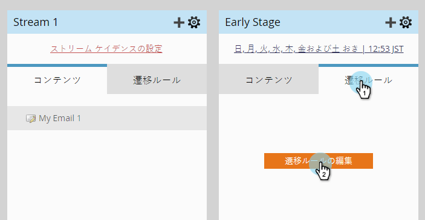
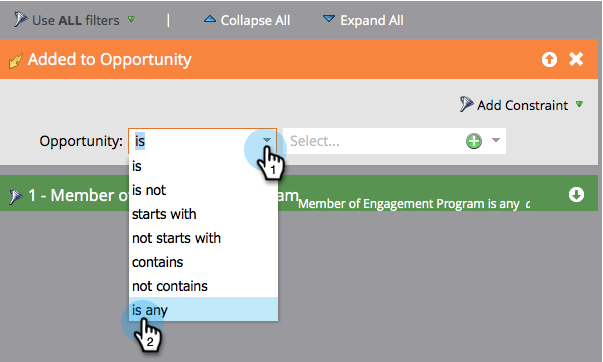

# エンゲージメントストリーム間でリードを遷移させる {#transition-people-between-engagement-streams}

エンゲージメントプログラムでは、複数のストリームを使用できます。 [ ストリームを追加](/help/marketo/product-docs/email-marketing/drip-nurturing/creating-an-engagement-program/add-a-stream.md)する場合は、ユーザーがストリームから別のストリームに移動する方法を定義します。 この定義を&#x200B;**遷移ルール**&#x200B;と呼びます。

1. **[!UICONTROL マーケティングアクティビティ]**&#x200B;に移動します。

   

1. ストリームが複数あるエンゲージメントプログラムを選択し、「**[!UICONTROL ストリーム]**」タブに移動します。

   

1. 他のストリームから取り込むストリームの「**[!UICONTROL 遷移ルール]**」をクリックし、「**[!UICONTROL 遷移ルールの編集]**」をクリックします。

   

   >[!NOTE]
   >
   >遷移ルールに従って、リードがこのストリームに移ります。必ず、遷移先のストリームでルールを定義します。

   遷移ルールウィンドウが開いたら、選択したトリガーを探してドラッグします。 この例では、人物は商談に追加されると[!UICONTROL  ミッドステージ ]に移動されます。

   

1. 演算子を&#x200B;**[!UICONTROL is any]**&#x200B;に設定して、追加された商談に対してユーザーが移動できるようにします。

   

   >[!TIP]
   >
   >1 つの遷移ルールに複数のトリガーやフィルターを用いることはできますが、その遷移ルールではすべてのフィルターを使用します（すべてのフィルターを使用するのが、唯一のオプションです）。 トランジションルールでORを使用する必要がある場合は、代わりに外部スマートキャンペーンを設定することをお勧めします。

1. 「**[!UICONTROL 閉じる]**」をクリックします。

   

   これで、エンゲージメントプログラムのリードが商談に追加された場合、その人物は[!UICONTROL 中間ステージ]ストリームに遷移します。

   

   >[!NOTE]
   >
   >上記の手順は、[一時停止](/help/marketo/product-docs/email-marketing/drip-nurturing/using-engagement-programs/pause-people-in-an-engagement-program.md)中の人物にも適用&#x200B;*されます*。
