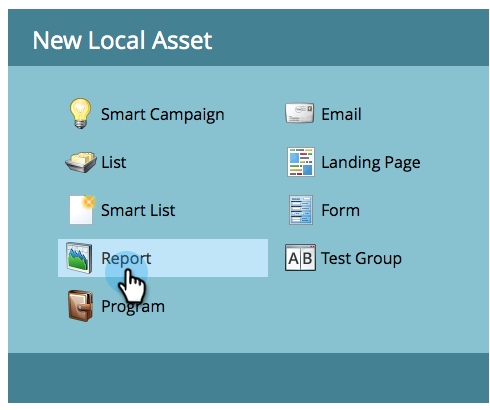
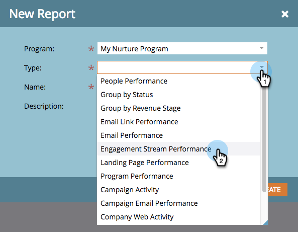
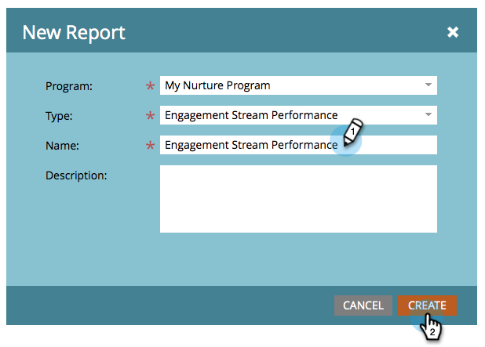
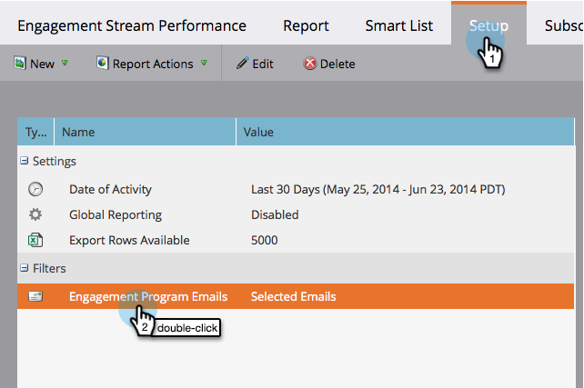
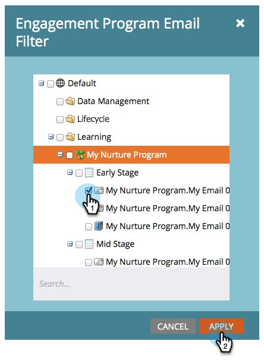

# エンゲージメントストリームパフォーマンスレポート {#engagement-stream-performance-report}

エンゲージメントコンテンツの効果を知りたい場合は、 エンゲージメントストリームパフォーマンスレポートをお試しください。

## レポートの作成 {#create-the-report}

1. エンゲージメントプログラムを検索して選択し、「**[!UICONTROL 新規]**」の下で「**[!UICONTROL 新規ローカルアセット]**」をクリックします。

   

1. 「**[!UICONTROL レポート]**」を選択します。

   

   >[!TIP]
   >
   >プログラムの下にレポートを作成すると、そのレポートはプログラムの内容に自動的に制限されます。

   レポート&#x200B;**[!UICONTROL タイプ]**&#x200B;として「**[!UICONTROL エンゲージメントストリームのパフォーマンス]**」を選択します。
   

1. レポートに名前を付け、「**[!UICONTROL 作成]**」をクリックします。

   

   次に、設定を設定します。

## 設定の編集 {#edit-settings}

1. レポートを選択します。

   

1. 「**[!UICONTROL 設定]**」タブで、**[!UICONTROL エンゲージメントプログラムメール]**&#x200B;フィルターをダブルクリックします。

   

1. レポート対象のメールを選択し、「**[!UICONTROL 適用]**」をクリックします。

   

## レポートを実行する {#run-report}

1. レポートを実行するには、「**[!UICONTROL レポート]**」タブをクリックします。

   

   >[!TIP]
   >
   >図には示されていませんが、エンゲージメントスコアはこのレポートの列です。 詳しくは、[エンゲージメントスコアについて](/help/marketo/product-docs/email-marketing/drip-nurturing/reports-and-notifications/understanding-the-engagement-score.md)を参照してください。

   レポートは、エンゲージメントプログラム別にグループ化されています。
