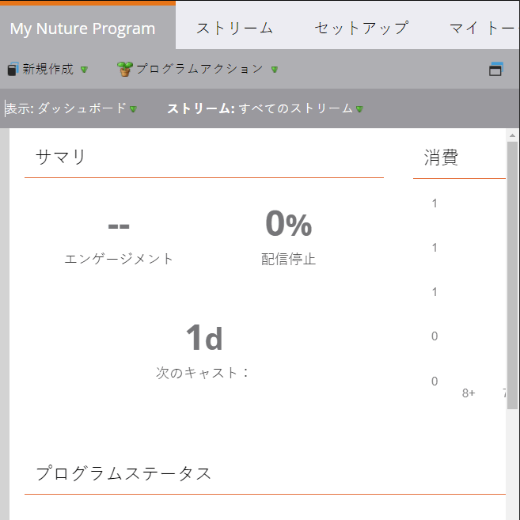
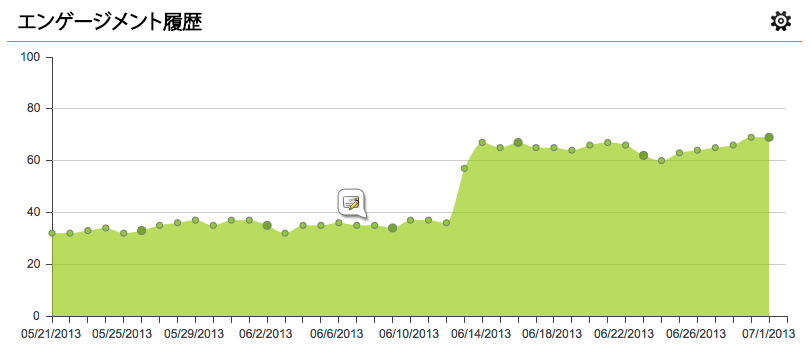
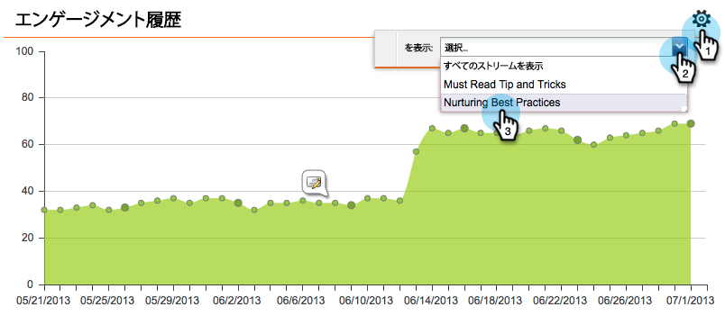
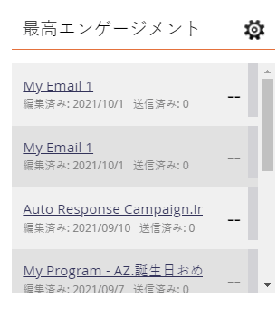
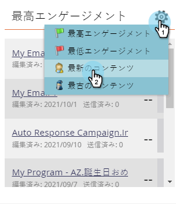

# エンゲージメントダッシュボード {#the-engagement-dashboard}

エンゲージメントダッシュボードを使用すると、エンゲージメントプログラムのコンテンツの効果を簡単に確認できます。

>[!NOTE]
>
>エンゲージメントスコアには、最近 3 回のキャストのデータが含まれます。 新しいキャストは、各キャストの 72 時間後に計算されます。 詳しくは、 [エンゲージメントスコア](/help/marketo/product-docs/email-marketing/drip-nurturing/reports-and-notifications/understanding-the-engagement-score.md).

## エンゲージメントダッシュボードの表示 {#view-the-engagement-dashboard}

エンゲージメントプログラムを選択し、 **表示** > **ダッシュボード**.

>[!TIP]
>
>以下を確認します。 [エンゲージメントストリームパフォーマンスレポート](/help/marketo/product-docs/email-marketing/drip-nurturing/reports-and-notifications/engagement-stream-performance-report.md) 詳細な統計を参照してください。

## 消費ウィジェットについて {#understand-the-exhaustion-widget}

このウィジェットは、リードがすべてのコンテンツを消費したタイミングを予測するのに役立ちます。 消費スコアは、各キャストの直後に計算されます。 次の例は、1 キャストで、195 名のリードがすべてのコンテンツを消費したことを示しています。

>[!NOTE]
>
>「設定」タブを開き、「消費済みコンテンツ通知」が **オン** をクリックして、上のグラフを表示します。 オフの場合、グラフは異なるように見えます。

>[!CAUTION]
>
>「消費済み」の担当者は、次のキャストでは何の通信も受信しません。

## エンゲージメントウィジェットの理解 {#understand-the-engagement-over-time-widget}

平均エンゲージメントスコアの推移と、コンテンツ編集の影響を示します。

>[!AVAILABILITY]
>
>この機能は、Marketoの収益サイクルエクスプローラを利用するお客様向けのアドオンとして利用できます。 詳しくは、カスタマーサクセスマネージャーにお問い合わせください。

平均ではなくコンテンツの 1 つの部分を表示するには、歯車アイコンをクリックして、コンテンツの一部を選択します。

## 最も高いエンゲージメントウィジェットについて {#understand-the-highest-engagement-widget}

最も高いエンゲージメントスコアで並べられた、すべてのコンテンツのリスト。

並べ替えを変更するには、歯車アイコンをクリックして、並べ替え順を選択します。

_新しい_ および _最も古い_ は、最後の承認の時間に基づきます。

>[!NOTE]
>
>詳しくは、 [エンゲージメントプログラムの作成](/help/marketo/product-docs/email-marketing/drip-nurturing/creating-an-engagement-program/create-an-engagement-program.md) 深く潜る。
