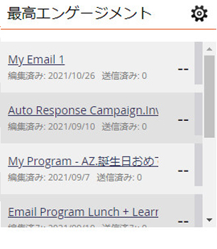

# エンゲージメントスコアについて {#understanding-the-engagement-score}

エンゲージメントスコアを使用すると、エンゲージメントプログラムのコンテンツの効果を簡単に確認できます。 スコアの範囲は 0 ～ 100 です。 チェックアウト [エンゲージメントダッシュボード](/help/marketo/product-docs/email-marketing/drip-nurturing/reports-and-notifications/the-engagement-dashboard.md) を参照して、コンテンツのパフォーマンスを追跡する方法を確認してください。

スコアは、エンゲージ済みの行動（開く、クリック、プログラムの成功）とアンゲージ済みの行動（購読解除）を考慮に入れる独自のアルゴリズムに基づいています。 点滴と育成のスタイルのメールに対してベンチマークを行い、平均 50 を達成しました。 訪問者にコンテンツに関与する機会を与えるために、エンゲージメントスコアは各キャストの 72 時間後に計算されます。 また、スコアはからのデータのみをカバーします。 **最後の 3 人** キャスト。

>[!NOTE]
>
>プログラムをストリーム内のコンテンツとして使用する場合、エンゲージメントスコアはプログラムのメンバーシップと成功ステータスに基づきます。 **not** e メールインタラクション（クリック、開封、購読解除）。

エンゲージメントスコアは、すべての顧客に共通です。 これらを比較して、誰が最も魅力的なコンテンツを持っているかを確認できます。

>[!NOTE]
>
>独自のアルゴリズムは、E メールプログラムのエンゲージメントスコアにも適用されます。

>[!MORELIKETHIS]
>
>[エンゲージメントプログラムについて](/help/marketo/product-docs/email-marketing/drip-nurturing/creating-an-engagement-program/understanding-engagement-programs.md)
