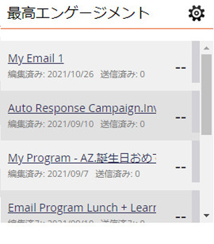

# エンゲージメントスコアについて {#understanding-the-engagement-score}

エンゲージメントスコアを使用すると、エンゲージメントプログラムのコンテンツの効果を簡単に確認できます。 スコアの範囲は 0 ～ 100 です。 [エンゲージメントダッシュボード](/help/marketo/product-docs/email-marketing/drip-nurturing/reports-and-notifications/the-engagement-dashboard.md)を参照して、コンテンツの効果を追跡する方法を確認してください。

スコアは、関与した行動（[!UICONTROL 開封]、[!UICONTROL クリック]、[!UICONTROL プログラムの成功]）と離脱した行動（[!UICONTROL 登録解除]）を考慮した独自のアルゴリズムに基づいています。 ドリップメールやナーチャリングスタイルのメールに対してベンチマークテストを実施し、平均50通のインサイトを獲得できます。 訪問者にコンテンツに関与する機会を与えるために、エンゲージメントスコアは各キャストの 72 時間後に計算されます。 また、スコアは&#x200B;**最後の 3**&#x200B;キャストからのデータのみをカバーします。

>[!NOTE]
>
>プログラムをストリーム内のコンテンツとして使用する場合、エンゲージメントスコアはプログラムのメンバーシップと成功ステータスに基づき、メールインタラクション（クリック、開封、登録解除）には基づき&#x200B;**ません**。

エンゲージメントスコアは、すべての顧客に共通です。 これらを比較して、誰が最も魅力的なコンテンツを持っているかを確認できます。

>[!NOTE]
>
>独自のアルゴリズムは、メールプログラムのエンゲージメントスコアにも適用されます。

>[!MORELIKETHIS]
>
>[エンゲージメントプログラムについて](/help/marketo/product-docs/email-marketing/drip-nurturing/creating-an-engagement-program/understanding-engagement-programs.md)
