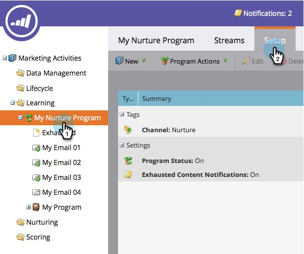

# 使い果たしたコンテンツ通知の無効化と有効化 {#disable-and-enable-exhausted-content-notifications}

ユーザーがストリーム内のすべてのコンテンツを排出すると、Marketorは通知を送信できます。 必要に応じて、通知を無効または有効にすることができます。 これが方法です。

1. 「 **マーケティングアクティビティ**」に移動します。

   

1. エンゲージメントプログラムを選択し、「 **設定** 」タブをクリックします。

   

1. 重複を押しながら **クリックすると、「使い果たされたコンテンツ通知**」が表示されます。

   

1. 「**オフ**」(または「 **オン**」 **)を選択し、「**&#x200B;保存」をクリックします。

   

   超！ 通知を有効にすると、ストリーム自体に何かが表示され、電子メール通知を受け取ります。

