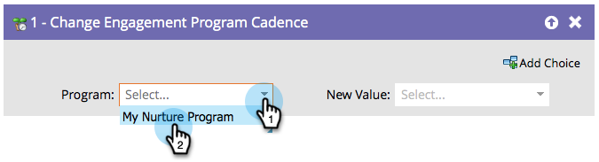

# エンゲージメントプログラム内の人物の一時停止 {#pause-people-in-an-engagement-program}

エンゲージメントプログラムのメンバーであるリードは、[すべてのコンテンツを消費する](people-who-have-exhausted-content.md)までコンテンツを受信します。 [[!UICONTROL エンゲージメントプログラムケイデンスを変更]](/help/marketo/product-docs/core-marketo-concepts/smart-campaigns/program-flow-actions/change-engagement-program-cadence.md)フローステップを使用すると、まだすべてのコンテンツを消費していないリードに対してもコンテンツを受信しないようにできます。

1. エンゲージメントプログラムを選択します。

   

1. リードがコンテンツを受信しないように、「**[!UICONTROL 新しい値]**」で「**[!UICONTROL 一時停止]**」を選択します。

   

   リードへのコンテンツ配信を再開する場合は、「**[!UICONTROL 標準]**」に戻します。 再開されるのは一時停止したところからになります。

   >[!NOTE]
   >
   >一時停止されたリードはコンテンツを受信できなくなりますが、条件を満たす場合、ストリーム間のトランジションはおこなわれます。
