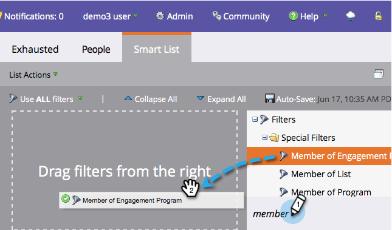
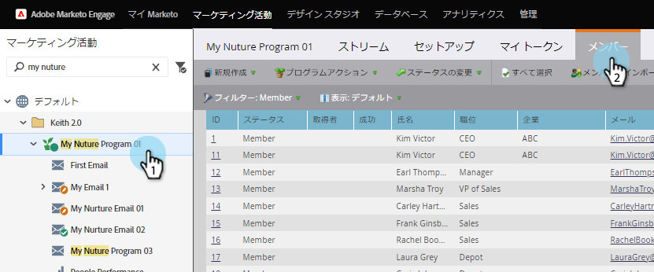

# コンテンツを使い切った人物 {#people-who-have-exhausted-content}

人物がストリーム内のすべてのコンテンツを受信すると、そのストリームで配信できるコンテンツをすべて使い切った状態となり、新しいコンテンツが追加されるまで待機状態になります。 この「消費済み」のリードを見つける方法はいくつかあります。

## エンゲージメントプログラムのメンバーフィルター {#member-of-engagement-program-filter}

1. 新しいスマートリストを作成し、「**[!UICONTROL エンゲージメントプログラムメンバー]**」フィルターをドラッグします。

   

1. コンテンツ消費済みのリードを探すエンゲージメントプログラムを選択します。

   

1. 「**[!UICONTROL 制約を追加]**」から「**[!UICONTROL コンテンツ消費済み]**」を選択します。

   

1. 「**[!UICONTROL コンテンツ消費済み]**」を「**[!UICONTROL true]**」に設定します。

   

   このスマートリストを実行するだけで、所属しているストリーム内のコンテンツをすべて使い切った人物のリストが表示されます。

## 「メンバー」タブ {#members-tab}

1. **[!UICONTROL マーケティングアクティビティ]**&#x200B;に移動します。

   

1. エンゲージメントプログラムを選択し、「**[!UICONTROL メンバー]**」タブに移動します。

   

1. 「**[!UICONTROL コンテンツ消費済み]**」という列を確認します。

   

   この列には、すべてのコンテンツを使い切った人物と、まだ使い切っていない人物の両方が表示されます。

## ストリーム {#stream}

1. ストリーム自体の「[!UICONTROL ストリーム]」タブでも、コンテンツを消費済みであるリードの合計数を確認できます。

   

   >[!NOTE]
   >
   >この数字は、各キャストの実行後すぐに更新されます。
