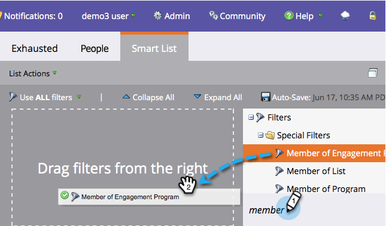

# コンテンツを使い果たした人{#people-who-have-exhausted-content}

ある人が1つのストリーム内のすべてのコンテンツを受け取った場合、その人はあらゆる可能性を使い果たし、さらに追加されるまで待ちます。 「疲れ果てた」人を見つける方法はいくつかあります。

## エンゲージメントプログラムのメンバーフィルタ{#member-of-engagement-program-filter}

1. 新しいスマートリストを作成し、**エンゲージメントプログラムのメンバー**&#x200B;フィルターを探してドラッグします。

   

1. 使い果たされたユーザーを検索するエンゲージメントプログラムを検索して選択します。

   

1. 「**追加制約**」で、「**使い果たされたコンテンツ**」を選択します。

   

1. **使い果たされたコンテンツ**&#x200B;を&#x200B;**true**&#x200B;に設定します。

   

   このスマートリストを実行すると、そのストリーム内のすべてのコンテンツを使い果たした人のリストを確認できます。

## [メンバ]タブ{#members-tab}

1. **マーケティングアクティビティ**&#x200B;に移動します。

   

1. エンゲージメントプログラムを選択し、「**メンバー**」タブに移動します。

   

1. 「**使い果たされたコンテンツ**」という列に注目してください。

   

   これにより、すべてのコンテンツを使い果たした訪問者と使用しなかった訪問者が表示されます。

## ストリーム{#stream}

1. また、ストリーム自体の「Streams」タブに、コンテンツを使い果たした人の合計も表示されます。

   

   >[!NOTE]
   >
   >この数値は、キャストのたびにすぐに更新されます。

