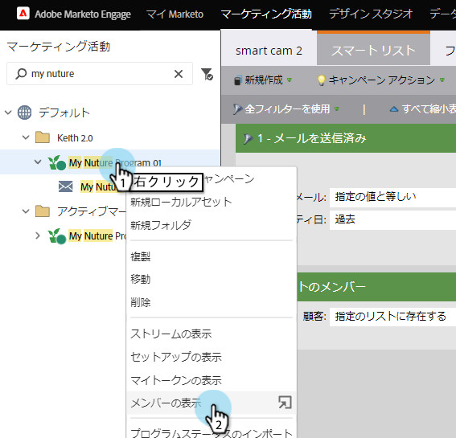

# 「エンゲージメントプログラムのメンバー」を参照 {#see-members-of-an-engagement-program}

エンゲージメントプログラムのメンバーをすばやく表示できます。 これが方法です。

1. エンゲージメントプログラムで右クリックし、「 **表示メンバー」を選択します。**

   

   >[!NOTE]
   >
   >「 [使い果たされたコンテンツ](../../../../product-docs/email-marketing/drip-nurturing/creating-an-engagement-program/understanding-engagement-programs.md) 」列の値は、キャストのたびに更新されます。

1. これで、プログラムのすべてのメンバーを表示できます。

   

