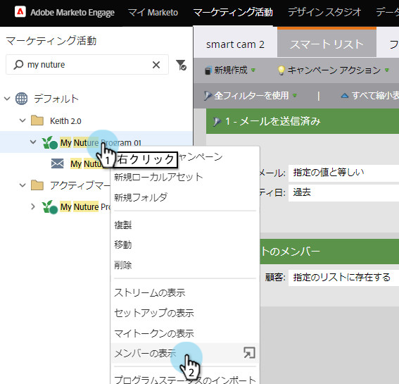

# エンゲージメントプログラムのメンバーの参照 {#see-members-of-an-engagement-program}

エンゲージメントプログラムのメンバーをすばやく確認できます。 手順は以下のとおりです。

1. エンゲージメントプログラムから右クリックし、「**[!UICONTROL メンバーを表示]**」を選択します。

   

   >[!NOTE]
   >
   >この[消費済みコンテンツ](/help/marketo/product-docs/email-marketing/drip-nurturing/creating-an-engagement-program/understanding-engagement-programs.md)列の値は、キャストのたびにアップデートされます。

1. これで、プログラムのすべてのメンバーが表示されます。

   
