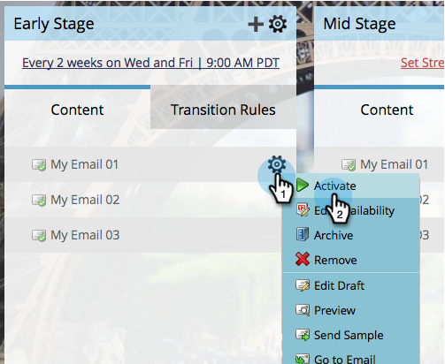

# ストリームコンテンツのアクティベートとディアクティベート {#activate-and-deactivate-stream-content}

デフォルトでは、ストリームコンテンツはオフになっています。 コンテンツをアクティベートして、エンゲージメントキャスト中に送信します。

## ストリームコンテンツをアクティベートする {#activate-stream-content}

1. **[!UICONTROL マーケティングアクティビティ]**&#x200B;に移動します。

   

1. エンゲージメントプログラムを選択して、「**[!UICONTROL ストリーム]**」タブをクリックします。

   

1. アクティブにするコンテンツにマウスポインターを置き、歯車アイコンをクリックして、「**[!UICONTROL アクティベート]**」をクリックします。

   >[!NOTE]
   >
   >アクティブにするには、メールを承認する必要があります。

   

   >[!TIP]
   >
   >また、最上位レベルの歯車アイコンをクリックし、次に「**[!UICONTROL すべてのコンテンツをアクティベートする]**」をクリックします。

## ストリームコンテンツのディアクティベート {#deactivate-stream-content}

1. エンゲージメントプログラムを選択して、「**[!UICONTROL ストリーム]**」タブをクリックします。

   

1. ディアクティベートするコンテンツの上にマウスポインターを置いて、歯車アイコンをクリックし、「**[!UICONTROL ディアクティベート]**」をクリックします。

   
