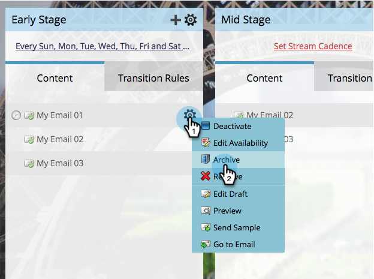

# ストリームコンテンツのアーカイブとアーカイブ解除 {#archive-and-unarchive-stream-content}

ストリーム内のコンテンツの一部を使用しなくなった場合は、[削除](/help/marketo/product-docs/email-marketing/drip-nurturing/using-stream-content/remove-stream-content.md)またはアーカイブできます。 コンテンツをアーカイブする方法は次のとおりです。

>[!TIP]
>
>関連するすべての履歴は削除によって破棄されますが、アーカイブした場合は保持されます。

## ストリームコンテンツをアーカイブする {#archive-stream-content}

1. エンゲージメントプログラムを選択し、「**[!UICONTROL ストリーム]**」タブに移動します。

   

1. アーカイブするメールにポインタを合わせて、歯車アイコンの下で「**[!UICONTROL アーカイブ]**」をクリックします。

   

   履歴を保存する場合は、アーカイブを作成します。

## ストリームコンテンツのアーカイブ解除 {#unarchive-stream-content}

1. エンゲージメントプログラムを選択し、「**[!UICONTROL ストリーム]**」タブに移動します。

   

1. ストリームの歯車アイコンをクリックし、「**[!UICONTROL アーカイブ済みコンテンツを表示]**」をクリックします。

   

1. アーカイブされたコンテンツが表示されます。アーカイブを解除するコンテンツの歯車アイコンをクリックし、「**[!UICONTROL アーカイブ解除]**」をクリックします。

   

   これで、このコンテンツを優先順位付けし、アクティブ化できます。
