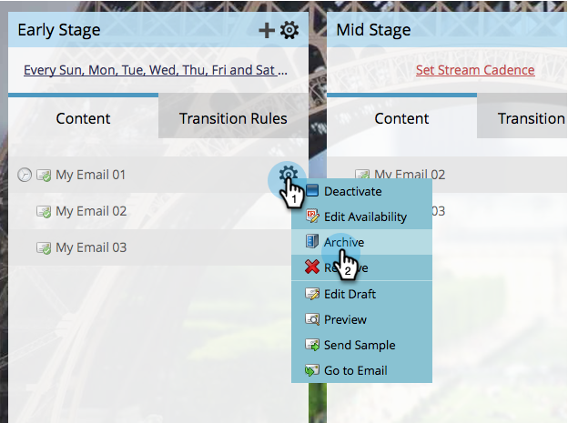

# ストリームコンテンツのアーカイブとアーカイブ解除{#archive-and-unarchive-stream-content}

ストリーム内のコンテンツの一部を使用したくない場合は、[削除](/help/marketo/product-docs/email-marketing/drip-nurturing/using-stream-content/remove-stream-content.md)するか、アーカイブします。 コンテンツをアーカイブする方法を次に示します。

>[!TIP]
>
>削除すると、関連付けられたすべての履歴が破棄され、アーカイブすると、保持されます。

## ストリームコンテンツをアーカイブ{#archive-stream-content}

1. エンゲージメントプログラムを選択し、「**Streams**」タブに移動します。

   

1. アーカイブする電子メールの上にカーソルを置き、歯車アイコンの下の「**アーカイブ**」をクリックします。

   

   それだ！ 履歴を保存したい場合は、アーカイブを忘れないでください。

## ストリームコンテンツのアーカイブ解除{#unarchive-stream-content}

1. エンゲージメントプログラムを選択し、「**Streams**」タブに移動します。

   

1. ストリームの歯車アイコンをクリックし、「**アーカイブされたコンテンツを表示**」をクリックします。

   

1. アーカイブ済みのコンテンツが表示されたら、アーカイブを解除するコンテンツの歯車アイコンをクリックし、**アーカイブを解除**&#x200B;をクリックします。

   

   完璧！ このコンテンツを優先付けし、アクティブにすることができます。
