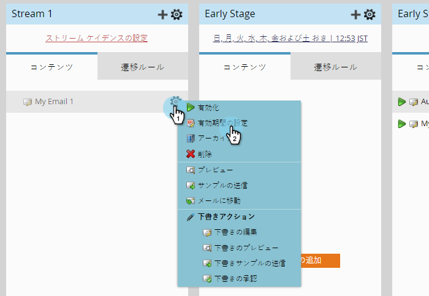

# ストリームコンテンツの可用性の編集{#edit-availability-of-stream-content}

ストリーム内でコンテンツをアクティブにする時間枠を設定できます。 これが方法です。

1. エンゲージメントプログラムを選択し、「**Streams**」タブに移動します。

   

1. スケジュールするコンテンツの歯車アイコンをクリックし、「**可用性を編集**」を選択します。

   

1. **「**&#x200B;アクティブ期間：&lt;a1/>」の日付を選択し、**アクティブ期間：**日付を選択して、「**保存**」をクリックします。

   

   >[!TIP]
   >
   >「**アクティブ —**」を空白のままにして、コンテンツを永久に利用できるようにします。

   完璧！ スケジュールされたコンテンツの横に時計アイコンが表示されます。 設定したスケジュールに従って、アクティブになり非アクティブになります。   

