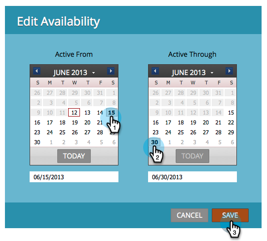

# ストリームコンテンツの可用性の編集 {#edit-availability-of-stream-content}

ストリームで有効化するコンテンツの時間枠を設定できます。手順は以下のとおりです。

1. エンゲージメントプログラムを選択し、「**[!UICONTROL ストリーム]**」タブに移動します。

   

1. スケジュールするコンテンツの歯車アイコンをクリックし、「**[!UICONTROL 可用性を編集]**」を選択します。

   

1. 「**[!UICONTROL 有効開始]**」日、「**[!UICONTROL 有効期間]**」を選択して、「**[!UICONTROL 保存]**」をクリックします。

   

   >[!TIP]
   >
   >「**[!UICONTROL 有効期間]**」を空白にすると、コンテンツが永久に使用可能になります。

   完璧です。スケジュールされたコンテンツの横に時計アイコンが表示されます。このアイコンはアクティブになり、設定したスケジュールに従って非アクティブになります。

   
