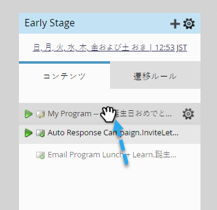

# ストリームコンテンツの優先順位を設定{#prioritize-stream-content}

ストリームにコンテンツを追加した後、優先度を変更できます。 コンテンツは、キャストごとに上から下へ常に配信され、同じ人に2回コンテンツが送信されることはありません。

1. **マーケティングアクティビティ**&#x200B;に移動します。

   

1. エンゲージメントプログラムを選択し、「**Streams**」タブをクリックします。

   

1. 次に、コンテンツを目的の順序にドラッグ&amp;ドロップします。

   

   >[!NOTE]
   >
   >キャスト時に、優先度は常に上から下に読み取られます。

   簡単だ！ これで、ストリームコンテンツの優先順位の決定方法がわかります。
