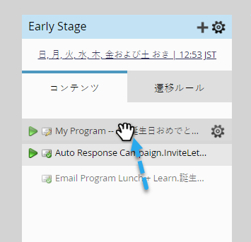

# ストリームコンテンツの優先順位を決める {#prioritize-stream-content}

ストリームにコンテンツを追加した後、優先度を変更できます。コンテンツは、常に各キャストで上から下へ配信され、同じリードに 2 回はコンテンツが送信されません。

1. **[!UICONTROL マーケティングアクティビティ]**&#x200B;に移動します。

   

1. エンゲージメントプログラムを選択して、「**[!UICONTROL ストリーム]**」タブをクリックします。

   

1. 次に、コンテンツを目的の順序にドラッグ&amp;ドロップします。

   

   >[!NOTE]
   >
   >優先度は、キャスト時に常に上から下へ読み取られます。

   簡単ですね。これで、ストリームコンテンツを優先順位付けする方法がわかりました。
