# Experience Manager アセットの操作 {#work-with-experience-manager-assets}

Adobe Experience Manager Assets を使用して、マーケティングとクリエイティブのワークフローを統合します。 Marketo Engageとネイティブに統合されているため、_Assets as a Cloud Service_&#x200B;に簡単にアクセスして、デジタルアセットを検索して使用し、メッセージに入力できます。

Adobe Experience Manager _Assets as a Cloud Service_&#x200B;は、効率的なデジタルアセット管理とDynamic Mediaの運用のための使いやすいクラウドソリューションを提供します。 詳しくは、[Adobe Experience Manager as a Cloud Service](https://experienceleague.adobe.com/ja/docs/experience-manager-cloud-service/content/assets/overview) ドキュメントを参照してください。

>[!PREREQUISITES]
>
>* 統合には、_Assets as a Cloud Service_&#x200B;およびDynamic Mediaのライセンスが必要です。 Open APIを使用する[Dynamic Mediaが有効になっていることを確認します](https://experienceleague.adobe.com/ja/docs/experience-manager-cloud-service/content/assets/dynamicmedia/dynamic-media-open-apis/dynamic-media-open-apis-overview#enable-dynamic-media-open-apis)。 契約と設定に応じて、ビジュアルコンテンツをデザインする際に、Adobe Experience Manager _Assets as a Cloud Service_&#x200B;にMarketo Engageから直接アクセスできます。

>[!NOTE]
>
>現在、_Adobe Experience Manager Assets_&#x200B;の画像アセットのみがMarketo Engageでサポートされています。 アセットの変更は、Adobe Experience Manager Assetsの中央リポジトリから行う必要があります。 [詳細情報](https://experienceleague.adobe.com/en/docs/experience-manager-cloud-service/content/assets/manage/manage-digital-assets){target="_blank"}

## AEM Cloud Servicesへのリンク {#link-to-your-aem-cloud-services}

この機能を使用する前に、まずAEM Cloud ServicesとAdobe Marketo Engageをリンクする必要があります。

+++AEM Cloud ServicesとMarketo Engageのリンク

>[!NOTE]
>
>**管理者権限が必要**

1. Marketo Engageで、**管理者**&#x200B;領域に移動し、左側のナビゲーションツリーで「**Adobe Experience Manager**」を選択します。

   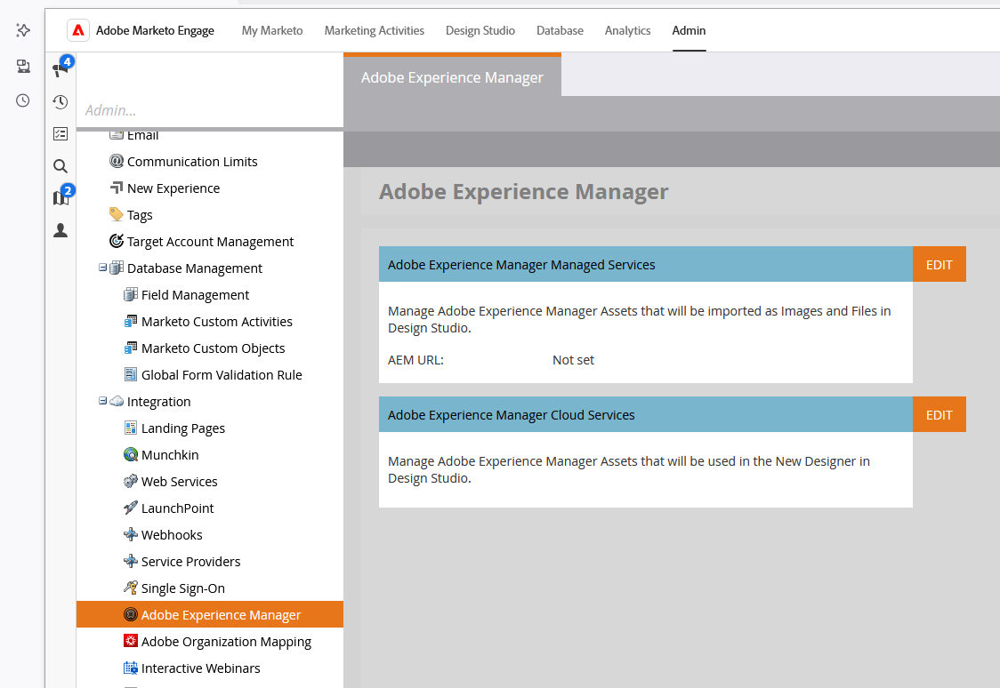{width="800" zoomable="yes"}

1. _Adobe Experience Manager Cloud Services_&#x200B;の横にある&#x200B;**Edit**&#x200B;をクリックします。

   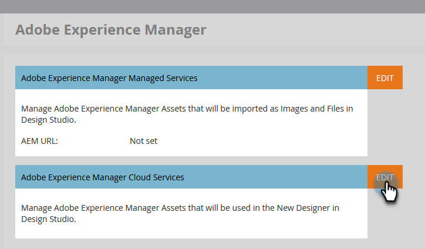{width="400" zoomable="yes"}

1. 1つ以上のリポジトリを選択します。

   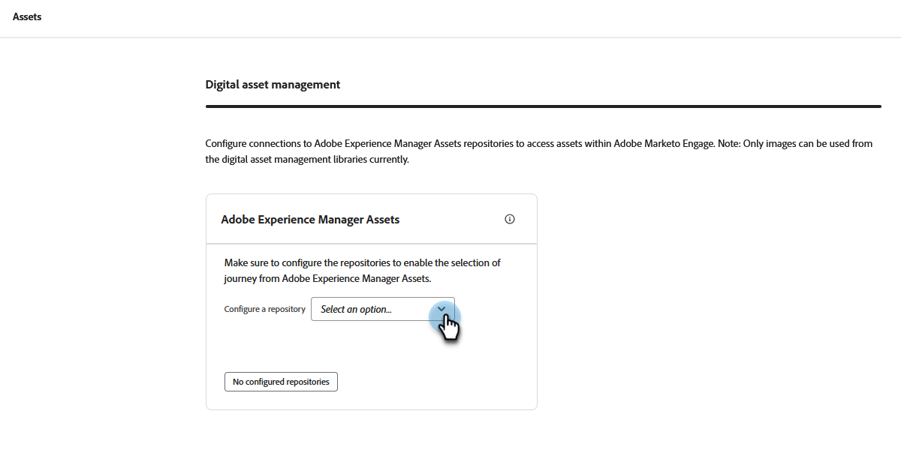{width="800" zoomable="yes"}

   >[!NOTE]
   >
   >* Marketo Engage サブスクリプションと同じIMS組織に関連付けられているリポジトリのみが一覧表示されます。
   >
   >* Marketo Engageは、配信層のリポジトリのみをサポートします。 オーサー層を使用しており、それを変換する場合は、[Adobe Experience Manager サポート ](https://experienceleague.adobe.com/en/docs/experience-manager-cloud-manager/content/overview/help-resources)にお問い合わせください。

1. リポジトリを設定するには、[ サービス資格情報の証明書](https://experienceleague.adobe.com/ja/docs/experience-manager-learn/getting-started-with-aem-headless/authentication/service-credentials)を追加する必要があります。 「**+証明書を追加**」ボタンをクリックします。

   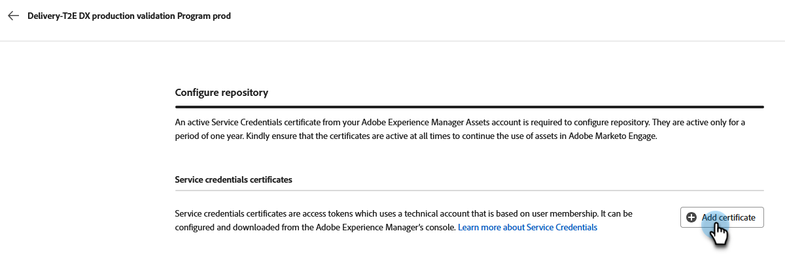{width="800" zoomable="yes"}

1. 証明書（JSON ファイルのみ）をドラッグ&amp;ドロップするか、コンピューターから選択します。 終了したら「**追加**」をクリックします。

   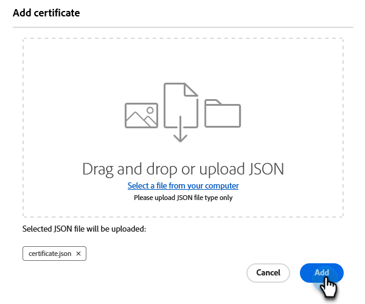{width="600" zoomable="yes"}

1. 設定されたリポジトリが、ステータスと有効期限とともに以下に表示されます。 省略記号ボタン （**...**）をクリックします 証明書を表示します。 それ以外の場合は完了です。

   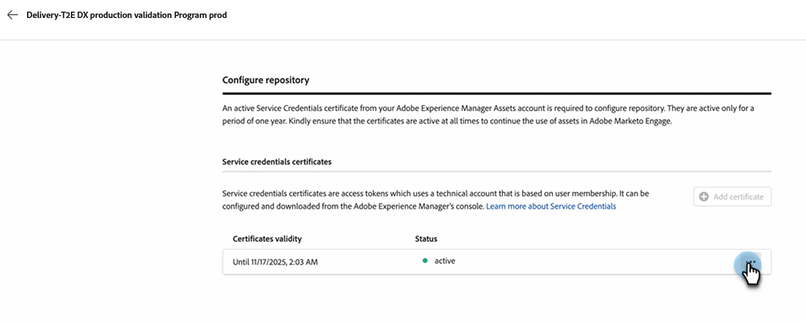{width="700" zoomable="yes"}

これで、そのリポジトリ内のデジタルアセット管理ライブラリのすべての画像に、Marketo Engage電子メールDesignerからアクセスできるようになります。

+++

## AEM assetsの操作 {#working-with-aem-assets}

これらのデジタルアセットを使用すると、_Assets as a Cloud Service_&#x200B;の最新の変更が、リンクされた参照を通じてライブメールキャンペーンに自動的に反映されます。 _Adobe Experience Manager Assets as a Cloud Service_&#x200B;で画像が削除された場合、その画像はメールで壊れた参照で表示されます。 現在Marketo Engageで使用されているアセットが変更または削除されると、画像の変更がメール作成者に通知されます。 アセットの変更はすべて、Adobe Experience Manager Assetsの中央リポジトリでおこなう必要があります。

### AEM Assetsを画像ソースとして使用 {#use-aem-assets-as-the-image-source}

環境に1つ以上のアセットリポジトリ接続がある場合、メール、メールテンプレート、ビジュアルフラグメントの詳細を作成または表示する際に、AEM Assetsをアセットのソースとして指定できます。

* 新しいコンテンツを作成する場合は、ダイアログで&#x200B;**[!UICONTROL Image Source]**&#x200B;項目として`AEM Assets`を選択します。

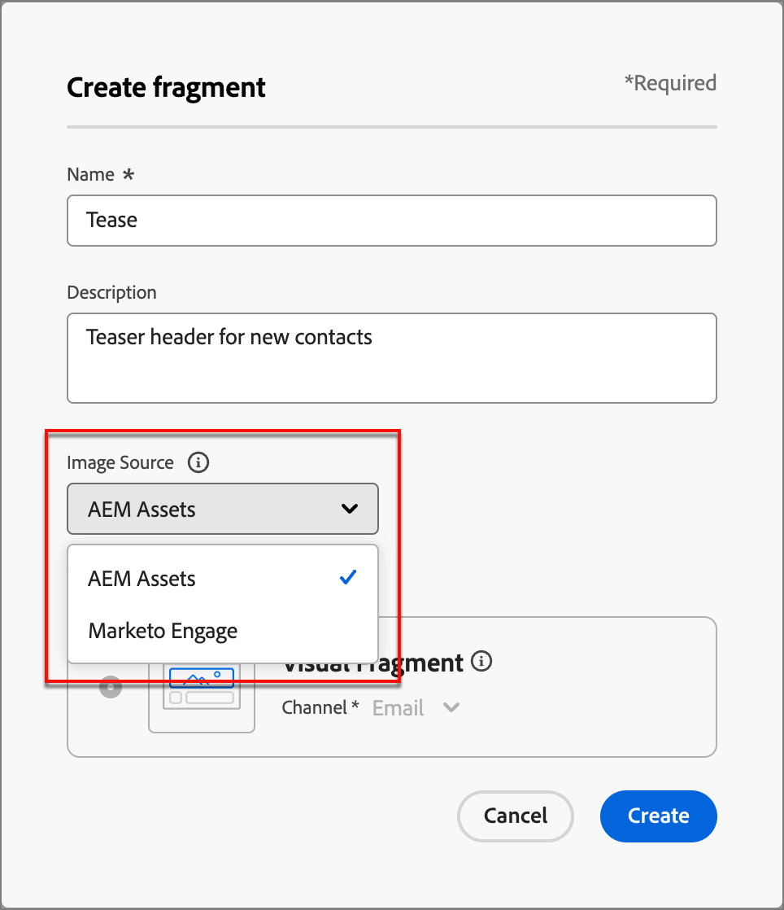{width="400" zoomable="yes"}

* 既存のコンテンツリソースを開く場合は、右側の&#x200B;_[!UICONTROL 本文]_ セクションで`AEM Assets`を選択します。

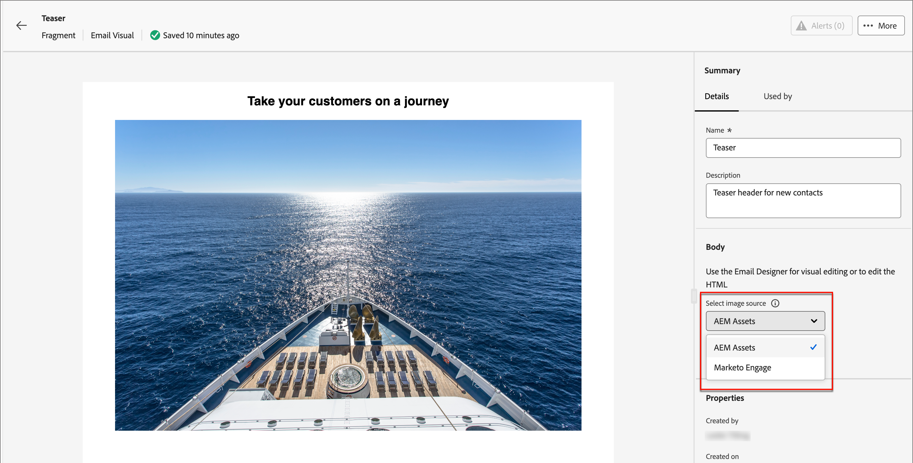{width="700" zoomable="yes"}

### オーサリング用アセットへのアクセス {#access-assets-for-authoring}

>[!IMPORTANT]
>
>管理者は、アセットへのアクセスが必要なユーザーをAssets コンシューマーユーザーやAssets ユーザーの製品プロファイルに追加する必要があります。 [詳細情報](https://experienceleague.adobe.com/en/docs/experience-manager-cloud-service/content/security/ims-support#managing-products-and-user-access-in-admin-console)

ビジュアルコンテンツエディターで、左側のサイドバーにある&#x200B;_Experience Manager Asset セレクター_ アイコンをクリックします。 これにより、ツールパネルが、選択したリポジトリ内の使用可能なアセットのリストに変更されます。

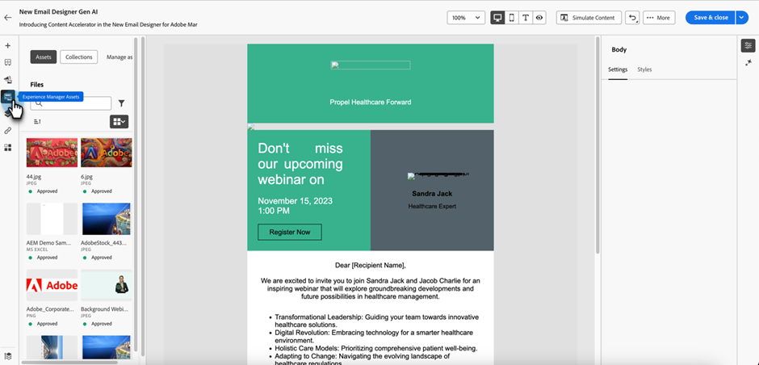{width="700" zoomable="yes"}

複数の接続されたAEM リポジトリがある場合は、「**[!UICONTROL 別名で管理]**」ボタンをクリックして、使用するリポジトリを選択します。

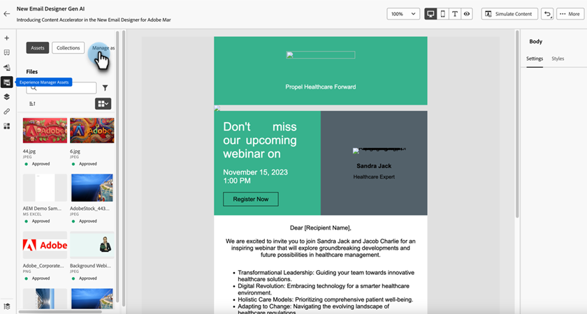{width="700" zoomable="yes"}

目的のリポジトリを選択します。

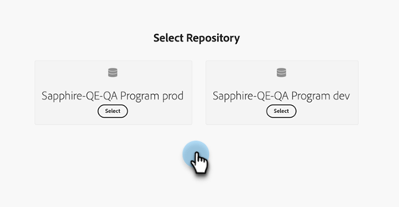{width="500" zoomable="yes"}

ビジュアルキャンバスに画像アセットを追加するには、複数の方法があります。

* 左側のナビゲーションから画像のサムネールをドラッグ&amp;ドロップします。

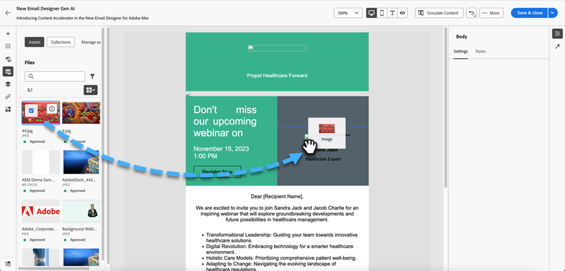{width="700" zoomable="yes"}

* 画像コンポーネントをカンバスに追加し、**[!UICONTROL 参照]**&#x200B;をクリックして&#x200B;_[!UICONTROL Assetsを選択]_ ダイアログを開きます。

  ダイアログから、選択したリポジトリから画像を選択できます。

  必要なアセットを見つけるのに役立つツールは複数あります。

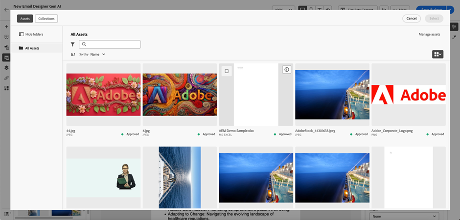{width="700" zoomable="yes"}

* 右上の&#x200B;**[!UICONTROL リポジトリ]**&#x200B;を変更します。

* 右上の&#x200B;**[!UICONTROL アセットの管理]**&#x200B;をクリックして、別のブラウザータブでAssets リポジトリを開き、AEM Assets管理ツールを使用します。

* 右上の&#x200B;_表示タイプ_ セレクターをクリックして、表示を&#x200B;**[!UICONTROL リストビュー]**、**[!UICONTROL グリッドビュー]**、**[!UICONTROL ギャラリービュー]**、または&#x200B;**[!UICONTROL ウォーターフォールビュー]**&#x200B;に変更します。

* 「_並べ替え順序_」アイコンをクリックして、並べ替え順序を昇順と降順で変更します。

* 「**[!UICONTROL 並べ替え]**」メニューの矢印をクリックして、並べ替え条件を&#x200B;**[!UICONTROL 名前]**、**[!UICONTROL サイズ]**、または&#x200B;**[!UICONTROL 変更]**&#x200B;に変更します。

* 左上の&#x200B;_フィルター_ アイコンをクリックして、条件に従って表示される項目をフィルタリングします。

* 検索フィールドにテキストを入力して、アセット名に一致するアセットの表示アイテムをフィルタリングします。

{width="700" zoomable="yes"}
