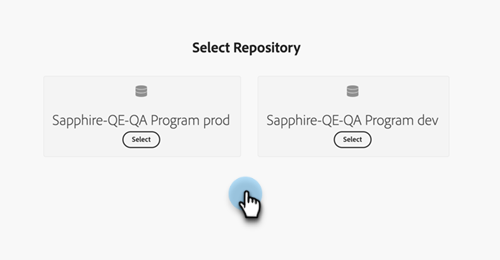

# Experience Manager アセットの操作 {#work-with-experience-manager-assets}

_Adobe Experience Manager Assets as a Cloud Service_ アカウントをAdobe Marketo Engage インスタンスに接続して、Marketo EngageのメールDesignerでAEM アセットリポジトリーを活用できるようにします。

>[!NOTE]
>
>現在、Marketo Engageでは _0&rbrace;Adobe Experience Manager Assets&rbrace; の画像アセットのみがサポートされています。_&#x200B;アセットに対する変更は、Adobe Experience Manager Assets中央リポジトリから行う必要があります。 [詳細情報](https://experienceleague.adobe.com/ja/docs/experience-manager-cloud-service/content/assets/manage/manage-digital-assets){target="_blank"}

## AEM Cloud Services へのリンク {#link-to-your-aem-cloud-services}

この機能を使用する前に、まずAEM Cloud Services をAdobe Marketo Engageにリンクする必要があります。

+++AEM Cloud Services とMarketo Engageのリンク

>[!NOTE]
>
>**管理者権限が必要**

1. Marketo Engageで、「**管理者** エリアに移動し、左側のナビゲーションツリーで「**Adobe Experience Manager**」を選択します。

   {width="800" zoomable="yes"}。

1. **2&rbrace;Adobe Experience Manager Cloud Services** の横にある「編集 _をクリックします。_

   {width="400" zoomable="yes"}

1. 1 つ以上のリポジトリーを選択します。

   {width="800" zoomable="yes"}

   >[!NOTE]
   >
   >* Marketo Engage サブスクリプションと同じ IMS 組織に関連付けられているリポジトリーのみが表示されます。
   >
   >* Marketo Engageでは、配信層からのリポジトリのみをサポートしています。 オーサー層を使用している場合にコンバージョンするには、[Adobe Experience Manager サポート ](https://experienceleague.adobe.com/ja/docs/experience-manager-cloud-manager/content/overview/help-resources) にお問い合わせください。

1. リポジトリを設定するには、[ サービス資格情報証明書 ](https://experienceleague.adobe.com/ja/docs/experience-manager-learn/getting-started-with-aem-headless/authentication/service-credentials) を追加する必要があります。 「**+証明書を追加**」ボタンをクリックします。

   {width="800" zoomable="yes"}

1. 証明書（JSON ファイルのみ）をドラッグ&amp;ドロップするか、コンピューターから選択します。 終了したら「**追加**」をクリックします。

   {width="600" zoomable="yes"}

1. 設定済みのリポジトリが、ステータスと有効期限と共に以下に表示されます。 省略記号ボタン （**...**）をクリックして、証明書を表示します。 それ以外の場合は、完了です。

   {width="700" zoomable="yes"}

これで、そのリポジトリー内の Digital Asset Management ライブラリのすべての画像に、Marketo EngageのメールDesignerからアクセスできるようになりました。

+++

## AEM Assets の操作 {#working-with-aem-assets}

これらのデジタルアセットを使用すると、_Assets as a Cloud Service_ の最新の変更が、リンクされた参照を通じてライブ メールキャンペーンに自動的に反映されます。 _Adobe Experience Manager Assets as a Cloud Service_ で画像を削除すると、メール内で画像が壊れた参照と共に表示されます。 現在Marketo Engageで使用されているアセットを変更または削除すると、画像の変更がメール作成者に通知されます。 アセットに対するすべての変更は、Adobe Experience Manager Assets中央リポジトリで行う必要があります。

### AEM Assetsを画像ソースとして使用 {#use-aem-assets-as-the-image-source}

お使いの環境に 1 つ以上のアセットリポジトリ接続がある場合、メール、メールテンプレートまたはビジュアルフラグメントの詳細を作成または表示するときに、AEM Assetsをアセットのソースとして指定できます。

* 新しいコンテンツを作成する場合は、ダイアログで `AEM Assets` を **[!UICONTROL Image Source]** 項目として選択します。

{width="400" zoomable="yes"}

* 既存のコンテンツリソースを開く場合は、右側の _[!UICONTROL 本文]_ セクションで `AEM Assets` を選択します。

{width="700" zoomable="yes"}

### オーサリング用アセットへのアクセス {#access-assets-for-authoring}

>[!IMPORTANT]
>
>管理者は、アセットにアクセスする必要があるユーザーをAssets コンシューマーユーザー製品プロファイルまたはAssets ユーザー製品プロファイルに追加する必要があります。 [詳細情報](https://experienceleague.adobe.com/ja/docs/experience-manager-cloud-service/content/security/ims-support#managing-products-and-user-access-in-admin-console)

ビジュアルコンテンツエディターで、左側のサイドバーにある「_Experience Manager アセットセレクター_」アイコンをクリックします。 これにより、ツールパネルが、選択したリポジトリで使用可能なアセットのリストに変更されます。

{width="700" zoomable="yes"}

複数のAEM リポジトリが接続されている場合は、「**[!UICONTROL 名前を付けて管理]**」ボタンをクリックして、使用するリポジトリを選択します。

{width="700" zoomable="yes"}

目的のリポジトリを選択します。

{width="500" zoomable="yes"}

画像アセットをビジュアルキャンバスに追加するには、複数の方法があります。

* 左側のナビゲーションから画像サムネールをドラッグ&amp;ドロップします。

{width="700" zoomable="yes"}

* キャンバスに画像コンポーネントを追加し、「参照 **[!UICONTROL をクリックして]** Assetsを選択 _[!UICONTROL ダイアログを開き]_ す。

  ダイアログで、選択したリポジトリから画像を選択できます。

  必要なアセットを見つけるのに役立つツールが複数あります。

{width="700" zoomable="yes"}

* 右上の **[!UICONTROL リポジトリ]** を変更します。

* 右上の **[!UICONTROL アセットを管理]** をクリックして、別のブラウザータブでAssets リポジトリを開き、AEM Assets management tools を使用します。

* 右上の _表示タイプ_ セレクターをクリックして、表示を **[!UICONTROL リスト表示]**、**[!UICONTROL グリッド表示]**、**[!UICONTROL ギャラリー表示]**、**[!UICONTROL ウォーターフォール表示]** に変更します。

* _並べ替え順序_ アイコンをクリックして、並べ替え順序を昇順と降順の間で変更します。

* 「**[!UICONTROL 並べ替え基準]**」メニュー矢印をクリックして、並べ替え条件を **[!UICONTROL 名前]**、**[!UICONTROL サイズ]**、**[!UICONTROL 変更]** に変更します。

* 左上の _フィルター_ アイコンをクリックし、条件に従って表示される項目をフィルタリングします。

* 「検索」フィールドにテキストを入力して、表示される項目をアセット名と一致するようにフィルタリングします。

{width="700" zoomable="yes"}
