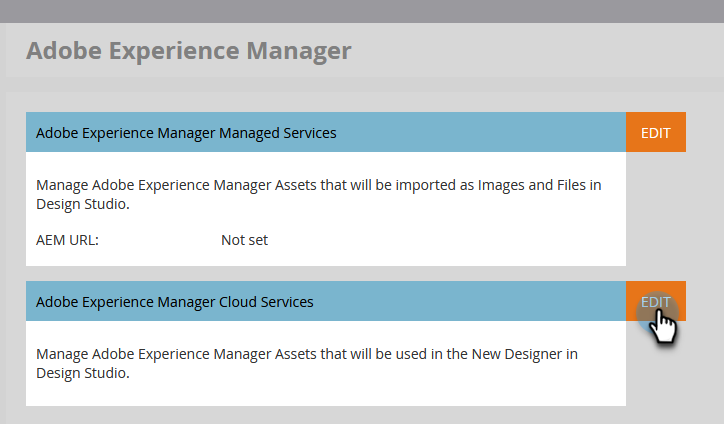

# Adobe Experience Manager Cloud Serviceの接続 {#connect-adobe-experience-manager-cloud-services}

Adobe Marketo Engage インスタンスにAEM Assets Cloud Serviceアカウントを接続して、メールDesignerMarketo EngageでAEM アセットリポジトリを活用できるようにする方法について説明します。

>[!NOTE]
>
>**管理者権限が必要**

1. Marketo Engageで、「**管理者** エリアに移動し、左側のナビゲーションツリーで「**Adobe Experience Manager**」を選択します。

   {width="800"}。

1. **2}Adobe Experience ManagerCloud Service** の横にある「編集 _をクリックします。_

   {width="400"}

1. 1 つ以上のリポジトリーを選択します。

   {width="800"}

   >[!NOTE]
   >
   >Marketo Engageサブスクリプションと同じ IMS 組織に関連付けられているリポジトリのみが表示されます。

1. リポジトリを設定するには、[ サービス資格情報証明書 ](https://experienceleague.adobe.com/ja/docs/experience-manager-learn/getting-started-with-aem-headless/authentication/service-credentials) を追加する必要があります。 「**+証明書を追加**」ボタンをクリックします。

   {width="800"}

1. 証明書（JSON ファイルのみ）をドラッグ&amp;ドロップするか、コンピューターから選択します。 終了したら「**追加**」をクリックします。

   {width="600"}

1. 設定済みのリポジトリが、ステータスと有効期限と共に以下に表示されます。 省略記号ボタン （**...**）をクリックして、証明書を表示します。 それ以外の場合は、完了です。

   {width="600"}

これで、そのリポジトリ内の Digital Asset Management ライブラリのすべての画像に、Marketo EngageのメールDesignerからアクセスできるようになります。

>[!MORELIKETHIS]
>
>[Experience Managerアセットの操作 ](/help/marketo/product-docs/email-marketing/email-designer/aem-assets.md)
