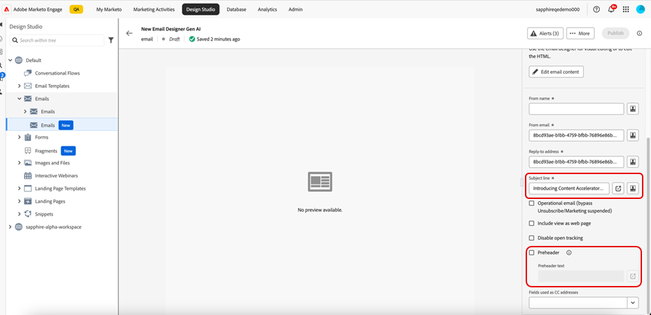
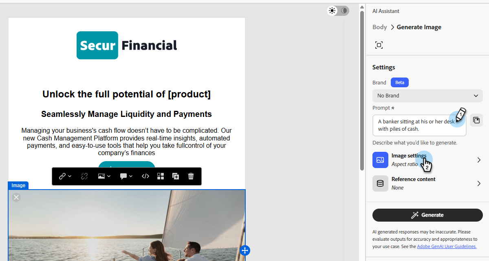

# Email DesignerのAI アシスタント {#ai-assistant-email-designer}

MARKETO ENGAGE Email DesignerのAI アシスタントを使用すると、現代的でパフォーマンスの高い、直感的なメールを作成できます。 これは、Adobeの生成AI テクノロジーとプロンプトライブラリ、および特定のペルソナ/購買グループ、マーケティングジャーニーの段階、コミュニケーション戦略、トーンなどに適したコンテンツの作成を支援する画像生成用Fireflyを通じて実現されます。特定のブランドアセットを利用して、コンテンツを制作することもできます。

>[!PREREQUISITES]
>
>AI アシスタントはデフォルトで有効になっていません。 最初に、メール Designerで生成AI機能を使用するための[Core Gen-AI条件と補足条件](https://www.adobe.com/legal/terms/enterprise-licensing/genai-ww.html){target="_blank"}に同意する必要があります。 詳しくは、Adobe アカウントチーム（アカウントマネージャー）にお問い合わせください。

## 権限の設定 {#set-up-permissions}

_上記の前提条件に従った_&#x200B;後、Marketo管理者は、ユーザーが生成AI ボタンを表示する前に、特定のユーザー/ロールへのアクセスを適用する必要があります。

+++権限の設定方法を説明します

1. Marketo Engageで、**管理者**&#x200B;をクリックし、**ユーザーと役割**&#x200B;を選択します。

   

1. 「**役割**」タブで、目的の役割をダブルクリックします。

   

1. _Access Design Studio_&#x200B;で、**Access AI Assistant** チェックボックスを選択し、**Save**&#x200B;をクリックします。

   

1. 「ユーザー」タブをクリックし、アクセス権を付与するユーザーを選択します。

   

1. 手順3で選択した役割と目的のワークスペース（該当する場合）を選択します。 「**保存**」をクリックします。

   

+++

## ユースケース {#use-cases}

AI アシスタントの主なユースケースがいくつかあります。

* [電子メールの件名および/またはプリヘッダー](#create-a-subject-line-preheader)を作成する
* [ メールの特定のセクション ](#create-content-for-a-specific-section)のコンテンツを作成する
* 選択したテンプレートから[ メール全体](#create-an-entire-email)を作成

## 件名/プリヘッダーの作成 {#create-a-subject-line-preheader}

AI アシスタントを使用して、件名、プリヘッダー、またはその両方を作成できます。

次の例は、件名を示しています。 プリヘッダーの場合、_プリヘッダー_ チェックボックスをクリックすると、同じ手順を実行できます（上の画像を参照）。

新しい電子メールDesignerを使用して電子メールを作成する場合は、一時的な件名を入力します。

電子メールを作成した後、件名は右側の&#x200B;_詳細_&#x200B;列にあります。 AI アシスタント ボタン（）をクリックすると、生成AI機能を使用して新しい件名を作成する際のサポートを受けることができます。

AI アシスタントに対して「**参照コンテンツを使用**」オプションを有効にして、選択したコンテンツに基づいて、新しいコンテンツをパーソナライズします。

プロンプトを入力して、件名をカスタマイズします。 関連するテキスト設定を入力し、参照として使用するブランドアセットをアップロードして、適切な件名を作成します。

テキスト設定には次のものが含まれます。

<table><tbody>
  <tr>
    <td style="width:25%"><b>購買グループ</b></td>
    <td>ターゲットにする特定の購買グループ（例：実務担当者、インフルエンサー、意思決定者）</td>
  </tr>
  <tr>
    <td style="width:25%"><b>マーケティングジャーニーステージ</b></td>
    <td>特定のマーケティングジャーニー段階の受信者（例：発見、評価、コミット）</td>
  </tr>
  <tr>
    <td style="width:25%"><b>コミュニケーション戦略</b></td>
    <td>コミュニケーションの目的（例：緊急、社会的証明、情報提供）</td>
  </tr>
  <tr>
    <td style="width:25%"><b>言語</b></td>
    <td>件名を生成する言語。</td>
  </tr>
  <tr>
    <td style="width:25%"><b>トーン</b></td>
    <td>コンテンツを生成するトーン（例：インスピレーション、刺激的、ユーモラス）。</td>
  </tr>
  <tr>
    <td style="width:25%"><b>絵文字</b></td>
    <td>生成されたコンテンツに絵文字を含めることができます。</td>
  </tr>
</tbody>
</table>

「**Generate**」をクリックすると、サンプルが表示され、次の中から選択できます。

また、ブランドアセットをアップロードして、アセット内のコンテンツを参照として使用し、件名を作成することもできます。

バリエーションを選択するには、そのチェックボックスを選択し、**選択**&#x200B;をクリックします。 **調整**&#x200B;をクリックして調整することもできます。 さらに、「サムズアップ」アイコンまたは「サムズダウン」アイコンをクリックして、生成AIがユーザーの好みを学習できるようにフィードバックを提供することもできます。

選択を行うと、件名がメールの詳細に入力されます。

## メールの特定のセクションのコンテンツを作成 {#create-content-for-a-specific-section}

メールが作成されたら、特定のセクション、画像、テキストを変更するオプションがあります。

この例では財務テンプレートを使っています。 既存の画像のうち1つ以上がニーズに合わない場合は、AI アシスタントに対して、説明に基づいて新しい画像を作成するように指示できます。 目的の画像を選択し、AI アシスタントアイコンをクリックします。

「銀行員が現金の山で自分のデスクに座っている」など、プロンプトに関連する詳細を入力します。 何を入力すればよいかわからない場合は、プロンプトライブラリ（プロンプトの右側）を使用することもできます。 **画像設定**&#x200B;をクリックします。

切り替えスイッチをクリックして&#x200B;_AI_&#x200B;を使用して画像を生成し、使用するモデル（Adobe FireflyまたはGemini 2.5 Nano Banana）など、必要な設定を変更します。 完了したら、**生成**&#x200B;をクリックします。

複数のバリエーションが作成されます。 お気に入りを選択し、**適用**&#x200B;をクリックします。

>[!NOTE]
>
>どの画像もニーズに合わない場合は、**生成**&#x200B;をもう一度クリックして、新しいバージョンを作成します。

画像と同様に、メールのテキスト部分も変更できます。

## 選択したテンプレートからメール全体を作成 {#create-an-entire-email}

このオプションは、メールが既存のテンプレートを使用して作成された場合にのみ使用できます。 これは、電子メールDesignerで提供される標準テンプレート、既に作成した保存テンプレート、またはHTMLの読み込みオプションを使用して読み込んだテンプレートです。 このオプションは、電子メールに「[ ゼロからデザイン ](/help/marketo/product-docs/email-marketing/email-designer/email-authoring.md#design-from-scratch)」を選択した場合は使用できません。

テンプレート内のコンポーネントを選択せずにテンプレートを選択し、メールDesignerの「AI アシスタント」ボタンをクリックします。

関連するプロンプトを入力し、メールに必要なテキスト設定、ブランドアセット、および画像設定を選択します。

Fireflyを使用して画像を生成する場合は、「画像の設定」を選択し、「**AIを使用して画像を生成**」の切り替えスイッチを選択します。

希望する&#x200B;_コンテンツタイプ_、_色とトーン_、_照明_、_構図_&#x200B;を選択して、メール用の生成AI画像を作成します。 完了したら、**Generate**&#x200B;をクリックします。

**プレビュー**&#x200B;をクリックすると、バリエーションがメールでどのように表示されるかを確認できます。 **適用**&#x200B;をクリックして、バリエーションを選択します。
