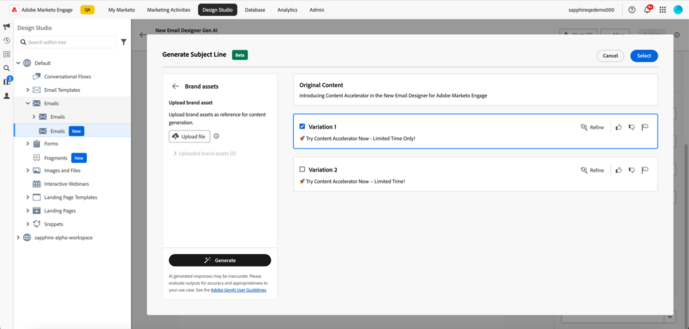
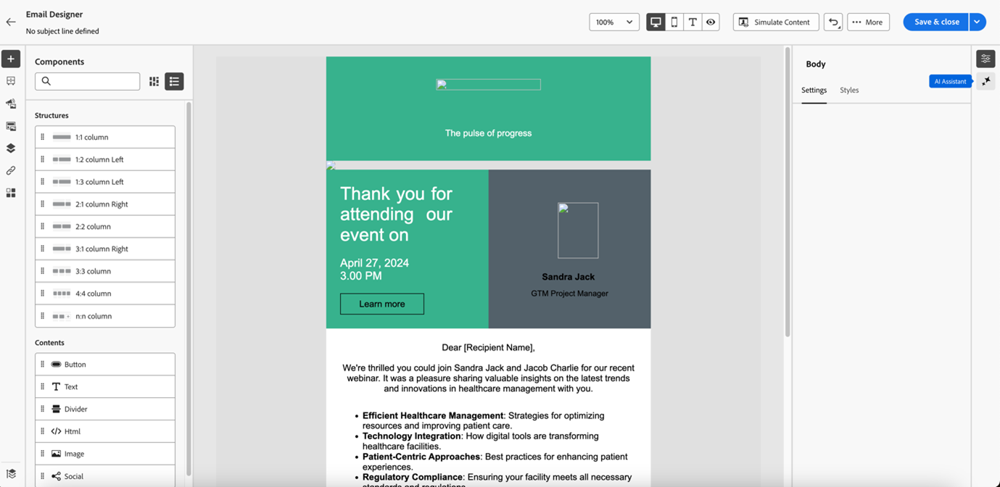

# AI アシスタントを使用 {#use-ai-assistant}

Marketo Engage メールDesignerの AI アシスタントを使用すると、現代的でパフォーマンスの高い直感的なメールを作成できます。 これは、Adobeの生成 AI テクノロジーと迅速なライブラリを、特定のペルソナ/購入グループ、マーケティングジャーニーステージ、コミュニケーション戦略、トーンなどに適したコンテンツの作成を支援する画像生成用のFireflyと組み合わせることで実現されます。 また、特定のブランドアセットを利用してコンテンツを作成することもできます。

>[!PREREQUISITES]
>
>AI アシスタントはデフォルトでは有効になっていません。 まず、コアの Gen-AI 条件と、メールDesignerの Gen-AI 機能を使用するための補足条件に同意する必要があります。 詳しくは、Adobe アカウントチーム（アカウントマネージャー）にお問い合わせください。

AI アシスタントの主なユースケースは 3 つあります。

* メールの [ 件名を作成 ](#create-a-subject-line)
* メールの [ 特定のセクションのコンテンツを作成 ](#create-content-for-a-specific-section)
* 選択したテンプレートからの [ メール全体の作成 ](#create-an-entire-email)

## 件名行を作成 {#create-a-subject-line}

新しいメールDesignerを使用してメールを作成する際に、一時的な件名を入力します。

メールを作成すると、右側の _詳細_ 列に件名が表示されます。 その横にある AI アシスタントボタン（）をクリックすると、生成 AI 機能を使用して新しい件名を作成する方法を確認できます。

AI アシスタントに対して「**参照コンテンツを使用**」オプションを有効にして、選択したコンテンツに基づいて、新しいコンテンツをパーソナライズします。

件名をカスタマイズするためのプロンプトを入力します。 関連するテキスト設定を入力し、適切な件名を作成するために、参照として使用するブランドアセットをアップロードします。

テキストの設定には、次のものが含まれます。

<table><tbody>
  <tr>
    <td style="width:25%"><b>購買グループ</b></td>
    <td>ターゲットとしている特定の購入グループ（実務担当者、インフルエンサー、意思決定者など）。</td>
  </tr>
  <tr>
    <td style="width:25%"><b>マーケティングジャーニーステージ</b></td>
    <td>特定のマーケティングジャーニーステージ（検出、評価、コミットなど）の受信者。</td>
  </tr>
  <tr>
    <td style="width:25%"><b>コミュニケーション戦略</b></td>
    <td>コミュニケーションの目的（緊急、ソーシャルプルーフ、情報など）。</td>
  </tr>
  <tr>
    <td style="width:25%"><b>言語</b></td>
    <td>件名行を生成する言語です。</td>
  </tr>
  <tr>
    <td style="width:25%"><b>トーン</b></td>
    <td>コンテンツを生成するトーン （例：感動的、エキサイティング、ユーモラス）。</td>
  </tr>
  <tr>
    <td style="width:25%"><b>絵文字</b></td>
    <td>生成されるコンテンツに絵文字を含めることができます。</td>
  </tr>
</tbody>
</table>

「**生成**」をクリックすると、サンプルが表示され、次の中から選択できます。

また、ブランドアセットをアップロードして、アセット内のコンテンツを参照として使用し、件名行を作成することもできます。

バリエーションを選択するには、チェックボックスを選択して **選択** をクリックします。 **リファイン** をクリックして微調整することもできます。 さらに、サムズアップまたはサムズダウンアイコンをクリックしてフィードバックを提供し、Gen-AI テクノロジーが環境設定を学習できるようにします。

選択を行うと、メールの詳細に件名が入力されます。

## メールの特定のセクションに対応するコンテンツの作成 {#create-content-for-a-specific-section}

メールの作成後、特定のセクション、画像またはテキストを変更できます。

この例では、ヘルスケアテンプレートを使用しています。 既存の医療専門家のイメージがニーズを満たさない場合は、AI アシスタントに医療専門家の独自のイメージを作成するように指示できます。 画像のコンテンツを選択し、AI アシスタントをクリックするだけです。

「ヘルスケアエキスパート向けの画像の生成」など、関連する詳細をプロンプトに入力し、必要なカスタマイズを追加します。 また、入力する内容が不明な場合は、プロンプト ライブラリ（プロンプトの右側）を使用することもできます。

「**生成**」をクリックすると、選択できる複数のバリアントが作成されます。

画像と同様に、メールのテキスト部分も変更できます。

## 選択したテンプレートからメール全体を作成 {#create-an-entire-email}

このオプションは、既存のテンプレートを使用してメールを作成した場合にのみ使用できます。 メールDesignerから提供される標準テンプレート、作成済みの保存済みテンプレートまたは「HTMLの読み込み」オプションを使用して読み込まれたテンプレートを選択できます。 このオプションは、メールに対して [ ゼロからデザイン ](/help/marketo/product-docs/email-marketing/email-designer/email-authoring.md#design-from-scratch) を選択した場合は使用できません。

テンプレート内のコンポーネントを選択せずにテンプレートを選択し、電子メールDesignerの「AI アシスタント」ボタンをクリックします。

関連するプロンプトを入力し、テキスト設定、ブランドアセット、メールに必要な画像設定を選択します。

Fireflyを使用して画像を生成する場合は、「画像設定」を選択し、「**AI を使用して画像を生成**」の切替スイッチを選択します。

目的の _コンテンツタイプ_、_カラーとトーン_、_照明_、_構成_ を選択して、メールの Gen-AI 画像を作成します。 終了したら「**生成**」をクリックします。

**プレビュー** をクリックして、メール内でのバリエーションの表示を確認します。 **適用** をクリックしてバリエーションを選択します。
