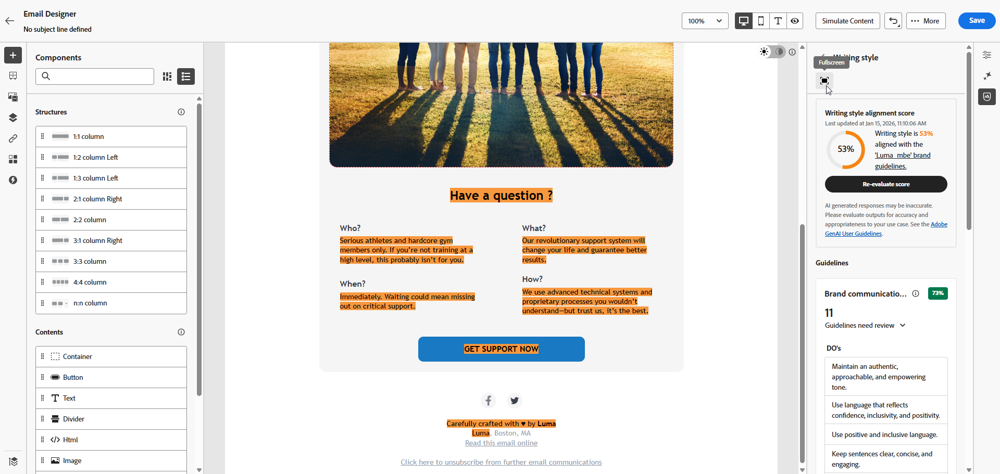
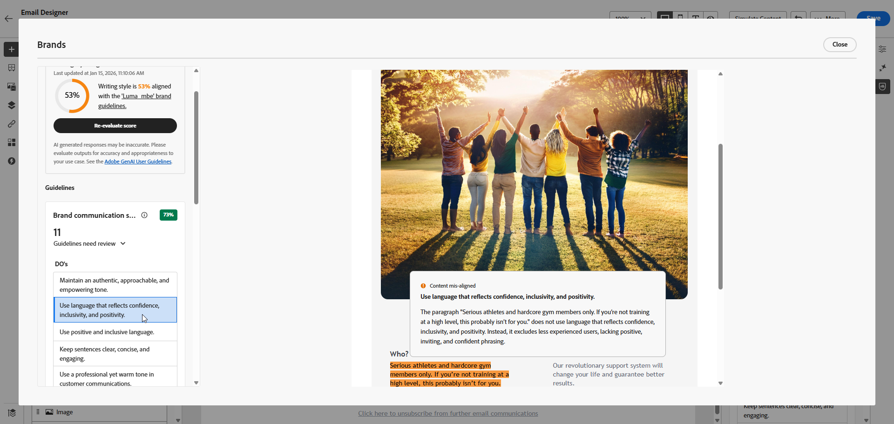
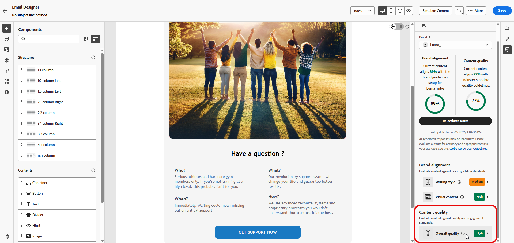

# ブランドスコア {#brand-score}

ブランドスコアを確認することで、メールキャンペーン全体でトーン、メッセージ、ビジュアルアイデンティティの一貫性を確保し、コンテンツが公開される前に品質チェックとして役立ちます。

>[!AVAILABILITY]
>
>Adobe Marketo EngageでAI アシスタントを使用するには、事前に[使用許諾契約書](https://www.adobe.com/legal/licenses-terms/adobe-dx-gen-ai-user-guidelines.html){target="_blank"}{target="_blank"}に同意する必要があります。 詳しくは、アドビ担当者にお問い合わせください。

## ブランドアラインメントを使用してコンテンツを検証 {#validate-content}

ブランドを[設定して公開](/help/marketo/product-docs/email-marketing/email-designer/brands/manage-brands.md#create-brand-kit){target="_blank"}したら、メールキャンペーン内でブランド調整スコアを直接評価して、コンテンツがブランドガイドラインに準拠していることを確認します。

1. 電子メールで、**[!UICONTROL ブランド調整]** アイコンをクリックします。

   コンテンツは、[&#x200B; デフォルトのブランド &#x200B;](/help/marketo/product-docs/email-marketing/email-designer/brands/manage-brands.md#default-brand){target="_blank"}を自動的に評価します。

   {width="800" zoomable="yes"}

1. 別のブランドを使用して評価するには、**[!UICONTROL ブランド]**&#x200B;ドロップダウンメニューから選択し、「**[!UICONTROL スコアを評価]**」をクリックします。

   {width="800" zoomable="yes"}

1. **[!UICONTROL 書き込みのスタイル]**&#x200B;または&#x200B;**[!UICONTROL 視覚的なコンテンツ]**&#x200B;を参照して、スコアに関する詳細なインサイトを確認します。

   {width="800" zoomable="yes"}

1. 詳細なインサイトを得るには アイコンをクリックすると、品質スコアの詳細なビューが表示されます。

   {width="800" zoomable="yes"}

1. フラグ付けされたガイドラインを選択して、特定のフィードバックと提案を表示します。 ブランド一致では、次のカテゴリが評価されます。

   * **[!UICONTROL 書き込みのスタイル]**：
     * **[!UICONTROL ブランドコミュニケーションスタイル]**：すべてのチャネルをまたいで一貫性のあるブランドの声を確保するために、パーソナリティと感情的なトーンを定義します。
     * **[!UICONTROL ブランドメッセージ標準]**：効果的なマーケティングおよびプロモーションテキストの構造化および書式設定ルール。
     * **[!UICONTROL 法的コンプライアンス標準]**：すべてのコミュニケーションが、テキストの配置やコンプライアンスチェックリストを含む法的要件に準拠していることを確認します。

   * **[!UICONTROL 視覚的なコンテンツ]**：
     * **[!UICONTROL 写真標準]**：解像度、コンポジション、照明、ファイル形式など、写真コンテンツの要件。
     * **[!UICONTROL イラスト標準]**：イラストのスタイルパラメーター、線の太さ、カラーの使用状況、ファイル形式の要件。
     * **[!UICONTROL アイコン標準]**：グリッドシステム、線の太さ、均一性を考慮したサイズなど、アイコンのデザインに関する仕様。
     * **[!UICONTROL 使用ガイドライン]**：ブランドアイデンティティを維持するための、画像の選択、配置、コンテキストに関するベストプラクティス。

   {width="800" zoomable="yes"}

1. レコメンデーションに基づいてコンテンツを編集し、ブランド一致を向上させます。

1. 変更した後にコンテンツを手動で再評価し、一致スコアを更新します。

## コンテンツ品質の検証 {#validate-quality}

>[!NOTE]
>
>コンテンツの品質評価は、ブランドガイドラインとは独立しています。 ドロップダウンメニューでブランドを選択しても、そのブランドのガイドラインは品質チェックに適用されません。 ブランド選択は、ブランド調整スコアリングにのみ関連します。

ブランドの整合性に加えて、一般的なコンテンツの品質を評価し、ブランドガイドラインに依存せずに、読みやすさ、コンテンツの一貫性、有効性に関する潜在的な問題を特定できます。

コンテンツの品質を評価するには、次の手順に従います。

1. 電子メールで、**[!UICONTROL ブランド調整]** アイコンをクリックします。

   {width="800" zoomable="yes"}

1. 「**[!UICONTROL スコアを評価]**」をクリックして、ブランドの整合性とコンテンツ品質の両方のスコアを生成します。

   {width="800" zoomable="yes"}

1. 「**[!UICONTROL 全体的な品質]**」タブに移動して、コンテンツ品質に関するインサイトと推奨事項を確認します。

   {width="800" zoomable="yes"}

1. 詳細なインサイトを得るには アイコンをクリックすると、品質スコアの詳細なビューが表示されます。

   {width="800" zoomable="yes"}

1. フラグが設定されている項目を選択して、特定のフィードバックと改善に向けた実用的な提案を表示します。 スコアは、次のカテゴリに基づいています。

   * **[!UICONTROL CTAの効果]**:call-to-actionが読者に望ましい行動を起こすための動機付けをどの程度行っているかを評価します。
   * **[!UICONTROL 件名]**：明確さ、関連性、注目すべき品質を評価して、メールの開封を促進します。
   * **[!UICONTROL 読みやすさ]**：コンテンツがどの程度簡単で魅力的であるかを測定して、読者が理解できるようにします。
   * **[!UICONTROL スパムチェック]**：配信品質に影響を与える可能性のある一般的なスパムトリガーを特定します。
   * **[!UICONTROL コンテンツの一貫性]**：コンテンツがスムーズに流れ、トピックに沿ったものになります。
   * **[!UICONTROL 校正]**：スペル、文法、明瞭度の問題をチェックします。

   {width="800" zoomable="yes"}

1. レコメンデーションにもとづいてコンテンツを編集することで、読みやすさ、コンテンツの統一性、全体的な品質を向上させます。

1. 変更を加えた後、**[!UICONTROL スコアを再評価]**&#x200B;して、品質スコアを更新します。
