# ブランドテーマ {#brand-themes}

ブランドテーマを利用すれば、メールテンプレートにカスタムスタイルを追加して、特定のブランドやデザイン言語に合った再利用可能なコンテンツを簡単に作成できます。

この機能により、マーケターは、一意のデザインニーズに合わせた高度なカスタマイズオプションを提供しながら、視覚的に魅力的でブランドの一貫性のあるメールをより迅速かつ少ない労力で活用できます。

## テーマの作成 {#create-a-theme}

1. 手順に従って、[電子メールテンプレートを作成](/help/marketo/product-docs/email-marketing/email-designer/email-template-authoring.md#create-an-email-template)します。

1. _テンプレートのデザイン_&#x200B;画面で、**テーマの作成または編集**&#x200B;を選択します。

   

1. デフォルトのテーマを基本として選択し、**作成**&#x200B;をクリックします。

   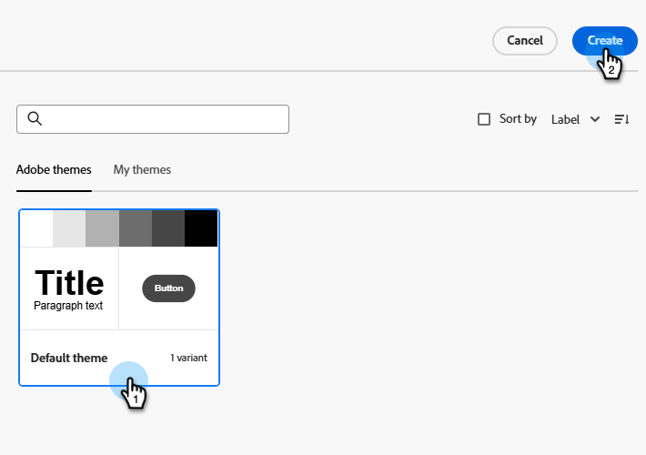

1. カンバスが開き、テーマの様々な部分を編集できます。

   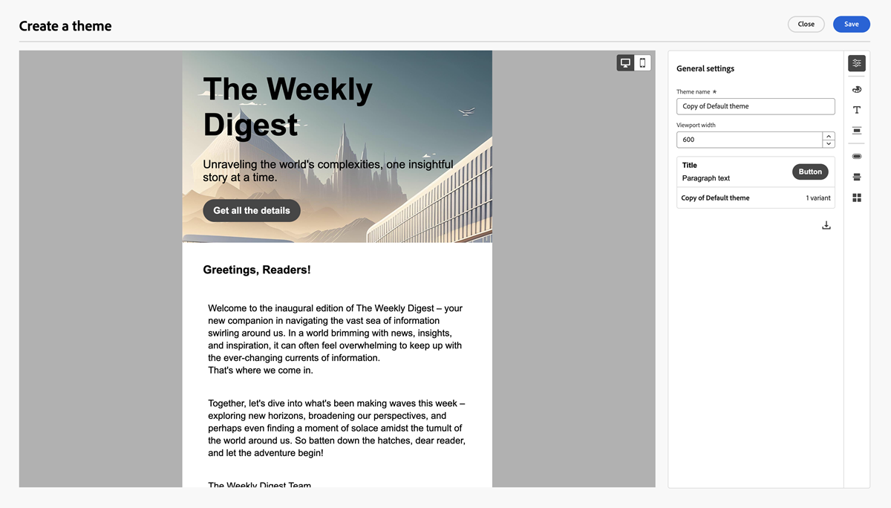

## 設定 {#settings}

すべての設定オプションには、右側のアイコンからアクセスできます。 それぞれの結果を確認します。

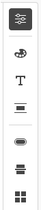

### 一般設定 {#general-settings}

テーマに名前を付け、ビューポートサイズを調整します。

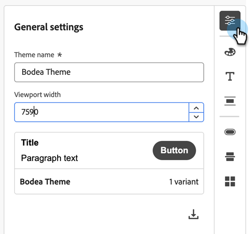

### カラー {#colors}

カラーを調整する際は、メインパネルで変更が反映されていることを確認します。

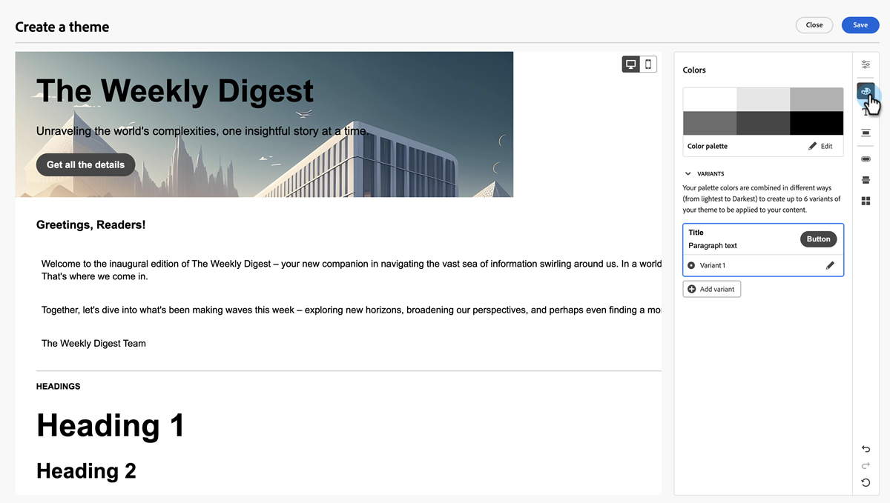

>[!NOTE]
>
>デフォルトのテーマに基づいて、一連のスウォッチが既に設定されています。

「**編集**」をクリックします。

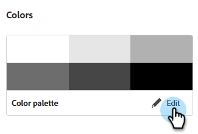

プリセットから選択するか、セット内の各カラーを個別に設定できます。 パレットを選択すると、後で別のカラー設定で、これらのカラーにアクセスできるようになります。

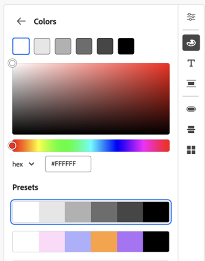

編集が完了したら、戻る矢印（）をクリックして戻ります。

バリエーションを編集するには、その鉛筆アイコンをクリックします。

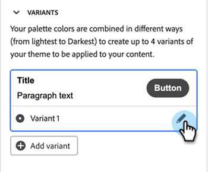

>[!NOTE]
>
>最大4つのバリエーションを作成できます。

複数の要素をカスタマイズできます。 バリアント設定は、次のカテゴリに分類されます。

* 一般
* 見出し
* 段落
* ボタン

**一般**

これらの設定を使用すると、本文、構造、背景、コンテナ、画像などの色を設定できます。

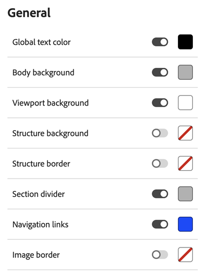

**見出し**

見出し1から見出し6まで、各見出しタイプのテキストと境界線の色を設定します。

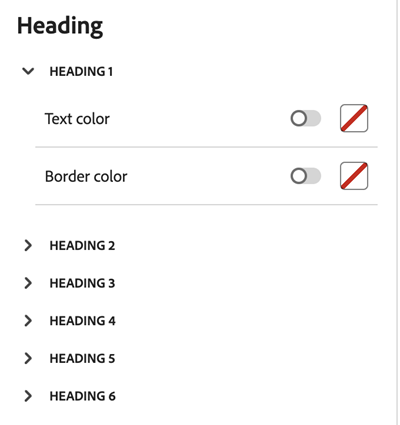

**段落**

最大3つの段落タイプのテキストと境界線の色を設定します。

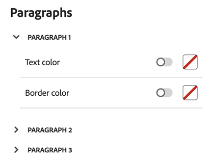

**ボタン**

プライマリ、セカンダリ、三次の3種類のボタンタイプに対して、塗りつぶし、境界線、テキストカラーを設定します。

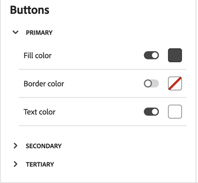

### テキスト設定 {#text-settings}

グローバル、見出し、段落のフォントタイプとサイズを設定します。

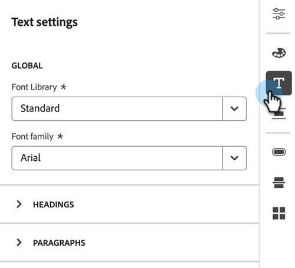

**グローバル**

標準またはGoogle フォントライブラリとそれぞれのフォントファミリーを選択します。

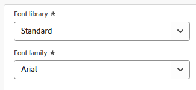

**見出し**

様々な見出しタイプに対して、フォントライブラリ、ファミリ、サイズ、テキストスタイル、およびテキストの整列を設定します。

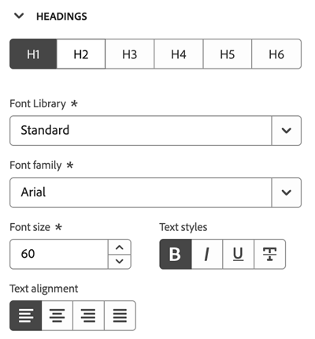

**段落**

異なる段落プリセットに対して、フォントライブラリ、ファミリ、サイズ、テキストスタイル、およびテキストの整列を設定します。

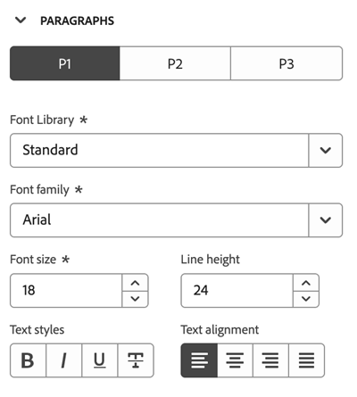

### 間隔と境界線 {#spacing-and-border}

複数の異なる構造から選択し、マージン、パディング、境界線をカスタマイズできます。

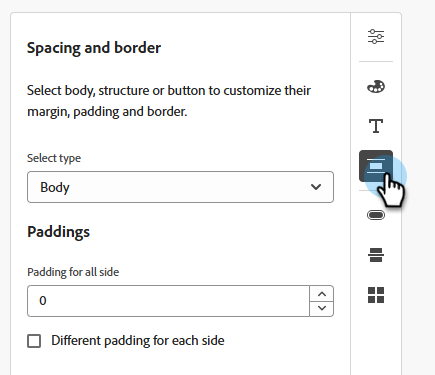

次の例では、コンテナをカスタマイズしています。

**余白**

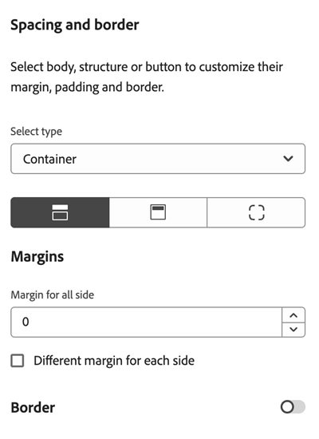

**パディング**

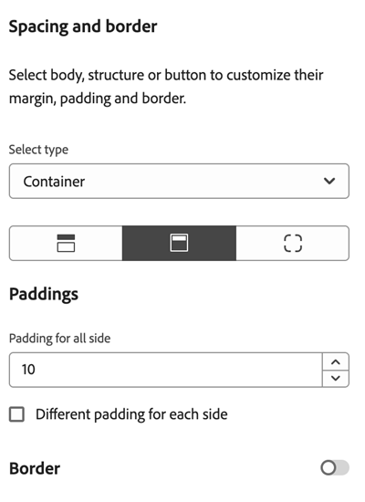

**角**

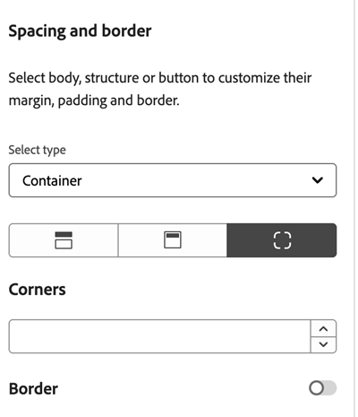

**境界線**

境界線をオンに切り替えて、サイズ、スタイル、位置を設定するオプションを表示します。

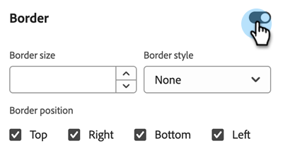

次に、境界線スタイルの変更の視覚的な例を示します。

<table><thead>
  <tr>
    <th>タイプ</th>
    <th>サイズとスタイルの設定</th>
    <th>エフェクト</th>
  </tr></thead>
<tbody>
  <tr>
    <td>破線</td>
    <td>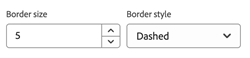</td>
    <td>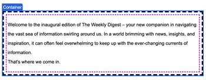</td>
  </tr>
  <tr>
    <td>点線</td>
    <td>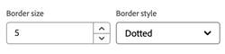</td>
    <td>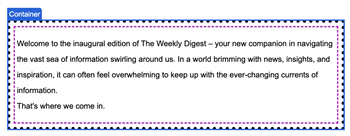</td>
  </tr>
  <tr>
    <td>実線</td>
    <td>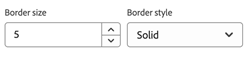</td>
    <td>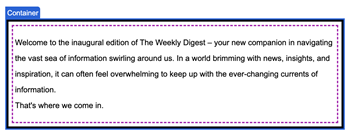</td>
  </tr>
</tbody></table>

境界線のどの辺を表示するか非表示にするかを調整します。 下の例では、上の境界線が非表示になっています。

<table><thead>
  <tr>
    <th>位置設定</th>
    <th>エフェクト</th>
  </tr></thead>
<tbody>
  <tr>
    <td>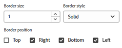</td>
    <td>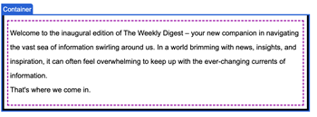</td>
  </tr>
</tbody></table>

### ボタン設定 {#button-settings}

シェイプ、半径、テキスト、サイズなど、ボタンのカラー以外の要素を設定します。 3つのプリセットは、プライマリ、セカンダリ、および三次です。

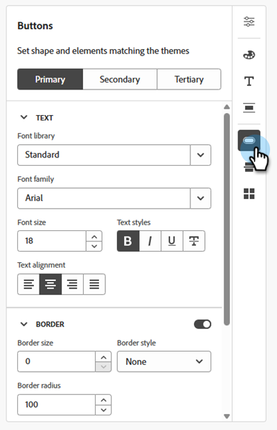

<table><thead>
  <tr>
    <th>設定</th>
    <th>説明</th>
  </tr></thead>
<tbody>
  <tr>
    <td>境界線/境界線の半径</td>
    <td>ボタンの境界線コーナー曲率</td>
  </tr>
  <tr>
    <td>ボーダー/ボーダーサイズ </td>
    <td>ボタンの境界線の太さ</td>
  </tr>
  <tr>
    <td>境界線/境界線スタイル</td>
    <td>ボタンの境界線スタイル（破線、実線、点線など）</td>
  </tr>
  <tr>
    <td>プライマリ/セカンダリ/高等教育機関</td>
    <td>ボタン設定の3つのプリセットの設定を許可</td>
  </tr>
  <tr>
    <td>サイズ/高さ</td>
    <td>ボタンの高さ設定</td>
  </tr>
  <tr>
    <td>サイズ/幅</td>
    <td>ボタンの幅の設定</td>
  </tr>
  <tr>
    <td>テキスト/フォントファミリー</td>
    <td>ボタンテキストのフォントファミリーの選択</td>
  </tr>
  <tr>
    <td>テキスト/フォントライブラリ</td>
    <td>ボタンテキストのフォントライブラリの選択</td>
  </tr>
  <tr>
    <td>テキスト/フォントサイズ</td>
    <td>ボタンテキストのフォントサイズ</td>
  </tr>
  <tr>
    <td>テキスト/テキストの整列</td>
    <td>ボタンテキストの整列</td>
  </tr>
  <tr>
    <td>テキスト/テキストスタイル</td>
    <td>ボタンテキストのテキストスタイル（太字、斜体、下線、取り消し線）</td>
  </tr>
</tbody></table>

### ディバイダー {#divider}

区切り線の種類とコンテナ設定を設定します。

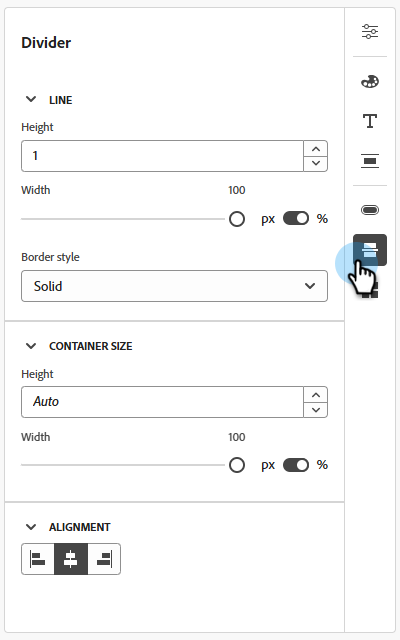

### グリッド設定 {#grid-settings}

_列の間隔_&#x200B;を使用して、グリッド内の間隔を制御します。

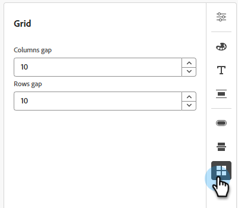

<table><tbody>
  <tr>
    <td>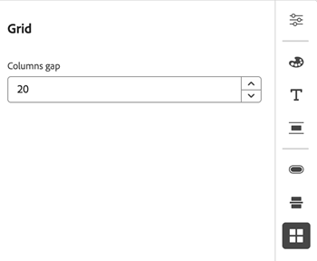</td>
    <td>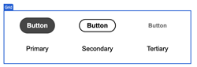</td>
  </tr>
 <tr>
    <td>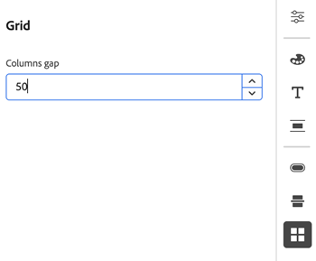</td>
    <td>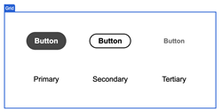</td>
  </tr>
</tbody></table>

終了したら「**保存**」をクリックします。

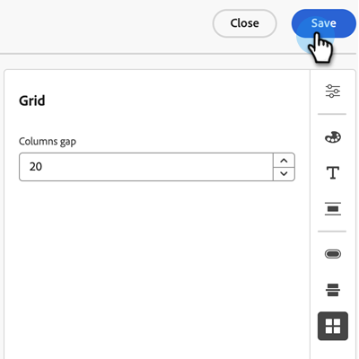

## 既存のテーマの編集 {#edit-a-brand-theme}

1. 手順に従って、[電子メールテンプレートを作成](/help/marketo/product-docs/email-marketing/email-designer/email-template-authoring.md#create-an-email-template)します。

1. _テンプレートのデザイン_&#x200B;画面で、**テーマの作成または編集**&#x200B;を選択します。

   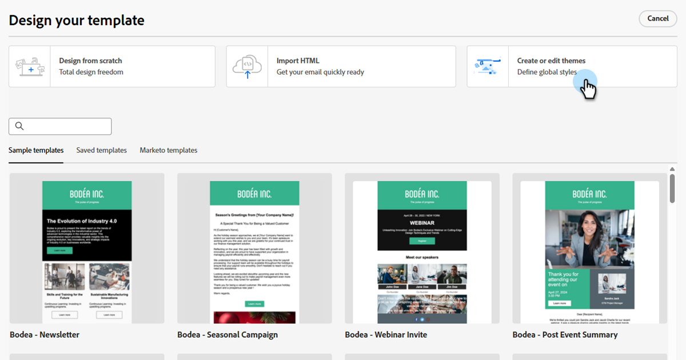

1. 「**マイテーマ**」タブをクリックします。

   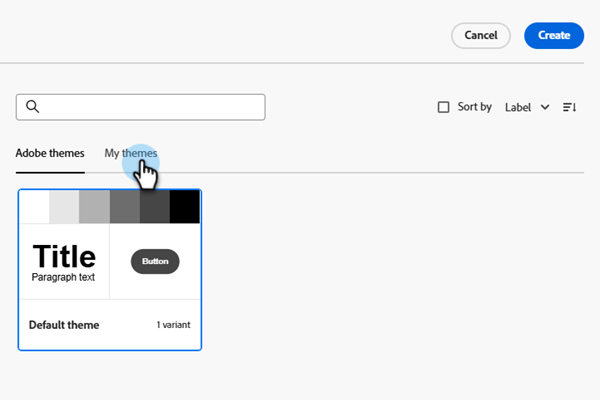

1. 必要なテーマを選択します。 _作成_ ボタンは、_編集_ ボタンになります。 「**編集**」をクリックします。

   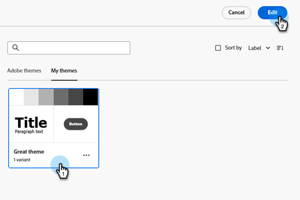

1. キャンバスが開いて編集できます。 **[設定](#settings)**&#x200B;にあるオプションのいずれかを変更します。

>[!TIP]
>
>自分の作品を保存することを忘れないでください。

## ブランドテーマの使用 {#using-brand-themes}

メール、メールテンプレート、フラグメントでテーマを活用。

エディターで構造やコンポーネントを作成し、任意のブランドテーマとそのバリエーションを適用できます。

### 電子メール内 {#in-your-emails}

1. 手順に従って、[電子メールを作成](/help/marketo/product-docs/email-marketing/email-designer/email-authoring.md#create-an-email)します。

1. 作成後、**電子メールコンテンツの編集**&#x200B;をクリックします。

   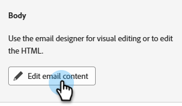

1. 「**デザインをゼロから作成**」を選択します。

   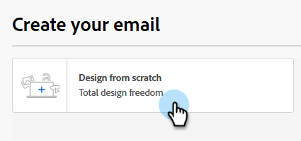

1. 「**テーマを使用**」を選択し、「**確認**」をクリックします（デフォルトで選択する必要があります）。

   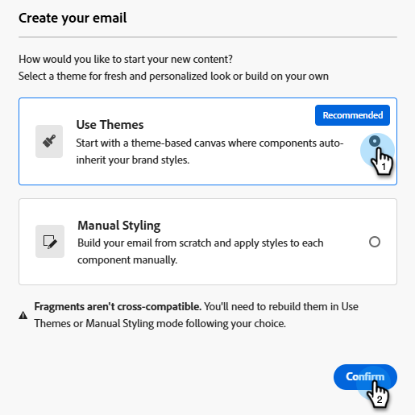

>[!NOTE]
>
>このオプションで作成したメールのみが、定義したブランドテーマを活用できます。

1. 右側のサイドバーにある&#x200B;_テーマ_ アイコンをクリックします。

   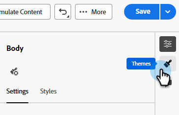

1. Adobeのテーマまたは作成済みのテーマから選択します。

   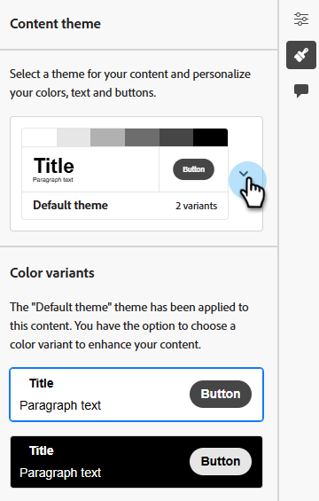

   >[!NOTE]
   >
   >* キャンバスでメールコンテンツをデザインし、コンテンツに適用するテーマを選択します。
   >* メールに含めることができるブランドテーマは1つだけです。
   >* このアセットで作成されたコンポーネントに対して、右側のパネルの「スタイル」タブから、テーマ内で使用できるスタイルオプションのいずれかを適用できます（例：call-to-actionはプライマリ/セカンダリ/テータリとして設定できます）。

1. あなたの望ましいデザインを実行してください。 例えば、テキストコンポーネントを選択して、テーマで定義されているいずれかの見出し/段落スタイルを適用できます。

   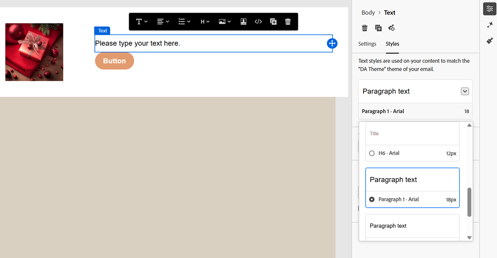

   >[!NOTE]
   >
   >「スタイル」タブは、コンポーネントのスタイルを設定するクリエイティブな自由度が高い、従来の手動スタイル設定メールとは異なります。

### テーマと互換性のあるテンプレートの作成 {#make-a-template-compatible}

1. 目的のテンプレートを検索して選択します。

1. **電子メールテンプレートを編集**&#x200B;をクリックします。

   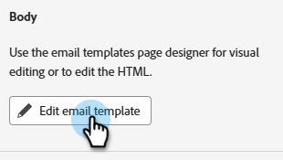

1. _テーマ_ アイコンをクリックし、**コンテンツからテーマを生成**&#x200B;をクリックします。

   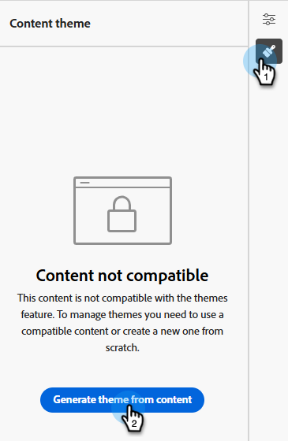

1. _テーマを作成_&#x200B;ウィンドウが開きます。 Marketo Engageは、スタイル設定要素を自動的に検出し、新しいテーマに統合します。

   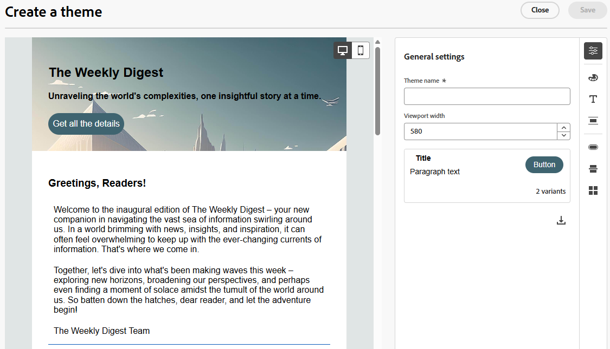

1. テーマに名前を付けます。

1. 必要な変更を加えます（ゼロからテーマを作成する場合と同じように）。 終了したら「**保存**」をクリックします。

   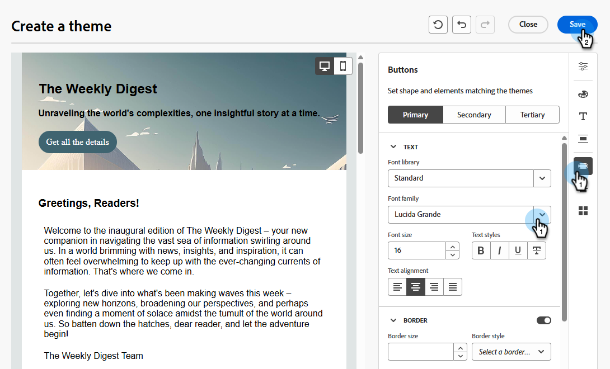

### フラグメント内の {#in-your-fragments}

1. 手順に従って、[&#x200B; フラグメントを作成](/help/marketo/product-docs/email-marketing/email-designer/fragments.md#create-a-fragment)します。

1. **[設定](#settings)**&#x200B;にあるオプションを使用して、コンテンツテーマをデザインします。

それ以降にキャンバスで作成されたすべてのフラグメントコンテンツは、選択したテーマを採用します。 また、コンテンツにテーマのバリエーションを適用することもできます。

フラグメントが公開されると、テーマを使用して作成されたあらゆる電子メール/メールテンプレートでフラグメントを使用できます。

## 注意事項 {#things-to-note}

* メールをゼロから作成する際に、ブランドやデザインに合った特定のスタイルをすばやく適用するには、テーマを使用してコンテンツの作成の開始を選択します。 クラシックモードを選択した場合は、メールをリセットしない限り、テーマを適用できません。

* フラグメントは、テーマモードとクラシックモード間で互換性がありません。 テーマが適用されるコンテンツでフラグメントを使用するには、テーマモードでフラグメントを作成する必要があります。

* テーマを更新しても、テーマを使用しているすべてのアセットに自動的にカスケードされることはありません。 テーマを更新するには、個々のオブジェクトを編集する必要があります。

* テーマを削除しても、テーマを使用しているアセットには影響しません。
