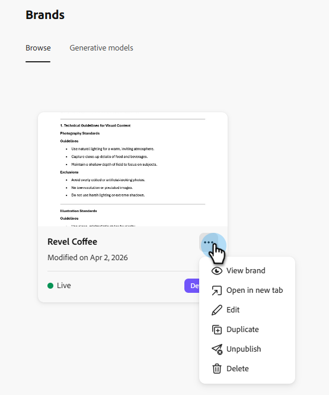

# ブランドの構築と管理 {#create-and-manage-brands}

ブランドガイドラインは、ブランドの視覚的および言語的 ID を確立する詳細なルールと標準のセットです。 すべてのマーケティングおよびコミュニケーションプラットフォーム全体で一貫したブランド表現を維持することを目的とした参照として機能します。

手作業でブランド情報を入力して整理したり、ブランドガイドラインのドキュメントをアップロードして情報を自動抽出したりできます。

>[!AVAILABILITY]
>
>Adobe Marketo EngageでAI アシスタントを使用するには、事前に[使用許諾契約書](https://www.adobe.com/legal/licenses-terms/adobe-dx-gen-ai-user-guidelines.html){target="_blank"}に同意する必要があります。 詳しくは、Adobeのアカウントマネージャーにお問い合わせください。

## ブランドへのアクセス {#access}

[!DNL Adobe Marketo Engage]の&#x200B;**[!UICONTROL ブランド]** メニューにアクセスするには、ユーザーに関連する権限を付与する必要があります。

+++  ブランド関連の権限を割り当てる方法を説明します

### ユーザ＆ロール {#users-and-roles}

1. _管理者_&#x200B;で、**ユーザーと役割**&#x200B;を選択します。

1. 必要な役割を選択します。

1. クリックして、**Access Design Studio** メニューを展開します。

1. **AI アシスタント**&#x200B;にアクセスを選択し、**保存**&#x200B;をクリックします。

+++

## ブランドの構築と管理 {#create-brand-kit}

ブランドガイドラインを作成および管理するには、詳細を自分で入力するか、ブランドガイドラインドキュメントをアップロードして、情報を自動的に抽出します。

1. _管理者_&#x200B;で、**新しいエクスペリエンス**&#x200B;を選択します。

   

1. 「_ブランドの管理_」の横にある「**編集**」をクリックします。

   

1. 「**[!UICONTROL ブランドを作成]**」をクリックします。

1. ブランドの&#x200B;**[!UICONTROL 名前]**&#x200B;を入力します。

1. PDFをドラッグ&amp;ドロップまたは選択して、ブランドガイドラインをアップロードし、自動的に関連するブランド情報を抽出します。 「**[!UICONTROL 作成]**」をクリックします。

   情報抽出プロセスが始まります。 完了までに数分かかる場合があります。

   

1. コンテンツとビジュアル作成基準が自動的に入力されます。 様々なタブを参照して、必要に応じて情報を調整します。

1. 各セクションまたはカテゴリの詳細メニューから、関連するブランド情報を自動的に抽出する参照を追加できます。

   既存のコンテンツを削除するには、「**[!UICONTROL セクションをクリア]**」または「**[!UICONTROL カテゴリをクリア]**」オプションを使用します。

   {width="800" zoomable="yes"}

   {width="800" zoomable="yes"}

1. 「**フィルター**」をクリックして、チャネルまたは要素タイプでガイドラインをフィルタリングします。

   

1. 設定が完了したら、**[!UICONTROL 保存]**、**[!UICONTROL 公開]**&#x200B;をクリックして、ブランドガイドラインをAI アシスタントで利用できるようにします。

1. 公開したブランドの変更を行うには、「**[!UICONTROL ブランドを編集]**」をクリックします。

   >[!NOTE]
   >
   >これにより、編集モードで一時的なコピーが作成され、公開後にライブバージョンが置き換えられます。

   

1. **[!UICONTROL ブランド]** ダッシュボードで、3つのドット アイコンをクリックして詳細メニューを開き、次の操作を行います。

* ブランドを表示
* 編集
* 複製
* 公開
* 非公開
* 削除

  

これで、AI アシスタントメニューの&#x200B;**[!UICONTROL ブランド]**&#x200B;ドロップダウンからブランドガイドラインにアクセスできるようになり、仕様に合わせたコンテンツとアセットを生成できます。

### デフォルトのブランドの設定 {#default-brand}

コンテンツを生成し、キャンペーン作成中に整列スコアを計算する際に、公開されたブランドをデフォルトで自動的に適用するように指定できます。

デフォルトのブランドを設定するには、**[!UICONTROL ブランド]**&#x200B;ダッシュボードに移動します。 詳細メニューを開くには、3つのドットアイコンをクリックし、**[!UICONTROL デフォルトのブランドとしてマーク]**&#x200B;を選択します。

