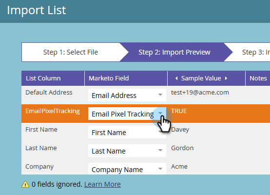
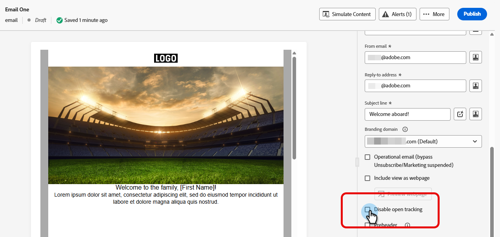
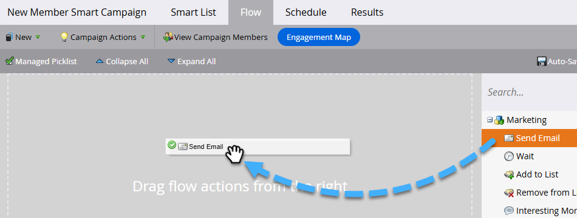
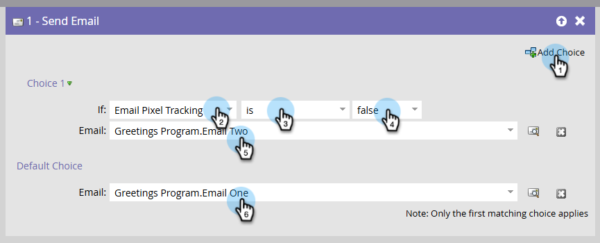

# CNIL ガイダンス：条件付きメール開封追跡 {#cnil}

[CNIL ガイドライン &#x200B;](https://experienceleaguecommunities.adobe.com/adobe-marketo-engage-27/understanding-cnil-s-updated-guidance-on-email-open-tracking-251632){target="_blank"}に従って、メール開封（ピクセル）トラッキングのエンドユーザーの同意を尊重するようにMarketo Engageを設定する方法について説明します。 このアプローチでは、カスタムのブール値フィールドを使用して、オープントラッキングが有効なメールと無効なメールのバリエーションを決定します。

## 手順1：カスタムブール値フィールドの作成 {#custom-field}

1. **管理者**&#x200B;領域で、**フィールド管理**&#x200B;をクリックし、**新しいカスタムフィールド**&#x200B;を選択します。

   

1. _オブジェクト_&#x200B;に対して、**人物**&#x200B;を選択します。 _Type_&#x200B;で、**Boolean**&#x200B;を選択します。 _Name_&#x200B;に、「電子メールピクセルトラッキング」（API名が自動生成）と入力します。 「**作成**」をクリックします。

   

## ステップ 2：同意フィールドに入力する {#populate}

1. データの読み込み（API同期または[CSV アップロード &#x200B;](https://experienceleague.adobe.com/en/docs/marketo/using/getting-started/quick-wins/import-a-list-of-people){target="_blank"}）を介して、各人物の電子メールピクセルトラッキングフィールド値を設定します。

   

1. カスタムフィールドが正しくマッピングされていることを確認します。

   

>[!NOTE]
>
>今後は、フォームへの入力中にデータを直接取得し、電子メールの開封追跡をオプトインまたはオプトアウトできるようにします。

## ステップ 3：メールのバリエーションを作成する {#variants}

2通のメールを作成。 電子メールの開封トラッキングは、電子メールDesignerと従来の電子メールエディターの両方で、デフォルトで有効になっていることに注意してください。

* **電子メール 1 （開封済みトラッキングを有効にする）**：電子メールを作成した後、追加の操作は必要ありません。 オープントラッキングを有効のままにします。

* **電子メール 2 （開封済みトラッキングを無効にする）**：電子メール 1を複製し、開封済みトラッキングを無効にします。

  

電子メール Designerでは、電子メールの右側にある&#x200B;_概要_ ペインの&#x200B;_詳細_ タブに、**開封トラッキングを無効にする** チェックボックスがあります。 従来のメールエディターでは、**開封トラッキングを無効にする** チェックボックスは、_メール設定_ メニューにあります。

**E メールデザイナー**

{width="800" zoomable="yes"}

**従来の電子メールエディター**

{width="800" zoomable="yes"}

## 手順4：スマートキャンペーンの設定 {#smart-campaign}

[&#x200B; スマートキャンペーンを作成](https://experienceleague.adobe.com/en/docs/marketo/using/product-docs/core-marketo-concepts/smart-campaigns/creating-a-smart-campaign/create-a-new-smart-campaign){target="_blank"}して、各人物が受信するメールを決定します。

1. スマートキャンペーンの「_Flow_」タブに、**メールを送信** フローステップを挿入します。

   {width="800" zoomable="yes"}

1. フローステップで、**選択肢を追加**&#x200B;をクリックします。 選択肢1では、**if**&#x200B;を&#x200B;_電子メールピクセルトラッキング_&#x200B;に設定し、演算子を&#x200B;_is_&#x200B;に設定し、値を&#x200B;_false_&#x200B;に設定します。 **電子メール**&#x200B;で、_電子メール 2_&#x200B;を選択します。

1. デフォルトの選択肢で、**Email**&#x200B;を&#x200B;_Email One_&#x200B;に設定します。

   

これにより、オープントラッキングに同意していないユーザーにはトラッキングされていない電子メールを送信し、同意したユーザーには標準のトラッキング済み電子メールを送信します。
