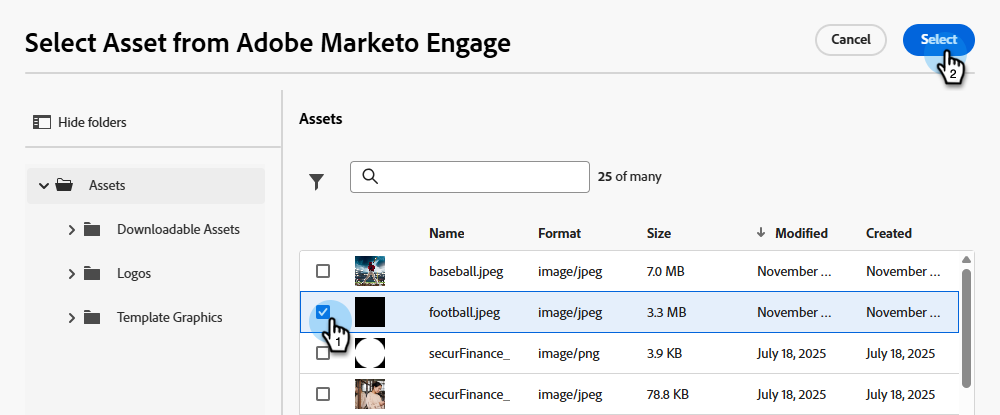

# 条件付きコンテンツ {#conditional-content}

条件付きコンテンツを使用すると、どのオーディエンスにどのようなコンテンツを表示するかを動的に制御できます。 既存のセグメントを利用して、事前に定義された基準にもとづいて受信者に表示される情報を決定できます。

>[!PREREQUISITES]
>
>少なくとも1つのセグメント [作成済み](/help/marketo/product-docs/personalization/segmentation-and-snippets/segmentation/create-a-segmentation.md)と[承認済み](/help/marketo/product-docs/personalization/segmentation-and-snippets/segmentation/approve-a-segmentation.md)があります。

## 条件付きコンテンツを追加 {#add-conditional-content}

1. 目的の電子メールを開き、**電子メールコンテンツの編集**&#x200B;をクリックします。

   

1. コンディショナルにするコンテンツを選択します（この例では、ヘッダー画像を選択します）。 _条件付きコンテンツを有効にする_ アイコンをクリックします。

   

1. ハイライトボックスがオレンジ色になります。 左側の&#x200B;_条件を選択_ アイコン （）をクリックして、バリエーションを定義します。

   {width="700" zoomable="yes"}

1. 目的のセグメントを選択し、**選択**&#x200B;をクリックします。

   

1. バリアントの既存の画像を置き換えるには、_画像を編集_ アイコンをクリックします。 新しい画像のソースを選択します。 この例では、Marketo Engage サブスクリプションで&#x200B;_Images &amp; Files_ ライブラリを選択しています。

   

1. 該当する画像を選択し、**選択**&#x200B;をクリックします。

   {width="600" zoomable="yes"}

1. 新しい画像が表示されます。 バリエーションの名前を変更して、識別しやすくすることをお勧めします。 省略記号をクリックし、**名前変更**&#x200B;を選択します。

   >[!NOTE]
   >
   >省略記号をクリックすると、バリエーションの定義された条件を表示したり、バリエーションを複製したりすることもできます。 複数のバリエーションがある場合は、削除オプションを使用できます。 バリエーションが1つしかない場合、バリエーションを削除する方法は、_コンディショナルコンテンツを有効にする_ アイコンをクリックするだけです（カーソルを合わせると、_コンディショナルコンテンツを無効にする_&#x200B;と表示されます）。

   {width="600" zoomable="yes"}

1. バリエーションを追加するには（オプション）、**バリエーションを追加**&#x200B;をクリックし、同じ手順に従います。

   

1. 完了すると、各バリエーションに選択したコンテンツが表示されます。

   

1. 受信者は、各セグメントで定義されたルールにもとづいて、コンテンツを確認できます。 上記の例では、Marketo Engage フィールド _お気に入りスポーツ_&#x200B;に「フットボール」がリストされているユーザー全員にフットボールの画像が表示されます。

>[!MORELIKETHIS]
>
>* [セグメントルールの定義](/help/marketo/product-docs/personalization/segmentation-and-snippets/segmentation/define-segment-rules.md)
>* [Marketo でのカスタムフィールドの作成](/help/marketo/product-docs/administration/field-management/create-a-custom-field-in-marketo.md)
