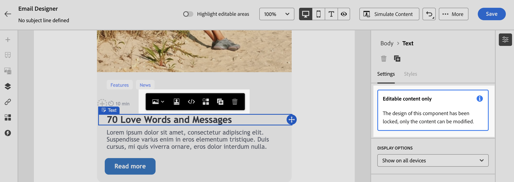

# メールテンプレート内のコンテンツをロック {#lock-content-email-templates}

Marketo Engageを使用すると、テンプレート全体または特定の構造やコンポーネントをロックすることで、メールテンプレートのコンテンツをロックできます。 これにより、意図しない編集や削除を防ぎ、テンプレートのカスタマイズをより細かく制御して、メールキャンペーンの効率と信頼性を向上させることができます。

>[!AVAILABILITY]
>
>コンテンツテンプレートを作成する権限を持つユーザーは、コンテンツのロックを有効にできます。

コンテンツのロックは、**構造** レベルまたは **コンポーネント** レベルのいずれかで適用できます。

* 構造がロックされている場合：

   * その構造内のすべてのコンテンツもロックされます。
   * 構造にコンテンツを追加することはできません。
   * デフォルトでは、構造を削除できません。「削除を許可」オプションを有効にすることで、この制限を上書きできます。
   * ロックされた構造内の個々のコンテンツコンポーネントは、編集可能として設定できます。

* 構造が編集可能である場合（構造がロックされていない場合）：

   * 個々のコンテンツコンポーネントは、その構造内でロックできます。
   * デフォルトでは、コンポーネントがロックされている場合、または「編集可能なコンテンツロックのみ」が選択されている場合は、コンポーネントを削除できません。「削除を許可」オプションを有効にすることで、この制限を上書きできます。

## メールテンプレートのロック {#lock-an-email-template}

### コンテンツのロックを有効にする {#enable-content-locking}

新しいテンプレートを作成する場合でも、既存のテンプレートを編集する場合でも、メールDesignerで直接メールテンプレートのコンテンツロックを有効にできます。

 – ここで編集を停止しました – 

1. メールテンプレートを開くか作成し、E メールデザイナーのコンテンツ編集画面にアクセスします。

1. 右側の&#x200B;**[!UICONTROL 本文]**&#x200B;ペインで、「**[!UICONTROL ガバナンス]**」オプションをオンに切り替えます。

1. **[!UICONTROL モード]**&#x200B;ドロップダウンリストから、テンプレートに必要なロックモードを選択します。

   * **[!UICONTROL コンテンツのロック]**：テンプレート内のコンテンツの特定のセクションをロックします。デフォルトでは、すべての構造とコンポーネントが編集可能になります。その後、個々の要素を選択的にロックできます。
   * **[!UICONTROL 読み取り専用]**：テンプレートのコンテンツ全体をロックして、変更できないようにします。

   {width="800" zoomable="yes"}

1. **[!UICONTROL コンテンツのロック]**&#x200B;モードを選択した場合は、ユーザーがテンプレートを操作する方法をさらに定義できます。「**[!UICONTROL コンテンツ編集を有効にする]**」オプションをオンに切り替えて、次のいずれかを選択します。

   * **[!UICONTROL 構造とコンテンツの追加を許可]**：ユーザーは、既存の構造の間に構造を追加したり、編集可能な構造内にコンテンツコンポーネントまたはフラグメントを追加したりすることができます。

   * **[!UICONTROL コンテンツの追加のみを許可]**：ユーザーは、編集可能な構造内にコンテンツコンポーネントまたはフラグメントを追加できますが、構造を追加または複製することはできません。

1. ロックモードを選択した後、**[!UICONTROL コンテンツのロック]**&#x200B;モードを選択した場合は、ロックする構造やコンポーネントを定義できます。

   * [詳しくは、構造のロック方法を参照してください](#lock-structures)
   * [詳しくは、コンポーネントのロック方法を参照してください](#lock-components)

   **[!UICONTROL 読み取り専用]**&#x200B;モードを選択した場合は、通常どおりテンプレートの最終処理と保存を続行できます。

テンプレート本文を選択して、テンプレートを設計する際に、いつでも&#x200B;**[!UICONTROL ガバナンス]**&#x200B;設定を調整できます。これを行うには、右側のペインの上部にあるナビゲーションパネルの&#x200B;**[!UICONTROL 本文]**&#x200B;リンクをクリックします。

{width="800" zoomable="yes"}

### 構造をロック {#lock-structures}

テンプレート内の構造をロックするには、以下の操作を行います。

1. ロックする構造を選択します。

1. **[!UICONTROL ロックタイプ]**&#x200B;ドロップダウンリストで「**[!UICONTROL ロック済み]**」を選択します。

   {width="800" zoomable="yes"}

   >[!NOTE]
   >
   >デフォルトでは、ユーザーはロックされた構造を削除できません。「**[!UICONTROL 削除を許可]**」オプションを有効にすると、この制限を上書きできます。

構造をロックした後は、その構造内でそれ以上のコンテンツコンポーネントやフラグメントを複製または追加できません。また、ロックされた構造内のすべてのコンポーネントもデフォルトでロックされます。ロックされた構造内でコンポーネントを編集可能にするには、以下の操作を行います。

1. ロック解除するコンポーネントを選択します。

1. 「**[!UICONTROL 特定のロックを使用]**」オプションをオンに切り替えます。

1. **[!UICONTROL ロックタイプ]**&#x200B;ドロップダウンリストで「**[!UICONTROL 編集可能]**」を選択します。スタイルのロック中にコンテンツの編集を許可するには、「**[!UICONTROL 編集可能なコンテンツのみ]**」を選択します。[詳しくは、コンポーネントのロック方法を参照してください](#lock-components)

   {width="800" zoomable="yes"}

### コンポーネントをロック {#lock-components}

構造内の特定のコンポーネントをロックするには、以下の操作を行います。

1. コンポーネントを選択し、右側のペインで「**[!UICONTROL 特定のロックを使用]**」オプションを有効にします。

1. **[!UICONTROL ロックタイプ]**&#x200B;ドロップダウンリストから、優先するロックオプションを選択します。

   {width="800" zoomable="yes"}

   * **[!UICONTROL 編集可能なコンテンツロックのみ]**：コンポーネントのスタイルをロックしますが、コンテンツの編集は許可します。
   * **[!UICONTROL ロック済み]**：コンポーネントのコンテンツとスタイルの両方を完全にロックします。

   >[!NOTE]
   >
   >「**[!UICONTROL 編集可能]**」ロックタイプを使用すると、ユーザーはロックされた構造内でもコンポーネントを編集できます。[詳しくは、構造のロック方法を参照してください](#lock-structures)

1. デフォルトでは、ユーザーはロックされたコンポーネントを削除できません。「**[!UICONTROL 削除を許可]**」オプションをアクティベートすることで、削除を有効にできます。

### ロックされたコンテンツの特定 {#identify-locked-content}

テンプレート内のロックされた構造とコンポーネントを簡単に特定するには、左側のメニューにある&#x200B;**[!UICONTROL ナビゲーションツリー]**&#x200B;を使用します。このメニューでは、すべてのテンプレート要素の概要を視覚的に表示し、ロックされた項目はロックアイコンでハイライト表示され、編集可能な項目は鉛筆アイコンでハイライト表示されます。

次の例では、テンプレート本文に対してガバナンスが有効になっています。*構造 2* はロックされており、*コンポーネント 1* は編集可能ですが、*構造 3* は完全にロックされています。

{width="800" zoomable="yes"}

## ロックされたコンテンツを含むテンプレートを使用 {#use-templates-with-locked-content}

ロックされたコンテンツを含むテンプレートを使用する場合、**[!UICONTROL ガバナンスが有効になっています]**&#x200B;というメッセージが右側のペインに表示されます。

テンプレートに適用されたロックのタイプに応じて、テンプレートの構造とコンポーネントに対して様々なアクションを実行できます。テンプレート内のすべての編集可能な領域をすばやく識別するには、「**[!UICONTROL 編集可能な領域をハイライト表示]**」オプションをオンに切り替えます。

例えば、以下のテンプレートでは、上部の画像はロックされているので編集や削除を行うことができませんが、それ以外のすべての領域は編集可能です。

{width="800" zoomable="yes"}

適用できる様々なロックタイプについて詳しくは、次の節を参照してください。

* [構造をロック](#lock-structures)
* [コンポーネントをロック](#lock-components)

メールの編集と、設定されている関連コンテンツのロック設定の例を以下に示します。

<table>
<thead>
  <tr>
    <th>コンテンツのロックタイプ</th>
    <th>テンプレートの設定</th>
    <th>メールの編集</th>
  </tr></thead>
<tbody>
  <tr>
    <td>読み取り専用コンテンツテンプレート</td>
    <td></td>
    <td></td>
  </tr>
  <tr>
    <td>完全なコンテンツは編集可能ですが、ユーザーは構造やコンポーネントを追加することはできません</td>
    <td></td>
    <td></td>
  </tr>
  <tr>
    <td>削除できないロックされた構造</td>
    <td></td>
    <td></td>
  </tr>
  <tr>
    <td>スタイルがロックされ、削除できないコンポーネント。ユーザーはコンテンツの変更のみ可能です。</td>
    <td></td>
    <td></td>
  </tr>
  <tr>
    <td>ロックされた構造内の編集可能なコンポーネント。</td>
    <td></td>
    <td></td>
  </tr>
</tbody>
</table>
