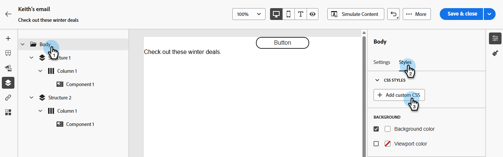
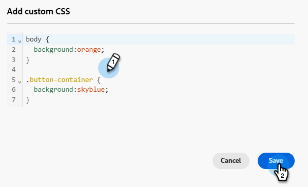
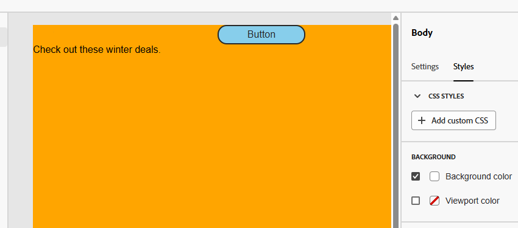

# メールコンテンツへのカスタム CSS の追加 {#custom-css}

Marketo Engageの電子メールDesignerに独自のカスタム CSSを直接追加し、高度で具体的なスタイルを設定できます。

## カスタム CSS の定義 {#define-custom-css}

1. 少なくとも1つのコンポーネントを追加して、メールDesignerに一部のコンテンツが定義されていることを確認します。

1. 左側の&#x200B;**[!UICONTROL ナビゲーションツリー]**&#x200B;または右側のペインから&#x200B;**[!UICONTROL 本文]**&#x200B;を選択します。 右側に&#x200B;**[!UICONTROL CSS スタイル]**&#x200B;が表示されます。

   {width="800" zoomable="yes"}

   >[!NOTE]
   >
   >**[!UICONTROL CSS スタイル]** セクションは、コンテンツがエディターに存在する場合にのみ使用できます。

1. 「**[!UICONTROL + カスタム CSS]**&#x200B;を追加」ボタンをクリックします。

   >[!NOTE]
   >
   >「**[!UICONTROL カスタム CSS を追加]**」ボタンは、「**[!UICONTROL 本文]**」を選択した場合にのみ使用できます。 ただし、コンテンツ内のすべてのコンポーネントにカスタム CSS スタイルを適用できます。

1. ポップアップ表示される専用のテキスト領域に CSS コードを入力します。 カスタム CSS [が有効で、適切な構文](#use-valid-css)に従っていることを確認してください。 終了したら「**保存**」をクリックします。

   

   >[!NOTE]
   >
   >ロックされたコンテンツ ](/help/marketo/product-docs/email-marketing/email-designer/content-locking.md)を含む[ テンプレートを使用する場合、コンテンツにカスタム CSSを追加することはできません。 ボタンラベルが&#x200B;**[!UICONTROL カスタム CSS]**&#x200B;を表示に変更され、表示されるカスタム CSSはすべて読み取り専用です。

1. CSSがコンテンツに適用されていることを確認します。 問題が発生しない場合は、「[ トラブルシューティング ](#troubleshooting)」セクションを確認してください。

   

   >[!NOTE]
   >
   >すべてのコンテンツを削除すると、セクションは非表示になり、以前に定義したカスタム CSS は適用されなくなります。 コンテンツを再度追加して、**[!UICONTROL CSS スタイル]** セクションを再表示します。 カスタム CSS が再度適用されます。

## 有効なCSSの使用 {#using-valid-css}

「**[!UICONTROL カスタム CSS を追加]**」テキスト領域に有効な CSS 文字列を入力できます。 適切に書式設定した CSS はコンテンツにすぐに適用されます。

>[!CAUTION]
>
>カスタム CSSのセキュリティは、お客様の責任で管理してください。 CSSに脆弱性や既存のコンテンツとの競合が発生していないことを確認します。
>
>意図せずコンテンツのレイアウトや機能が損なわれる可能性のあるCSSの使用を避けます。

+++ 有効なCSSのサンプル

有効な CSS の例を以下に示します。

```css
.acr-component[data-component-id="form"] {
  display: flex;
  justify-content: center;
  background: none;
}

.acr-Form {
  width: 100%;
  padding: 20px 100px;
  border-spacing: 0px 8px;
  box-sizing: border-box;
  margin: 0;
}

.acr-Form .spectrum-FieldLabel {
  width: 20%;
}

.acr-Form.spectrum-Form--labelsAbove .spectrum-FieldLabel,
.acr-Form [data-form-item="checkbox"] .spectrum-FieldLabel {
  width: auto;
}

.acr-Form .spectrum-Textfield {
  width: 100%;
}

#acr-form-error,
#acr-form-confirmation {
  width: 100%;
  padding: var(--spectrum-global-dimension-static-size-500);
  display: flex;
  align-items: center;
  flex-direction: column;
  justify-content: center;
  gap: var(--spectrum-global-dimension-static-size-200);
}

.spectrum-Form-item.is-required .spectrum-FieldLabel:after{
  content: '*';
  font-size: 1.25rem;
  margin-left: 5px;
  position: absolute;
}

/* Error field placeholder */
.spectrum-HelpText {
  display: none !important;
}

.spectrum-HelpText.is-invalid,
.is-invalid ~ .spectrum-HelpText {
  display: flex !important;
}
```

```css
@media only screen and (min-width: 600px) {
  .acr-paragraph-1 {
    width: 100% !important;
  }
}
```

+++

+++ 無効な CSS のサンプル

無効なCSSが入力された場合は、CSSを保存できないことを示すエラーメッセージが表示されます。 無効な CSS の例を以下に示します。

`<style>` タグの使用は許可されていません。

```html
<style type="text/css">
  .acr-Form {
    width: 100%;
    padding: 20px 100px;
    border-spacing: 0px 8px;
    box-sizing: border-box;
    margin: 0;
  }
</style>
```

中括弧の欠落などの無効な構文は許可されていません。

```css
body {
  background: red;
```

+++

## 技術的な実装 {#implementation}

次の例に示すように、カスタム CSS は、`data-name="global-custom"` 属性を持つ `<style>` タグの一部として `<head>` セクションの末尾に追加されます。 これにより、カスタムスタイルがコンテンツにグローバルに適用されます。

+++ 詳しくは、サンプルを参照してください

```html
<!DOCTYPE html>
<html>
  <head>
    <meta charset="utf-8">
    <meta name="content-version" content="3.3.31">
    <meta name="x-apple-disable-message-reformatting">
    <meta name="viewport" content="width=device-width,initial-scale=1.0">
    <style data-name="default" type="text/css">
      td { padding: 0; }
      th { font-weight: normal; }
    </style>
    <style data-name="grid" type="text/css">
      .acr-grid-table { width: 100%; }
    </style>
    <style data-name="acr-theme" type="text/css" data-theme="default" data-variant="0">
      body { margin: 0; font-family: Arial; }
    </style>
    <style data-name="media-default-max-width-500px" type="text/css">
      @media screen and (max-width: 500px) {
        body { width: 100% !important; }
      }
    </style>
    <style data-name="global-custom" type="text/css">
      /* Add your custom CSS here */
    </style>
  </head>
  <body>
    <!-- Minimal content -->
  </body>
</html>
```

+++

カスタム CSS は、E メールデザイナーの&#x200B;**[!UICONTROL 設定]**&#x200B;パネルでは解釈または検証されません。 これは完全に独立しており、「**[!UICONTROL カスタム CSS を追加]**」オプションを通じてのみ変更できます。

### ガードレール - インポートしたコンテンツ {#guardrails}

E メールデザイナーに読み込んだコンテンツでカスタム CSS を使用する場合は、次の点を考慮します。

* CSSを含む外部HTML](/help/marketo/product-docs/email-marketing/email-designer/email-authoring.md#import-html) コンテンツを[読み込む場合、そのコンテンツを変換しない限り、**[!UICONTROL 互換性モード]**&#x200B;になり、**[!UICONTROL CSS スタイル]** セクションは使用できません。

* Email Designerで作成されたコンテンツを読み込む際に、**[!UICONTROL カスタム CSSを追加]** オプションを通じて適用されたCSSが含まれる場合、以前に適用されたCSSは同じオプションから表示され、編集可能になります。

## トラブルシューティング {#troubleshooting}

カスタム CSSが適用されない場合は、以下の推奨事項をお試しください。

* CSSが有効であり、構文エラー（括弧が欠落している、プロパティ名が正しくないなど）がないことを確認します。 [詳細情報](#use-valid-css)

* CSSが`data-name="global-custom"`属性を持つ`<style>` タグに追加されていることを確認します。

* `global-custom` スタイルのタグに属性 `data-disabled` が `true` に設定されているかどうかを確認します。 その場合、カスタム CSSは適用されません。

  +++ 例：

  ```html
  <style data-name="global-custom" type="text/css" data-disabled="true"> body: { color: red; } </style>
  ```

  +++

* CSSが他のCSS ルールによって上書きされていないことを確認します。

   * ブラウザーの開発者ツールを使用して、コンテンツを調べ、CSSが正しいセレクターをターゲットにしていることを確認します。

   * 優先されるようにするには、宣言に `!important` を追加することを考慮します。

     +++ 例：

     ```css
     .acr-Form {
       background: red !important;
     }
     ```

     +++

>[!NOTE]
>
>Marketo Engage サポートは、カスタム CSSのトラブルシューティングを支援するように設定されていません。 CSSに関するサポートについては、Web開発者にお問い合わせください。
