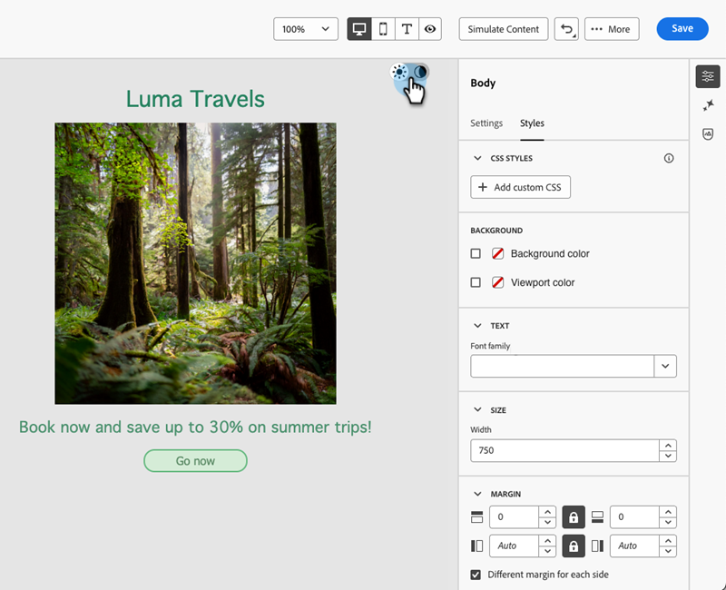
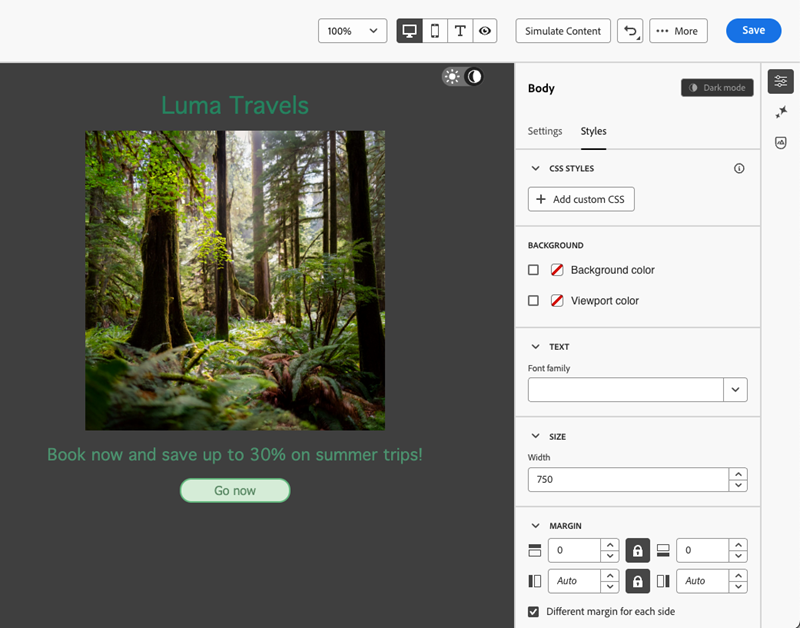
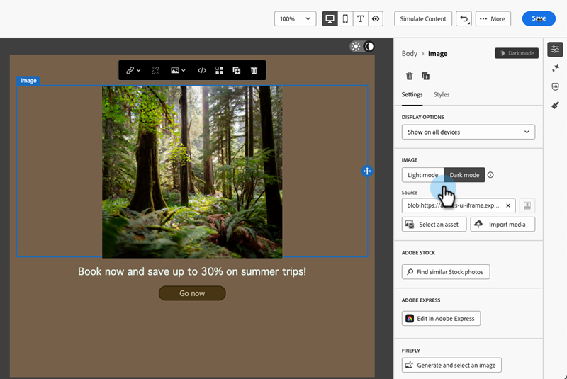
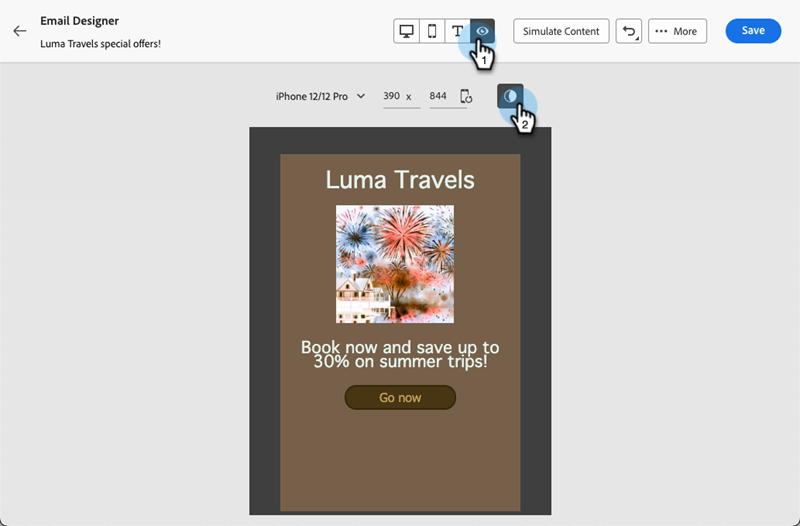
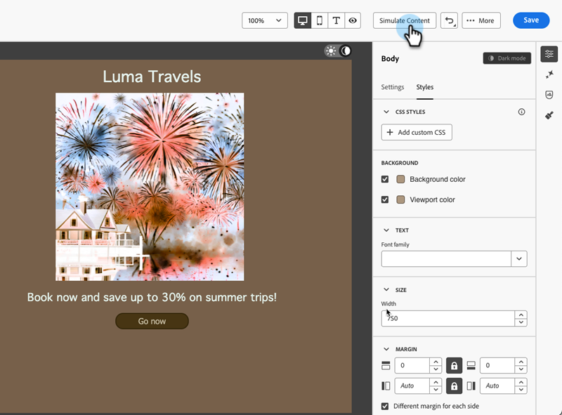

# ダークモード {#dark-mode}

電子メールをデザインする際に、電子メール Designerを使用すると、**[!UICONTROL ダークモード]** ビューに切り替えることができます。

**[!UICONTROL ダークモード]**&#x200B;では、ダークモードがオンの場合に電子メールクライアントをサポートして表示する特定のカスタム設定を定義できます。

## ダークモードとは {#what-is-dark-mode}

ダークモードでは、サポートメールクライアントやアプリで、テキストやボタンなどのUI要素に対して、背景が暗く、色が明るいメールを表示できます。 目の疲れを軽減し、バッテリー寿命を節約し、低光量環境での読みやすさを向上させ、より快適な視聴体験を実現します。

## ガードレール {#guardrails}

ダークモードのレンダリングは、メールクライアントによって大きく異なる場合があります。

ダークモードを使用する前に、主要なメールクライアントでどのように処理されるかを理解することが重要です。 区別するケースには、次の 3 つがあります。

### ダークモードをサポートしていないクライアント {#not-supporting}

次のような一部のメールクライアントでは、この機能をまったくサポートしていません。

* Yahoo! メール
* AOL

ダークモードのカスタム設定を定義するかどうかにかかわらず、これらのメールクライアントにはダークモードのレンダリングは表示されません。

### 独自のダークモードを適用しているクライアント {#default-support}

一部のメールクライアントでは、受信したすべてのメールに対して、独自のデフォルトのダークモードが体系的に適用されます。 色、背景、画像などは、そのメールクライアントに固有のダークモード設定で自動的に調整されます。 外部変更は不可能です。

以下に例を示します。

* Gmail（デスクトップ web メール、iOS、Android、モバイル web メール）
* Windows 版 Outlook
* Outlook Windows メール

この場合、メールDesignerでカスタムダークモード設定を定義すると、これらの設定はメールクライアントの設定によって上書きされます。

これらのメールクライアントはダークモードを処理しますが、特定のダークモードのデザインはレンダリングされません。

### カスタムダークモードをサポートしているクライアント {#custom-dark-mode}

一部の電子メールクライアントでは、`@media (prefers-color-scheme: dark)` クエリを使用してカスタムダークモードをレンダリングするオプションが提供されています。これは、[!DNL Marketo Engage] Email Designerで使用されている方法です。

このオプションを扱う主なクライアントは次のとおりです。

* Apple メール macOS
* Apple メール iOS
* Outlook macOS
* Outlook.com
* Outlook iOS
* Outlook Android

電子メールDesignerで定義した設定が表示されます。

>[!NOTE]
>
>メールDesignerで[&#x200B; カスタムダークモード設定](#define-custom-dark-mode)を定義する方法について説明します。

メールクライアントによっては、制限が適用される場合があります。 例えば、一部のクライアント（Apple Mail 16など）では、画像が存在する場合、ダークモードが生成されません。

最適な結果を得るには、ターゲットとするメールクライアントでコンテンツをテストします。 各クライアントのシミュレーションを確認するには、メールDesignerの[&#x200B; メールレンダリング &#x200B;](/help/marketo/product-docs/email-marketing/email-designer/test-email-rendering.md)機能を使用します。

## E メールデザイナーでのダークモード {#dark-mode-email-designer}

E メールデザイナーでのダークモードに関しては、考慮すべき 2 つの側面があります。

* サポートされているほとんどのメールクライアントで、デフォルトのダークモードがどのようにレンダリングされるかをプレビューできます。 [詳細情報](#preview-dark-mode)

* サポートする電子メールクライアントのデフォルト設定を上書きする場合は、編集中の電子メールでカスタムダークモード設定を定義できます。 [詳細情報](#define-custom-dark-mode)

### デフォルトのダークモードのプレビュー {#preview-dark-mode}

メールDesignerでダークモードにアクセスし、デフォルトのダークモード設定のプレビューを表示する方法について説明します。

1. E メールデザイナーのホームページで、「**[!UICONTROL ゼロからデザイン]**」オプションを選択します。

1. メールに[構造とコンテンツ &#x200B;](/help/marketo/product-docs/email-marketing/email-designer/email-authoring.md#add-structure-and-content)を追加します。

1. 右上の&#x200B;**[!UICONTROL ダークモード]**&#x200B;切り替えを有効にします。

   

1. デフォルトのダークモードのプレビューが表示されます。

   

デフォルトでは、E メールデザイナーのダークモードのプレビューには、画像とアイコンを除くすべての要素に「フルカラー反転」カラースキームが適用されます。

つまり、明るい要素と暗い要素のある領域を検出して反転させ、明るい背景が暗くなり、暗いテキストが明るくなり、暗い背景が明るくなり、明るいテキストが暗くなります。

>[!CAUTION]
>
>最終的なレンダリングは、受信者のメールクライアントによって異なる場合があります。 各メールクライアントのシミュレーションを表示するには、[&#x200B; メールレンダリング &#x200B;](/help/marketo/product-docs/email-marketing/email-designer/test-email-rendering.md)機能を使用します。

### カスタムダークモードの定義 {#define-custom-dark-mode}

**[!UICONTROL ダークモード]**&#x200B;に切り替えた後、受信者のメールクライアントでダークモードが有効になっている場合にのみ表示されるコンテンツの特定のスタイル要素を編集できます（この機能をサポートしている場合）。

>[!IMPORTANT]
>
>ダークモードの最終的なレンダリングはメールクライアントごとに異なるため、結果はクライアントごとに異なります。 [詳細情報](#guardrails)

Marketo Engageでは、メールDesigner カスタムダークモードのスタイル設定を活用するために、`@media (prefers-color-scheme: dark)` CSS クエリを使用します。このクエリは、ユーザーのメールクライアントがダークモードに設定されているかどうかを検出し、メールで定義されたダークテーマのデザインを適用します。

カスタムダークモードの設定を定義するには、次の手順に従います。

1. 電子メールDesignerの[&#x200B; ダークモードのプレビュー](#preview-dark-mode)に切り替えます。

1. テキスト、背景、ボタンなどのスタイル設定カラー属性を編集できます。

1. 画像やアイコンの色は変更できませんが、ダークモードでのみ特定のアセットを定義できます。 これを行うには、任意の画像を選択します。 **[!UICONTROL 設定]**&#x200B;パネルの専用切替スイッチを使用して&#x200B;**[!UICONTROL ダークモード]**&#x200B;に切り替え、別のアセットを選択します。

   

1. いつでも&#x200B;**[!UICONTROL ライブビュー]**&#x200B;に切り替えて、様々なデバイスサイズでコンテンツがどのようにレンダリングされるかを確認できます。 このビューから、ダークモード切り替えスイッチを選択して、様々なデバイスでコンテンツのダークモードのバージョンをプレビューします。

   

   >[!NOTE]
   >
   >ライブビューは、様々なデバイスサイズをまたいでレンダリングがどのように表示される可能性があるかを比較するのにデザインされた汎用プレビューです。 最終的なレンダリングは、受信者のメールクライアントによって異なる場合があります。

1. ダークモードの変更に満足したら、「**[!UICONTROL コンテンツをシミュレート]**」をクリックします。

   

1. 「**[!UICONTROL メールをレンダリング]**」を選択し、Litmus アカウントに接続します。 様々なメールクライアントでの最終的なダークモードレンダリングを確認できます。 [&#x200B; メールのレンダリング &#x200B;](/help/marketo/product-docs/email-marketing/email-designer/test-email-rendering.md)の詳細をご覧ください。

   >[!IMPORTANT]
   >
   >シミュレーションでは、ダークモードで電子メールがどのように表示されるかに非常に近いものの、実際のレンダリングは、電子メールサービスプロバイダーやデバイスの設定のバリエーションによって異なる場合があります。

## ベストプラクティス {#best-practices}

主要なメールクライアントでダークモードの採用が増加する中、[&#x200B; カスタムダークモード &#x200B;](#define-custom-dark-mode)を使用するかどうかにかかわらず、明るい環境と暗い環境の両方でメールがどのようにレンダリングされるかを考慮することが不可欠です。

ダークモードでは、色、背景、画像が変更され、デザインの選択が上書きされることがあります。 視覚的な一貫性、アクセシビリティ、ブランドの整合性を確保するには、次に示すベストプラクティスに従ってください。

**画像とロゴの最適化**

* ロゴやアイコンを透明な背景の PNG として保存し、ダークモードで白いボックスが表示されないようにします。

* 白色の背景または明るい背景がハードコードされた画像は回避します。

* 透明度がオプションでない場合は、不自然な色の反転を防ぐために、デザインでは単色の背景に画像を配置します。

**背景に対する注意**

* ライトモードとダークモードの両方で読みやすくするには、テキストと背景色の間に十分なコントラストを確保します。

* 重要なコンテンツについては、背景色にのみ依存することは回避します。 一部のクライアントでは、ダークモードで背景色を上書きすることがあるので、重要な情報が表示されていることを確認します。

**ダークモードでのアクセス可能なコンテンツのデザイン**

* 色覚異常のある人物でも簡単に区別できる色の組み合わせを使用します。

* 明るい背景と暗い背景の両方に対してコントラストを確保するのに、ミッドトーンパレットを使用します。

* 読みやすさを向上させ、Web コンテンツアクセシビリティガイドライン（WCAG）標準を満たすには、コントラストの高いアクセシブルな色の組み合わせを使用します。 WebAIM のコントラストチェッカーなどのツールを使用して、色のコントラストを検証します。

* 読みやすさに影響する場合があるので、細いフォントは回避します。 ブランドに細いフォントが必要な場合は、ダークモードで太字にします。

* 純粋な白色に純粋な黒色を重ねると、目への負担の原因となる場合があり、一部のメールクライアントにより自動的に反転される可能性があるので、これを回避します。

* ダークモードがサポートされていない場合は、アクセスできるフォールバックスタイル設定を指定します。

**ダークモード環境でのメールのテスト**

* 問題を早期に発見するには、反転したカラースキームを使用する E メールデザイナーの[ダークモードのプレビュー](#preview-dark-mode)を使用します。

* Litmusを活用した[電子メールレンダリング &#x200B;](/help/marketo/product-docs/email-marketing/email-designer/test-email-rendering.md)機能を使用して、主要な電子メールクライアントをまたいでデザインをシミュレートし、ダークモードでの色と画像の動作を確認します。
