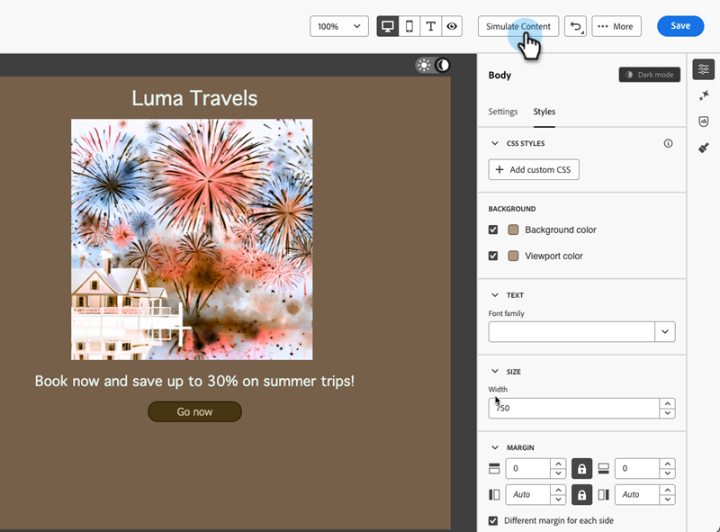

# ダークモード {#dark-mode}

メールをデザインする際に、Email Designerを使用して **[!UICONTROL ダークモード]** ビューに切り替えることができます。

**[!UICONTROL ダークモード]** では、ダークモードがオンの場合にメールクライアントをサポートすることで、表示する特定のカスタム設定を定義できます。

## ダークモードとは {#what-is-dark-mode}

ダークモードを使用すると、サポートされるメールクライアントやアプリで、テキスト、ボタン、その他の UI 要素に対して、暗い背景と明るい色のメールを表示できます。 目への負担を軽減し、バッテリー寿命を短縮し、低照度環境での読みやすさを向上させて、より快適な視聴体験を実現します。

## ガードレール {#guardrails}

ダークモードのレンダリングは、様々なメールクライアントで大きく異なる場合があります。

ダークモードを使用する前に、メインのメールクライアントによる処理方法を理解することが重要です。 区別するケースには、次の 3 つがあります。

### ダークモードをサポートしていないクライアント {#not-supporting}

次のような一部のメールクライアントでは、この機能をまったくサポートしていません。

* Yahoo! メール
* AOL

ダークモードのカスタム設定を定義しているかどうかに関係なく、これらのメールクライアントにはダークモードのレンダリングは表示されません。

### 独自のダークモードを適用しているクライアント {#default-support}

一部のメールクライアントでは、受信したすべてのメールに対して、独自のデフォルトのダークモードが体系的に適用されます。色、背景、画像などは、そのメールクライアントに固有のダークモード設定で自動的に調整されます。 外部の変更はできません。

以下に例を示します。

* Gmail（デスクトップ web メール、iOS、Android、モバイル web メール）
* Windows 版 Outlook
* Outlook Windows メール

この場合、メールDesignerでカスタムダークモードを定義すると、その設定はメールクライアントの設定によって上書きされます。

したがって、これらのメールクライアントはダークモードを処理しますが、特定のダークモードデザインはレンダリングされません。

### カスタムダークモードをサポートしているクライアント {#custom-dark-mode}

一部のメールクライアントには、`@media (prefers-color-scheme: dark)` クエリを使用してカスタムダークモードをレンダリングするオプションが用意されています。これは、[!DNL Marketo Engage] Email Designerで使用される方法です。

このオプションを処理する主なクライアントは次のとおりです。

* Apple メール macOS
* Apple メール iOS
* Outlook macOS
* Outlook.com
* Outlook iOS
* Outlook Android

メールDesignerで定義した設定が表示されます。

>[!NOTE]
>
>メールDesignerで [ カスタムダークモード設定 ](#define-custom-dark-mode) を定義する方法を説明します。

電子メールクライアントごとに、いくつかの制限が適用される場合があります。 例えば、画像が存在する場合、一部のクライアント（Apple Mail 16 など）ではダークモードが生成されません。

最適な結果を得るには、ターゲット設定しているメールクライアントでコンテンツをテストします。 各クライアントでシミュレーションを確認するには、メールDesignerの [ メールのレンダリング ](/help/marketo/product-docs/email-marketing/email-designer/test-email-rendering.md) 機能を使用します。

## E メールデザイナーでのダークモード {#dark-mode-email-designer}

E メールデザイナーでのダークモードに関しては、考慮すべき 2 つの側面があります。

* サポートされているほとんどのメールクライアントで、デフォルトのダークモードがどのようにレンダリングされるかをプレビューできます。[詳細情報](#preview-dark-mode)

* サポートされるメールクライアントのデフォルト設定を上書きする場合は、編集するメールにカスタムのダークモード設定を定義できます。 [詳細情報](#define-custom-dark-mode)

### デフォルトのダークモードのプレビュー {#preview-dark-mode}

メールDesignerでダークモードにアクセスする方法と、デフォルトのダークモード設定のプレビューを確認する方法について説明します。

1. E メールデザイナーのホームページで、「**[!UICONTROL ゼロからデザイン]**」オプションを選択します。

1. [ 構造とコンテンツ ](/help/marketo/product-docs/email-marketing/email-designer/email-authoring.md#add-structure-and-content) をメールに追加します。

1. 右上で、「**[!UICONTROL ダークモード]** 切り替えを有効にします。

   

1. デフォルトのダークモードのプレビューが表示されます。

   

デフォルトでは、E メールデザイナーのダークモードのプレビューには、画像とアイコンを除くすべての要素に「フルカラー反転」カラースキームが適用されます。

つまり、明るい要素と暗い要素の領域を検出してそれらを反転することで、明るい背景は暗くなり、暗いテキストは明るくなり、暗い背景は明るくなり、明るいテキストは暗くなります。

>[!CAUTION]
>
>最終的なレンダリングは、受信者のメールクライアントによって異なる場合があります。各メールクライアントのシミュレーションを確認するには、[ メールのレンダリング ](/help/marketo/product-docs/email-marketing/email-designer/test-email-rendering.md) 機能を使用します。

### カスタムダークモードの定義 {#define-custom-dark-mode}

**[!UICONTROL ダークモード]** に切り替えた後、受信者のメールクライアントでダークモードが有効な場合にのみ表示される、コンテンツの特定のスタイル要素を編集するように選択できます（その機能をサポートしている場合）。

>[!IMPORTANT]
>
>ダークモードの最終レンダリングはメールクライアントごとに異なるので、結果はクライアントによって異なる場合があります。 [詳細情報](#guardrails)

メールDesignerのカスタムダークモードスタイル設定を活用するために、Marketo Engageでは、`@media (prefers-color-scheme: dark)` CSS クエリを使用して、ユーザーのメールクライアントがダークモードに設定されているかどうかを検出し、メールで定義されたダークテーマのデザインを適用します。

カスタムダークモードの設定を定義するには、次の手順に従います。

1. メールDesignerの [ ダークモードプレビュー ](#preview-dark-mode) に切り替えます。

1. テキスト、背景、ボタンなどのスタイル設定色属性を編集します。

1. 画像やアイコンの色は変更できませんが、特定のアセットはダークモード用にのみ定義できます。 これを行うには、任意の画像を選択します。**[!UICONTROL 設定]**&#x200B;パネルの専用切替スイッチを使用して&#x200B;**[!UICONTROL ダークモード]**&#x200B;に切り替え、別のアセットを選択します。

   

1. コンテンツが様々なデバイスサイズでどのようにレンダリングされるかを確認するには、いつでも **[!UICONTROL ライブビューに切り替える]** ことができます。 この表示で、ダークモード トグルを選択して、様々なデバイスでのコンテンツのダークモードバージョンをプレビューします。

   

   >[!NOTE]
   >
   >ライブビューは、様々なデバイスサイズをまたいでレンダリングがどのように表示される可能性があるかを比較するのにデザインされた汎用プレビューです。最終的なレンダリングは、受信者のメールクライアントによって異なる場合があります。

1. ダークモードの変更に満足したら、「**[!UICONTROL コンテンツをシミュレート]**」をクリックします。

   

1. 「**[!UICONTROL メールをレンダリング]**」を選択し、Litmus アカウントに接続します。様々なメールクライアントでの最終的なダークモードレンダリングを確認できます。詳しくは、[ メールのレンダリング ](/help/marketo/product-docs/email-marketing/email-designer/test-email-rendering.md) を参照してください。

   >[!IMPORTANT]
   >
   >シミュレーションはダークモードでのメールの表示に非常に近いものですが、メールサービスプロバイダーやデバイスの設定の違いにより、実際のレンダリングは異なる場合があります。

## ベストプラクティス {#best-practices}

ダークモードの採用が主要なメールクライアント間で増加するにつれて、[ カスタムダークモード ](#define-custom-dark-mode) を使用しているかどうかに関係なく、メールが明暗の両方の環境でどのようにレンダリングされるかを考慮することが重要になります。

ダークモードでは、カラー、背景、画像を変更でき、デザインの選択肢を上書きする場合もあります。 視覚的な一貫性、アクセシビリティ、ブランドの整合性を確保するには、次に示すベストプラクティスに従ってください。

**画像とロゴの最適化**

* ロゴやアイコンを透明な背景の PNG として保存し、ダークモードで白いボックスが表示されないようにします。

* 白色の背景または明るい背景がハードコードされた画像は回避します。

* 透明度がオプションでない場合は、不自然な色の反転を防ぐために、デザインでは単色の背景に画像を配置します。

**背景に対する注意**

* ライトモードとダークモードの両方で読みやすくするには、テキストと背景色の間に十分なコントラストを確保します。

* 重要なコンテンツについては、背景色にのみ依存することは回避します。一部のクライアントでは、ダークモードで背景色を上書きすることがあるので、重要な情報が表示されていることを確認します。

**ダークモードでのアクセス可能なコンテンツのデザイン**

* 色覚異常のある人物でも簡単に区別できる色の組み合わせを使用します。

* 明るい背景と暗い背景の両方に対してコントラストを確保するのに、ミッドトーンパレットを使用します。

* 読みやすさを向上させ、Web コンテンツアクセシビリティガイドライン（WCAG）標準を満たすには、コントラストの高いアクセシブルな色の組み合わせを使用します。WebAIM のコントラストチェッカーなどのツールを使用して、色のコントラストを検証します。

* 読みやすさに影響する場合があるので、細いフォントは回避します。ブランドに細いフォントが必要な場合は、ダークモードで太字にします。

* 純粋な白色に純粋な黒色を重ねると、目への負担の原因となる場合があり、一部のメールクライアントにより自動的に反転される可能性があるので、これを回避します。

* ダークモードがサポートされていない場合は、アクセスできるフォールバックスタイル設定を指定します。

**ダークモード環境でのメールのテスト**

* 問題を早期に発見するには、反転したカラースキームを使用する E メールデザイナーの[ダークモードのプレビュー](#preview-dark-mode)を使用します。

* Litmus を活用した [ メールレンダリング ](/help/marketo/product-docs/email-marketing/email-designer/test-email-rendering.md) 機能を使用して、主要なメールクライアントをまたいでデザインをシミュレートし、ダークモードでの色と画像の動作を確認します。
