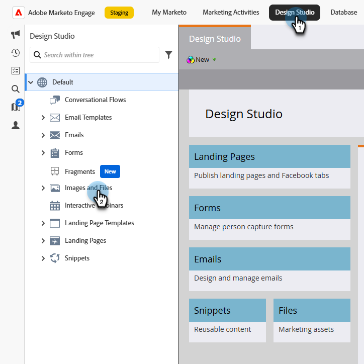

# Adobe Express を使用した画像の編集 {#edit-images-with-adobe-express}

Adobe Marketo Engageは、Adobe Expressとネイティブに統合されており、様々な画像編集ツールにアクセスできます。 これらのツールを使用して、Marketo Engage Design Studio の画像を編集できます。 この統合には、次のような主なメリットがあります。

* Marketo Engageで新しい画像を編集および保存することで、コンテンツの再利用が促進されました。

* 画像の更新や既存の画像の新しいバージョンの作成に要する時間と労力を削減します。

>[!NOTE]
>
>Adobe Expressは現時点では、PNG およびJPEG画像ファイル形式のみをサポートしています。

## Adobe Express Editor へのアクセス {#access-the-adobe-express-editor}

Adobe Express Editor にアクセスする方法は 2 つあります。

>[!BEGINTABS]

>[!TAB  画像名をクリックしてください ]

1. Marketo Engageで、**[!UICONTROL Design Studio]** に移動して、「**[!UICONTROL 画像とファイル]**」を選択します。

   {width="600" zoomable="yes"}

1. 編集する画像を選択します（または新しく作成します）。

   スクリーンショット

   >[!NOTE]
   >
   >* アセットをワークスペースとフォルダー別に表示するには、左上の **フォルダーを表示** アイコンをクリックして構造を開きます。
   >
   >* 任意の列でテーブルを並べ替えるには、列タイトルをクリックします。 タイトル行の矢印は、現在の並べ替え列と並べ替え順序を示します。

1. 画像の _詳細_ タブで、**Adobe Expressで編集** をクリックします。

   スクリーンショット

   >[!CAUTION]
   >
   >画像が既にメールまたはメールテンプレートで参照されている場合、編集を加えると、その画像が現在使用されているすべての場所で更新されます。

>[!TAB  画像およびファイルのアクション ]

1. Marketo Engageで、**[!UICONTROL Design Studio]** に移動して、「**[!UICONTROL 画像とファイル]**」を選択します。

   {width="600" zoomable="yes"}

   >[!NOTE]
   >
   >* アセットをワークスペースとフォルダー別に表示するには、左上の **フォルダーを表示** アイコンをクリックして構造を開きます。
   >
   >* 任意の列でテーブルを並べ替えるには、列タイトルをクリックします。 タイトル行の矢印は、現在の並べ替え列と並べ替え順序を示します。

1. 編集する画像の横にあるチェックボックスをオンにします。

   スクリーンショット

1. **[!UICONTROL 画像とファイルのアクション]** ドロップダウンで、**[!UICONTROL Adobe Expressで編集]** を選択します。

   >[!CAUTION]
   >
   >画像が既にメールまたはメールテンプレートで参照されている場合、編集を加えると、その画像が現在使用されているすべての場所で更新されます。

>[!ENDTABS]

## Enterprise ライセンスを持つユーザー {#users-with-an-enterprise-license}

Adobe Expressの Enterprise ライセンスをお持ちの場合は、Express Editor 全体にアクセスできます。 カラー、明るさ、シャープネス、コントラスト、サイズなどの画像設定を調整できます。 AI マジックオプションを使用すると、背景の削除、オブジェクトの挿入と削除、画像の一部の消去を行うことができます。

>[!IMPORTANT]
>
>すべてのAdobe Express編集機能にアクセスするには、購入したライセンスがMarketo Engage サブスクリプションと同じ IMS 組織に属している必要があります。 また、個々のユーザーは、Adobe Expressでライセンスを持っている必要があります。 [ ライセンスがない ](#users-without-an-enterprise-license) ユーザーは、Adobe Expressのクイックアクションにのみアクセスできます。

「Adobe Expressで編集」をクリックして、画像を開きます。

スクリーンショット

必要な変更を行い、ファイルを保存します。

スクリーンショット

「保存」をクリックして、アクションを完了します。

## Enterprise ライセンスを持たないユーザー {#users-without-an-enterprise-license}

Enterprise ライセンスを持たないユーザーでも、いくつかのクイックアクション編集機能にアクセスできます。 これらの機能は次のとおりです。

* 画像のサイズ変更
* 背景を削除
* 画像を切り抜く
* PNG に変換
* JPEGに変換

ページの「画像を切り抜き」をクリックします。

Adobe Express エディターで、画像に対して切り抜きを実行し、「保存」をクリックします。

注意：このアクションでは画像は上書きされませんが、さらに編集するための画像が表示されます。

左側のパネルの別のオプションを使用してさらに更新を行ったり、「保存」をクリックして既存の画像を上書きしたり、「新しいアセットとして保存」をクリックして新しい画像として保存したりできます。

「保存」をクリックして、アクションを完了します。

画像とファイルの一覧ページからのエディターへのアクセス
リストページで、編集する画像を選択し、ページの画像とファイルでの山形アクションボタンをクリックします。

「Adobe Expressで編集」をクリックします。

メールDesigner内のエディターへのアクセス

新しいメールDesignerで、編集する画像を選択します。

「Adobe Expressで編集」オプションが表示されます。 続行するには、ボタンをクリックします。

メモ：このアクションは、Marketo Design Studio リポジトリをソースとする画像に対して使用できます。

画像が使用中の場合は、加えた変更がそのコンテンツに影響を与えることを知らせる警告ダイアログが表示されます。 「続行」をクリックして、Adobe Express エディターに進みます。

Adobe Expressで編集を完了します

「保存」をクリックして、アクションを完了します。  編集された画像は元の画像と同じフォルダーに保存され、メール編集キャンバスでも更新されます。
