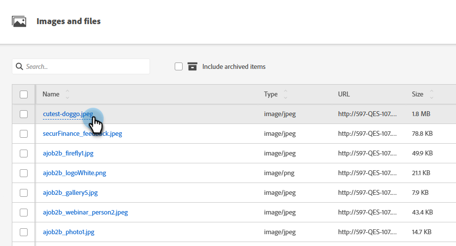
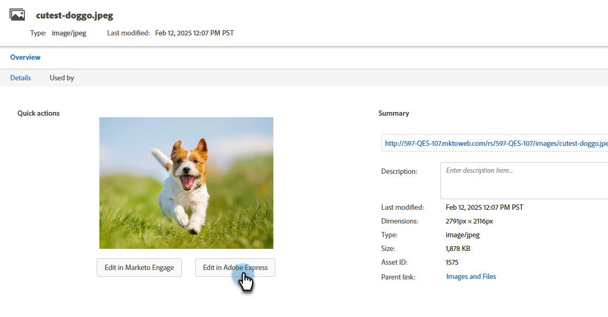
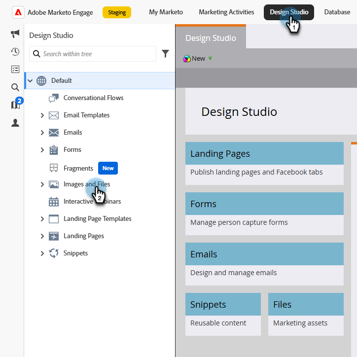
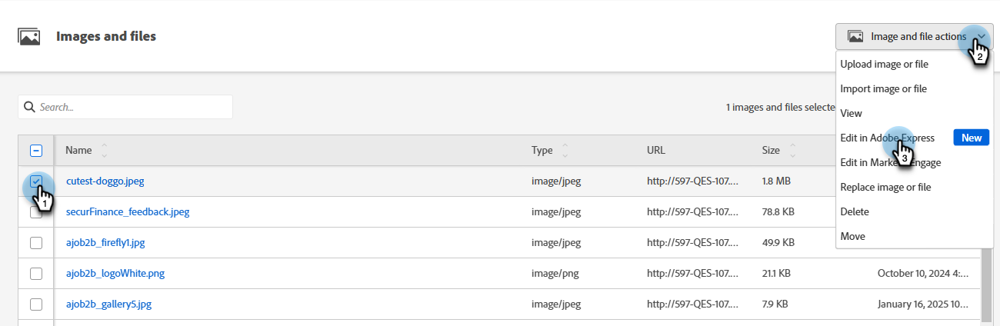
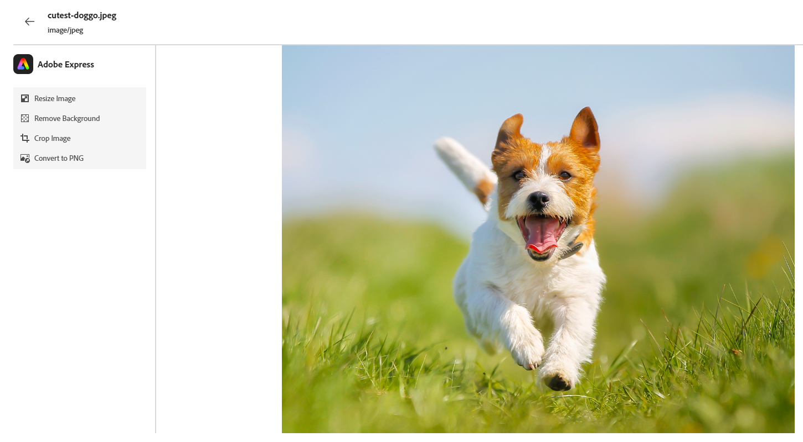
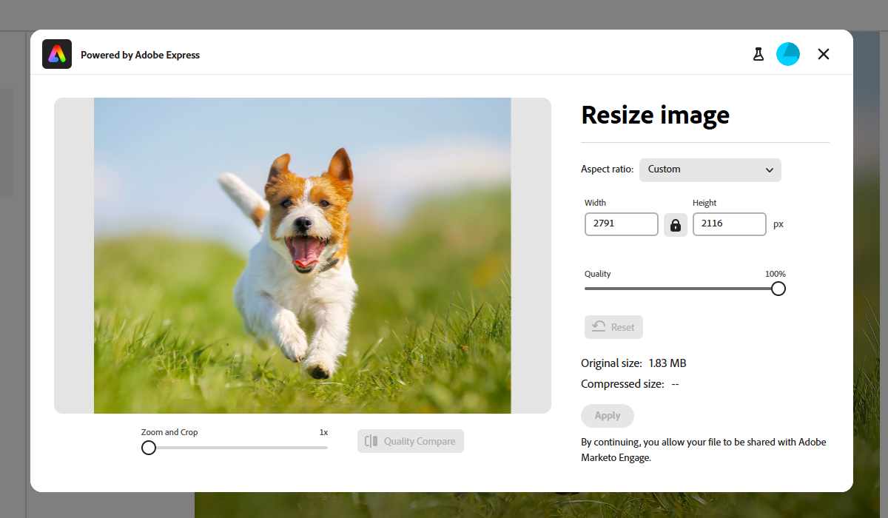
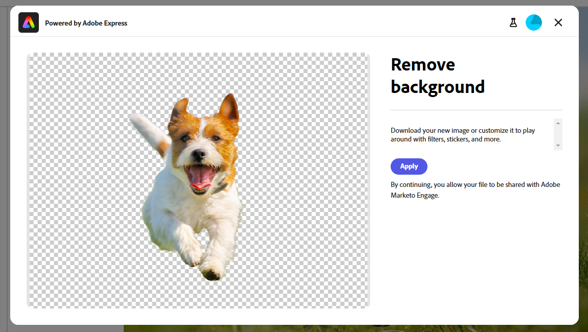
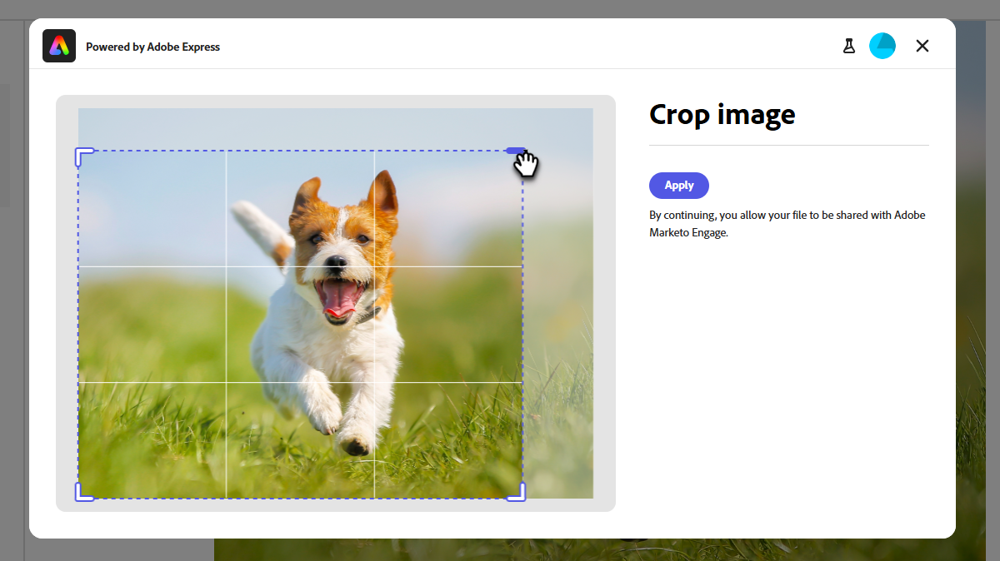
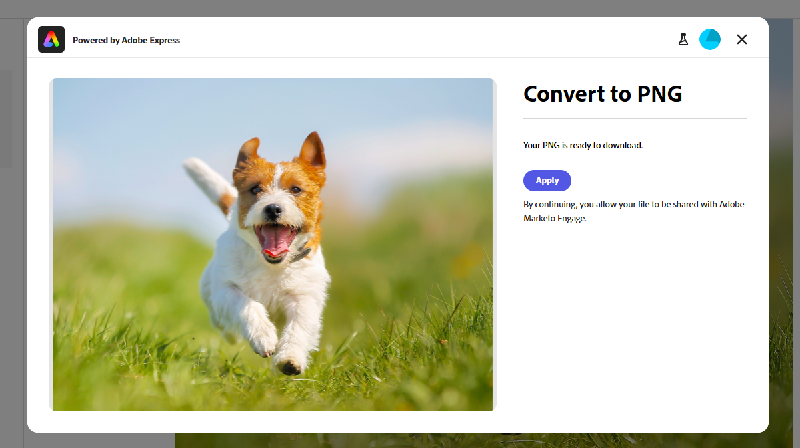
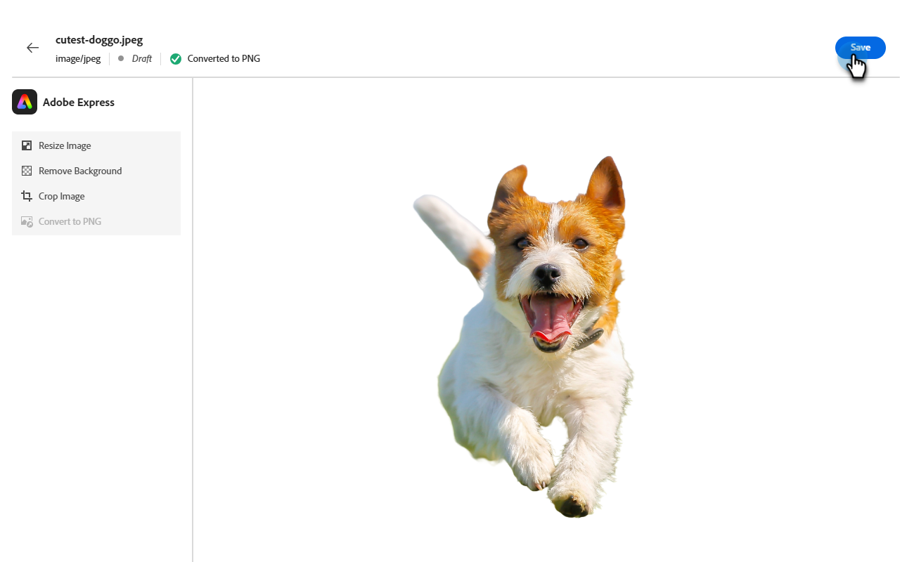

# Adobe Express を使用した画像の編集 {#edit-images-with-adobe-express}

Adobe Marketo Engageは、Adobe Expressとネイティブに統合されているため、様々な画像編集ツールを利用できます。 これらのツールを使用して、Marketo Engage Design Studioで画像を変更できます。 この統合には、次の主な利点があります。

* Marketo Engageで新しい画像を編集および保存することで、コンテンツの再利用を促進。

* 画像の更新や、既存の画像の新しいバージョンの作成にかかる時間と労力を削減。

>[!NOTE]
>
>Adobe Expressは、現時点ではPNGおよびJPEGの画像ファイル形式のみをサポートしています。

## Adobe Expressエディターへのアクセス {#access-the-adobe-express-editor}

Adobe Express エディターにアクセスするには、次の2つの方法があります。

* 画像名をクリックします
* _画像とファイルのアクション_ ドロップダウンメニュー

>[!BEGINTABS]

>[!TAB 画像名をクリック ]

1. Marketo Engageで、**[!UICONTROL Design Studio]**&#x200B;に移動し、**[!UICONTROL 画像とファイル]**&#x200B;を選択します。

   {width="600" zoomable="yes"}

1. 編集する画像を選択します。

   {width="600" zoomable="yes"}

   >[!NOTE]
   >
   >* ワークスペースとフォルダーでアセットを表示するには、左上の「**[!UICONTROL フォルダーを表示]**」アイコンをクリックして構造を開きます。
   >
   >* 任意の列で表を並べ替えるには、列タイトルをクリックします。 タイトル行の矢印は、現在の並べ替え列と順序を示します。

1. 画像&#x200B;_詳細_ タブで、「**[!UICONTROL Adobe Expressで編集]**」をクリックします。

   {width="600" zoomable="yes"}

   >[!CAUTION]
   >
   >画像が既に電子メールまたは電子メールテンプレートで参照されている場合、編集を行うと、現在使用されているあらゆる場所でその画像が更新されます。

>[!TAB 画像とファイルのアクション ]

1. Marketo Engageで、**[!UICONTROL Design Studio]**&#x200B;に移動し、**[!UICONTROL 画像とファイル]**&#x200B;を選択します。

   {width="600" zoomable="yes"}

   >[!NOTE]
   >
   >* ワークスペースとフォルダーでアセットを表示するには、左上の「**[!UICONTROL フォルダーを表示]**」アイコンをクリックして構造を開きます。
   >
   >* 任意の列で表を並べ替えるには、列タイトルをクリックします。 タイトル行の矢印は、現在の並べ替え列と順序を示します。

1. 編集する画像の横にあるチェックボックスをオンにします。 **[!UICONTROL 画像とファイルのアクション]** ドロップダウンで、「**[!UICONTROL Adobe Expressで編集]**」を選択します。

   {width="600" zoomable="yes"}

   >[!CAUTION]
   >
   >画像が既に電子メールまたは電子メールテンプレートで参照されている場合、編集を行うと、現在使用されているあらゆる場所でその画像が更新されます。

>[!ENDTABS]

## Adobe Express エンタープライズ版ライセンス {#adobe-express-enterprise-license}

### エンタープライズライセンスを持つユーザー {#users-with-an-enterprise-license}

Adobe Expressのエンタープライズライセンスをお持ちの場合は、Express エディター全体にアクセスできます。 カラー、明るさ、シャープネス、コントラスト、サイズなどの画像設定を調整できます。 「AI マジック」オプションを使用すると、背景の削除、オブジェクトの挿入と削除、画像の一部の消去を行うことができます。 各設定について詳しくは、[Adobe Express ユーザーガイド ](https://helpx.adobe.com/jp/express/user-guide.html){target="_blank"}を参照してください。

>[!IMPORTANT]
>
>購入したライセンスは、すべてのAdobe Express編集機能にアクセスするために、Marketo Engage サブスクリプションと同じIMS組織の下にある必要があります。 また、個々のユーザーはAdobe Expressでライセンスを取得する必要があります。 ライセンスのないユーザー[は、Adobe Expressのクイックアクションにのみアクセスできます。](#users-without-an-enterprise-license)

### エンタープライズライセンスを持たないユーザー {#users-without-an-enterprise-license}

エンタープライズライセンスをお持ちでない方は、引き続きいくつかのクイックアクション編集機能をご利用いただけます。 これらの機能は次のとおりです。

* [画像のサイズ変更](#resize-image)
* [背景を削除](#remove-background)
* [画像を切り抜く](#crop-image)
* [PNG/JPEGに変換](#convert-to-png-jpeg)

これらの機能には、画像ページの左側からアクセスできます。

{width="800" zoomable="yes"}

#### 画像のサイズ変更 {#resize-image}

1. **画像のサイズ変更**&#x200B;をクリックします。

1. 必要に応じて変更し、**適用**&#x200B;をクリックします。

{width="800" zoomable="yes"}

<table><tbody>
  <tr>
    <td style="width:25%"><b>縦横比</b></td>
    <td><b>縦横比</b> ドロップダウンで、<b>標準</b>を選択して事前計算された一般的な写真サイズから選択するか、<b> カスタム </b>を選択して独自の幅/高さを設定します。 また、特定のソーシャルメディアプラットフォームの標準サイズ（Pinterest、Snapchatなど）を選択することもできます。</td>
  </tr>
  <tr>
    <td style="width:25%"><b>幅と高さ</b></td>
    <td>デフォルトでは、縦横比はロックされ、サイズを調整しても画像の縦横比は変わりません。 必要に応じて、ロックボタンを選択して縦横比のロックを解除できます。</td>
  </tr>
  <tr>
    <td style="width:25%"><b>リセット</b></td>
    <td>「<b> リセット </b>」をクリックして、画像に対して行われた編集を削除し、元の状態に戻します。</td>
  </tr>
  <tr>
    <td style="width:25%"><b>ズームと切り抜き</b></td>
    <td><b> ズームと切り抜き</b>をクリックして、画像の特定の領域をズームインします。 ズーム後に<b>適用</b>をクリックすると、画像が現在表示されている画像に切り抜かれます。</td>
  </tr>
</tbody>
</table>

#### 背景を削除 {#remove-background}

1. 「**背景を削除**」をクリックします。

1. Adobe Expressでは、背景のない画像が表示されます。 ニーズに合った場合は、**適用**&#x200B;をクリックします。

{width="800" zoomable="yes"}

>[!TIP]
>
>結果に満足できない場合は、**X**&#x200B;をクリックしてウィンドウを閉じます。

#### 画像を切り抜く {#crop-image}

1. 「**[!UICONTROL 画像を切り抜き]**」をクリックします。

1. 画像の角をドラッグして、目的の切り抜きを作成します。

{width="800" zoomable="yes"}

1. 終了したら「**[!UICONTROL 適用]**」をクリックします。

#### PNG/JPEGに変換 {#convert-to-png-jpeg}

PNG ファイルをJPEG ファイルに、またはJPEG ファイルをPNG ファイルに変換します。

1. 「**[!UICONTROL PNG/JPEGに変換]**」をクリックします。

{width="800" zoomable="yes"}

1. 「**[!UICONTROL 適用]**」をクリックします。

## 作品を保存 {#save-your-work}

すべての編集が完了したら、**保存**&#x200B;をクリックして作業を保存します。

{width="800" zoomable="yes"}

編集した画像は、元の画像と同じフォルダーに保存されます。
