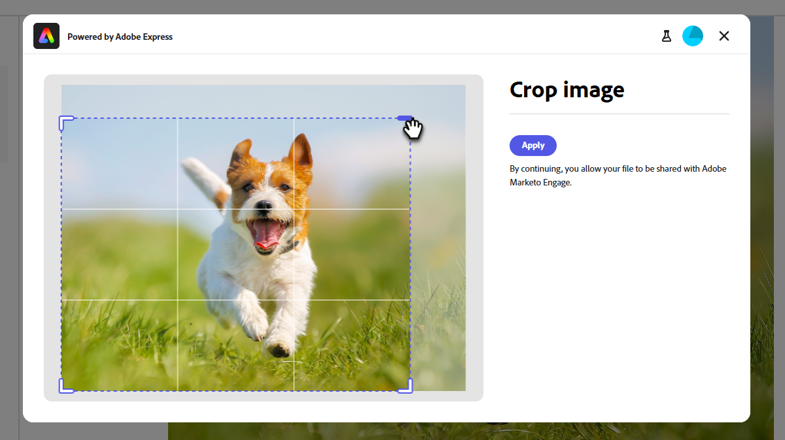

# Adobe Express を使用した画像の編集 {#edit-images-with-adobe-express}

Adobe Marketo Engageは、Adobe Expressとネイティブに統合されており、様々な画像編集ツールにアクセスできます。 これらのツールを使用して、Marketo Engage Design Studio の画像を編集できます。 この統合には、次のような主なメリットがあります。

* Marketo Engageで新しい画像を編集および保存することで、コンテンツの再利用が促進されました。

* 画像の更新や既存の画像の新しいバージョンの作成に要する時間と労力を削減します。

>[!NOTE]
>
>Adobe Expressは現時点では、PNG およびJPEG画像ファイル形式のみをサポートしています。

## Adobe Express Editor へのアクセス {#access-the-adobe-express-editor}

Adobe Express Editor にアクセスする方法は 2 つあります。

* 画像名をクリックします
* _画像とファイルのアクション_ ドロップダウンメニュー

>[!BEGINTABS]

>[!TAB  画像名をクリックしてください ]

1. Marketo Engageで、**[!UICONTROL Design Studio]** に移動して、「**[!UICONTROL 画像とファイル]**」を選択します。

   {width="600" zoomable="yes"}

1. 編集する画像を選択します。

   {width="600" zoomable="yes"}

   >[!NOTE]
   >
   >* アセットをワークスペースとフォルダー別に表示するには、左上の **[!UICONTROL フォルダーを表示]** アイコンをクリックして構造を開きます。
   >
   >* 任意の列でテーブルを並べ替えるには、列タイトルをクリックします。 タイトル行の矢印は、現在の並べ替え列と並べ替え順序を示します。

1. 画像の _詳細_ タブで、**[!UICONTROL Adobe Expressで編集]** をクリックします。

   {width="600" zoomable="yes"}

   >[!CAUTION]
   >
   >画像が既にメールまたはメールテンプレートで参照されている場合、編集を加えると、その画像が現在使用されているすべての場所で更新されます。

>[!TAB  画像およびファイルのアクション ]

1. Marketo Engageで、**[!UICONTROL Design Studio]** に移動して、「**[!UICONTROL 画像とファイル]**」を選択します。

   {width="600" zoomable="yes"}

   >[!NOTE]
   >
   >* アセットをワークスペースとフォルダー別に表示するには、左上の **[!UICONTROL フォルダーを表示]** アイコンをクリックして構造を開きます。
   >
   >* 任意の列でテーブルを並べ替えるには、列タイトルをクリックします。 タイトル行の矢印は、現在の並べ替え列と並べ替え順序を示します。

1. 編集する画像の横にあるチェックボックスをオンにします。 **[!UICONTROL 画像とファイルのアクション]** ドロップダウンで、**[!UICONTROL Adobe Expressで編集]** を選択します。

   {width="600" zoomable="yes"}

   >[!CAUTION]
   >
   >画像が既にメールまたはメールテンプレートで参照されている場合、編集を加えると、その画像が現在使用されているすべての場所で更新されます。

>[!ENDTABS]

## Adobe Express Enterprise ライセンス {#adobe-express-enterprise-license}

### Enterprise ライセンスを持つユーザー {#users-with-an-enterprise-license}

Adobe Expressの Enterprise ライセンスをお持ちの場合は、Express Editor 全体にアクセスできます。 カラー、明るさ、シャープネス、コントラスト、サイズなどの画像設定を調整できます。 AI マジックオプションを使用すると、背景の削除、オブジェクトの挿入と削除、画像の一部の消去を行うことができます。 各設定については、[Adobe Express ユーザーガイド ](https://helpx.adobe.com/express/user-guide.html){target="_blank"} を参照してください。

>[!IMPORTANT]
>
>すべてのAdobe Express編集機能にアクセスするには、購入したライセンスがMarketo Engage サブスクリプションと同じ IMS 組織に属している必要があります。 また、個々のユーザーは、Adobe Expressでライセンスを持っている必要があります。 [ ライセンスがない ](#users-without-an-enterprise-license) ユーザーは、Adobe Expressのクイックアクションにのみアクセスできます。

### Enterprise ライセンスを持たないユーザー {#users-without-an-enterprise-license}

Enterprise ライセンスを持たないユーザーでも、いくつかのクイックアクション編集機能にアクセスできます。 これらの機能は次のとおりです。

* [画像のサイズ変更](#resize-image)
* [背景を削除](#remove-background)
* [画像を切り抜く](#crop-image)
* [PNG/JPEGに変換](#convert-to-png-jpeg)

機能には、画像ページの左側からアクセスできます。

{width="800" zoomable="yes"}

#### 画像のサイズ変更 {#resize-image}

1. **画像のサイズ変更** をクリックします。

1. 必要な変更を加え、完了したら「**適用**」をクリックします。

{width="800" zoomable="yes"}

<table><tbody>
  <tr>
    <td style="width:25%"><b>縦横比</b></td>
    <td><b> 縦横比 </b> ドロップダウンで、「<b> 標準 </b>」を選択して事前に計算された一般的な写真サイズから選択するか、「<b> カスタム </b> を選択して独自の幅と高さを設定します。 また、特定のソーシャルメディアプラットフォームの標準サイズ（Pinterest、Snapchat など）を選択することもできます。</td>
  </tr>
  <tr>
    <td style="width:25%"><b>幅と高さ</b></td>
    <td>デフォルトでは、縦横比はロックされ、サイズを調整しても画像の縦横比は変わりません。 必要に応じて、ロック ボタンを選択して、アスペクト比をロック解除できます。</td>
  </tr>
  <tr>
    <td style="width:25%"><b>リセット</b></td>
    <td><b> リセット </b> をクリックして、画像に対して行われた編集を削除し、元の状態に戻します。</td>
  </tr>
  <tr>
    <td style="width:25%"><b>ズームと切り抜き</b></td>
    <td><b> ズームと切り抜き </b> をクリックして、画像の特定の領域をズームインします。 ズーム後に <b> 適用 </b> をクリックすると、画像が現在表示されている位置に切り抜かれます。</td>
  </tr>
</tbody>
</table>

#### 背景を削除 {#remove-background}

1. **背景を削除** をクリックします。

1. Adobe Expressが背景なしで画像を表示します。 必要に応じて、「**適用**」をクリックします。

{width="800" zoomable="yes"}

>[!TIP]
>
>満足のいく結果が得られない場合は、単に **X** をクリックしてウィンドウを閉じます。

#### 画像を切り抜く {#crop-image}

1. **[!UICONTROL 画像を切り抜き]** をクリックします。

1. 画像の隅をドラッグして、目的の切り抜きを作成します。

{width="800" zoomable="yes"}

1. 終了したら「**[!UICONTROL 適用]**」をクリックします。

#### PNG/JPEGに変換 {#convert-to-png-jpeg}

PNG ファイルをJPEG ファイルに、またはJPEG ファイルを PNG ファイルに変換します。

1. 「**[!UICONTROL PNG/JPEGに変換]**」をクリックします。

{width="800" zoomable="yes"}

1. 「**[!UICONTROL 適用]**」をクリックします。

## 作業内容を保存します {#save-your-work}

すべての編集が完了したら、「**保存** をクリックして作業内容を保存します。

{width="800" zoomable="yes"}

編集された画像は、元の画像と同じフォルダーに保存されます。
