# メールオーサリング {#email-authoring}

新しいMarketo Engage Email Designerでメールを作成、パーソナライズ、プレビューする方法について説明します。

>[!PREREQUISITES]
>
>新しい電子メールデザイナーにアクセスするには、Marketo Engage サブスクリプションを[Adobe Identity Management System （IMS） &#x200B;](https://experienceleague.adobe.com/ja/docs/marketo/using/product-docs/administration/marketo-with-adobe-identity/adobe-identity-management-overview){target="_blank"}に移行する必要があります。 まだ移行しておらず、迅速な対応をリクエストする場合は、アドビのアカウントチーム（担当のアカウントマネージャー）または [Marketo サポート](https://nation.marketo.com/t5/support/ct-p/Support){target="_blank"}にお問い合わせください。

## メールの作成 {#create-an-email}

メールデザイナーからのメールは、Design Studioでのみ作成でき、スマートキャンペーン/リストで参照するか、現時点ではメールプログラムで直接作成/使用できます。

>[!BEGINTABS]

>[!TAB デザインスタジオ]

1. [Adobe Experience Cloud](https://experienceleague.adobe.com/ja){target="_blank"}経由でMarketo Engageにログインします。

1. My Marketoで、**Design Studio**&#x200B;を選択します。

   

1. ツリーで、**電子メール （新規）**&#x200B;を選択します。

   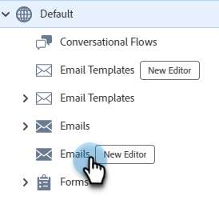

1. 「**メールを作成**」ボタンをクリックします。

   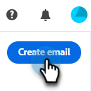

1. 電子メール名と件名を入力します。 「**作成**」をクリックします。

   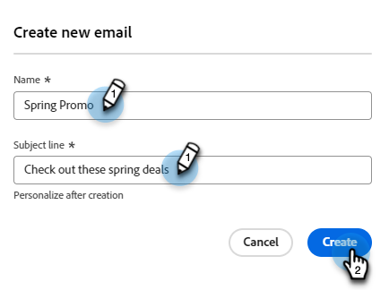

>[!TAB  メールプログラム ]

1. [Adobe Experience Cloud](https://experienceleague.adobe.com/ja){target="_blank"}経由でMarketo Engageにログインします。

1. メールプログラムを検索して選択（または作成）します。

   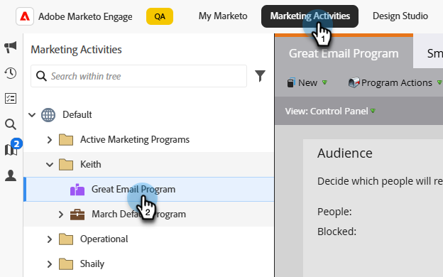

1. 新しいメールを作成するには、2つのオプションがあります。 メールプログラムの名前を右クリックし、**新しいローカルアセット**&#x200B;を選択するか、ダッシュボードの「電子メール」ボックスの「**+新しい電子メール**」ボタンをクリックします。 この例では、前者のフィールドを使用します。

   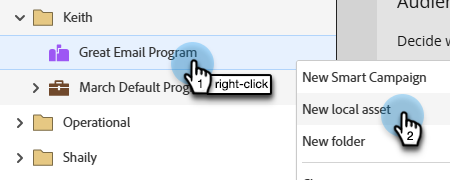

1. **電子メール（新しいエディター）**&#x200B;を選択します。

   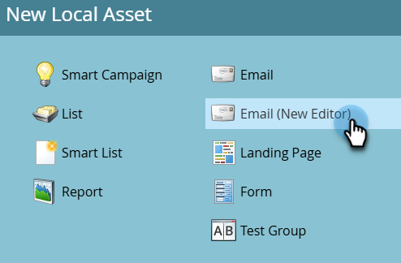

1. 電子メール名と件名を入力します。 「**作成**」をクリックします。

   

>[!ENDTABS]

次はメールのデザインです。

## コンテンツタイプを選択 {#choose-your-content-type}

1. 作成した電子メールで、**電子メールコンテンツの編集**&#x200B;をクリックします。

   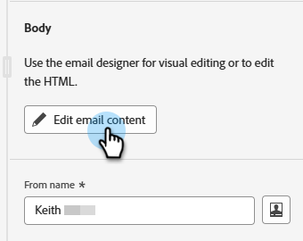

1. 「_メールを作成_」ページが読み込まれます。 いくつかのオプションから選択できます。

* ビジュアルメールエディターを使用して[&#x200B; ゼロからデザイン &#x200B;](#design-from-scratch)

* [HTMLまたはzip ファイルを使用して、独自のHTML](#import-html)を読み込む

* [既存のテンプレートを選択](#choose-a-template) （サンプルのいずれか1つ、または既に保存されたもの）

### ゼロからデザイン {#design-from-scratch}

メールエディターをゼロから作成する場合は、次のオプションを使用してコンテンツを定義します。

1. _メールを作成_ ページで、**ゼロからデザイン**&#x200B;を選択します。

1. テーマから始める（推奨）か、手動でのスタイル設定でゼロから構築するかを選択します。

   >[!NOTE]
   >
   >手作業によるスタイル設定で作成された電子メールでは、テーマで作成されたフラグメントを使用できません

1. メールに[構造とコンテンツ &#x200B;](#add-structure-and-content)を追加します。

1. [画像](#add-assets)を追加します。

1. コンテンツを[&#x200B; パーソナライズ &#x200B;](#personalize-content)します。

1. リンクを確認し、[&#x200B; トラッキングを編集](#edit-url-tracking)します。

### HTML の読み込み {#import-html}

既存のHTML コンテンツを読み込んで、メールをデザインできます。 コンテンツには、次のものがあります。

* スタイルシートが組み込まれたHTML ファイル

* HTML ファイル、スタイルシート（.css）および画像を含む.zip ファイル

>[!NOTE]
>
>.zip ファイル構造に制限はありません。 ただし、.zip フォルダーのツリー構造に合わせて、相対参照を指定する必要があります。

1. テンプレートページの「**HTMLを読み込み**」を選択します。

1. 目的のHTMLまたは.zip ファイルをドラッグ&amp;ドロップし（またはコンピューターからファイルを選択）、**読み込み**&#x200B;をクリックします。

   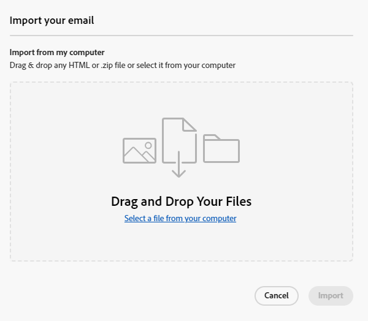

>[!NOTE]
>
>HTML コンテンツがアップロードされると、コンテンツは互換性モードになります。 このモードでは、テキストのパーソナライズ、リンクの追加、コンテンツへのアセットの追加のみを行うことができます。

[&#x200B; ビジュアルメールエディターツール &#x200B;](#add-structure-and-content)を使用して、インポートしたコンテンツに必要な変更を加えることができます。

### テンプレートの選択 {#choose-a-template}

テンプレートには2種類あります。

* **サンプルテンプレート**: Marketo Engageには、すぐに使える4つのメールテンプレートが用意されています。

* **保存したテンプレート**：テンプレート メニューを使用してゼロから作成したテンプレート、またはテンプレートとして保存するために作成した電子メールです。

>[!BEGINTABS]

>[!TAB  サンプルテンプレート ]

電子メールテンプレートデザインをすぐに始められるように、すぐに使えるテンプレートのひとつを選択しましょう。

1. 「サンプルテンプレート」タブはデフォルトで開いています。

1. 使用するテンプレートを選択します。

   

1. 「**このテンプレートを使用**」をクリックします。

   

1. ビジュアルコンテンツデザイナーを使用して、必要に応じてコンテンツを編集します。

>[!TAB 保存されたテンプレート ]

1. 「**保存したテンプレート**」タブをクリックし、目的のテンプレートを選択します。

   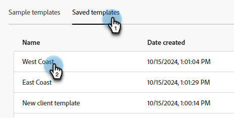

1. 「**このテンプレートを使用**」をクリックします。

   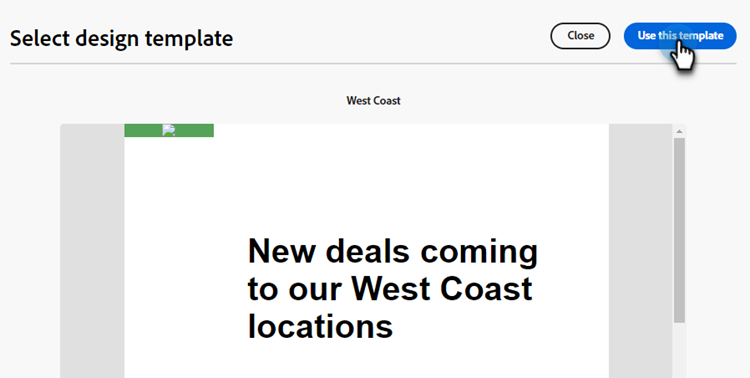

1. ビジュアルコンテンツデザイナーを使用して、必要に応じてコンテンツを編集します。

>[!ENDTABS]

## 構造とコンテンツの追加 {#add-structure-and-content}

1. コンテンツの作成または変更を開始するには、構造からアイテムをキャンバスにドラッグ&amp;ドロップします。 右側のペインで設定を編集します。

   >[!TIP]
   >
   >n:n列コンポーネントを選択して、選択した列数（3 ～ 10個）を定義します。 列の下にある矢印を移動して、各列の幅を定義することもできます。

   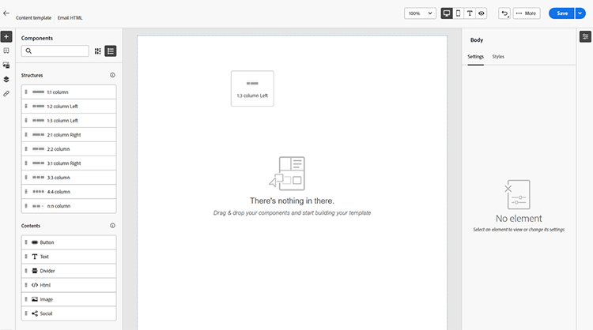

   >[!NOTE]
   >
   >各列のサイズは、構造コンポーネントの全幅の10%未満にすることはできません。 削除できるのは空の列のみです。

1. 「コンテンツ」セクションから、目的の項目をドラッグして、1つ以上の構造コンポーネントにドロップします。

   

1. 各コンポーネントは、「設定」タブまたは「スタイル」タブでカスタマイズできます。 フォント、テキストスタイル、余白などを変更します。

### フラグメントを追加 {#add-fragments}

1. フラグメントにアクセスするには、左側のナビゲーションで「_フラグメント_」アイコン（）を選択します。

   {width="700" zoomable="yes"}

1. 任意のフラグメントを構造コンポーネントのプレースホルダーにドラッグ&amp;ドロップします。

エディターは、メール構造のセクション/エレメント内でフラグメントをレンダリングします。 フラグメントのコンテンツは、構造内で動的に更新され、コンテンツがメールにどのように表示されるかを示します。

>[!TIP]
>
>フラグメントをメール内の水平方向のレイアウト全体に配置する場合は、1:1列構造を追加してから、フラグメントをドラッグ&amp;ドロップします。

メールが保存されると、フラグメントの詳細ページの「_[!UICONTROL 使用者]_」タブに表示されます。 メールテンプレートに追加されたフラグメントは、テンプレート内では編集できません。ソースフラグメントがコンテンツを定義します。

### Assetsを追加 {#add-assets}

Marketo Engage インスタンスの[画像とファイル &#x200B;](/help/marketo/product-docs/demand-generation/images-and-files/add-images-and-files-to-marketo.md){target="_blank"} セクションに保存されている画像を追加します。

>[!NOTE]
>
>現時点では、新しいデザイナーにのみ画像を追加できます。他のファイルタイプは追加できません。

1. 画像にアクセスするには、アセットセレクターアイコンをクリックします。

   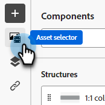

1. 目的の画像を構造コンポーネントにドラッグ&amp;ドロップします。

   

   >[!NOTE]
   >
   >既存の画像を置き換えるには、画像を選択し、右側の「設定」タブで「**アセットを選択**」をクリックします。

### レイヤー、設定、スタイル {#layers-settings-styles}

ナビゲーションツリーを開いて、特定の構造とその列/コンポーネントにアクセスし、より詳細な編集を行います。 アクセスするには、ナビゲーションツリーアイコンをクリックします。

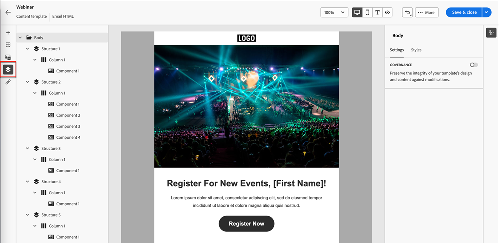

次の例では、列で構成される構造コンポーネント内のパディングと垂直方向の整列を調整する手順の概要を示します。

1. 構造コンポーネントの列をキャンバスで直接選択するか、左側に表示されている&#x200B;_ナビゲーションツリー_&#x200B;を使用して選択します。

1. 列ツールバーで、_[!UICONTROL 列を選択]_ ツールをクリックし、編集するツールを選択します。

   構造ツリーから選択することもできます。 その列の編集可能なパラメーターは、右側の&#x200B;_[!UICONTROL 設定]_ タブと&#x200B;_[!UICONTROL スタイル]_ タブに表示されます。

   

1. 列のプロパティを編集するには、右側の「_[!UICONTROL スタイル]_」タブをクリックし、必要に応じて変更します。

   * **[!UICONTROL 背景]**&#x200B;の場合、必要に応じて背景色を変更します。

     透明な背景の場合は、チェックボックスをオフにします。 **[!UICONTROL 背景画像]**&#x200B;設定を有効にして、単色の代わりに画像を背景として使用します。

   * **[!UICONTROL 線形]**&#x200B;の場合、_上位_、_中央_、または&#x200B;_下位_ アイコンを選択します。
   * **[!UICONTROL パディング]**&#x200B;の場合、すべての側面のパディングを定義します。

     パディングを調整する場合は、**[!UICONTROL 各辺の異なるパディング]**&#x200B;を選択します。 同期を解除するには、_ロック_ アイコンをクリックします。

   * **[!UICONTROL 詳細]** セクションを展開して、列のインラインスタイルを定義します。

   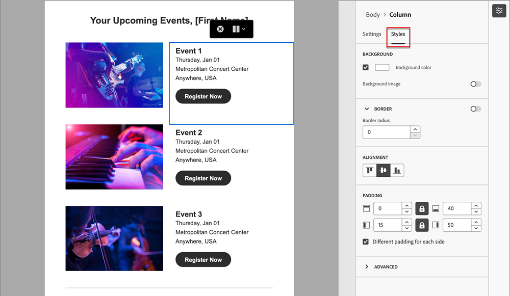

1. 必要に応じてこれらの手順を繰り返し、コンポーネント内の他の列の整列とパディングを調整します。

1. 変更を保存します。

### コンテンツのパーソナライズ {#personalize-content}

トークンは、新しいエディターでは従来と同じように機能しますが、アイコンは異なります。 次の例では、フォールバックテキストを含む名トークンの追加の概要を示しています。

1. テキストコンポーネントを選択します。 トークンを表示する場所にカーソルを置き、**パーソナライゼーションを追加** アイコンをクリックします。

   

1. 目的の[&#x200B; トークンタイプ &#x200B;](/help/marketo/product-docs/demand-generation/landing-pages/personalizing-landing-pages/tokens-overview.md){target="_blank"}をクリックします。

   

1. 目的のトークンを検索し、**...** アイコンをクリックします（「+」アイコンをクリックすると、フォールバックテキストのないトークンが追加されます）。

   

   >[!NOTE]
   >
   >「代替テキスト」は、デフォルト値の新しいエディター用語です。 例：``{{lead.First Name:default=Friend}}``。 選択したフィールドにユーザーの値がない場合は、このオプションをお勧めします。

1. 代替テキストを設定し、**追加**&#x200B;をクリックします。

   

1. 「**保存**」をクリックします。

### URL トラッキングを編集 {#edit-url-tracking}

メール内のリンクでMarketo トラッキング URLを有効にできない場合があります。 この情報は、表示先ページで URL パラメーターをサポートしていないためにページリンクエラーになる場合などに役立ちます。

1. リンク アイコンをクリックして、メール内のすべてのURLを表示します。

   

1. 鉛筆アイコンをクリックして、目的のリンクのトラッキングを編集します。

1. 「**トラッキングタイプ**」ドロップダウンをクリックし、選択します。

   

   <table><tbody>
     <tr>
       <td><b>mkt_tokを使用しないトラック</b></td>
       <td>宛先URLでmkt_tok クエリ文字列パラメーターを使用せずに、URLに対するトラッキングをアクティブ化します</td>
     </tr>
     <tr>
       <td><b>mkt_tokを使用したトラック</b></td>
       <td>宛先URLのmkt_tok クエリ文字列パラメーターを使用して、URLに対するトラッキングをアクティブ化します</td>
     </tr>
     <tr>
       <td><b>トラッキングしない</b></td>
       <td>URLのトラッキングを無効にします</td>
     </tr>
   </tbody>
   </table>

1. オプションで、URLにラベルを付けたり、タグを追加したりできます。

1. 終了したら「**保存**」をクリックします。

## アラートを確認 {#check-alerts}

コンテンツをデザインする際に、キー設定が見つからない場合は、画面の右上にアラートが表示されます。

アラートには、次の2種類があります。

**警告**

警告とは、次のような推奨事項やベストプラクティスを指します。

* **オプトアウトリンクがメール本文に存在しません**：登録解除リンクは必須ですが、メール本文に追加することはベストプラクティスです。

>[!NOTE]
>
>[業務用メール &#x200B;](/help/marketo/product-docs/email-marketing/general/functions-in-the-editor/make-an-email-operational.md) （マーケティング以外）に購読解除オプションを追加する必要はありません。

* **HTMLのテキストバージョンが空です**: HTML コンテンツを表示できない場合は、メール本文のテキストバージョンを定義する必要があります。

* **メール本文に空のリンクがあります**：メール内のすべてのリンクが正しいことを確認してください。

* **電子メールのサイズが上限の100 KBを超えています**：最適な配信を行うには、電子メールのサイズが100 KBを超えないようにしてください。

**エラー**

エラーが解決するまで、メールの送信やテストを行うことができません。

* **件名がありません**：電子メールの件名が必要です。

* **メッセージの電子メールバージョンが空です**：このエラーは、電子メールコンテンツが設定されていない場合に発生します。

## メールをテストする {#test-your-email}

メッセージコンテンツを定義したら、テストプロファイルを使用してメッセージをプレビューし、プルーフを送信し、一般的なデスクトップ、モバイル、web ベースのクライアントでのレンダリング方法を制御できます。 パーソナライズされたコンテンツを挿入した場合は、テストプロファイルデータを使用して、メッセージにどのように表示されるかを確認できます。

メールコンテンツをプレビューするには、**コンテンツをシミュレート**&#x200B;をクリックし、テストプロファイルを追加して、テストプロファイルデータを使用してメッセージを確認します。

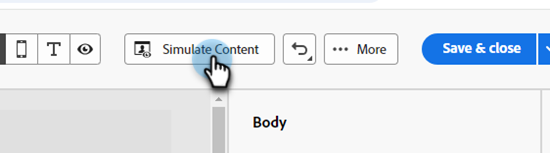

## メールの参照 {#reference-an-email}

メール Designerのメールは、メール、エンゲージメント、デフォルト、イベントプログラム（インタラクティブウェビナープログラムを除く）全体でアクセスできます。 Design Studioで電子メールを作成した場合、その電子メールは、他の電子メールと同様に、スマートキャンペーンやスマートリストから参照できます。

* 通常の手順[&#128279;](/help/marketo/product-docs/core-marketo-concepts/smart-lists-and-static-lists/creating-a-smart-list/create-a-smart-list.md)に従って スマートリストで参照します。

* 通常の手順[&#128279;](/help/marketo/product-docs/core-marketo-concepts/smart-campaigns/creating-a-smart-campaign/create-a-new-smart-campaign.md)に従って スマートキャンペーンで参照します。

>[!NOTE]
>
>保存されたメールのみが参照できます。 新しい電子メールデザイナーに「承認済み」ステータスがありません。

>[!MORELIKETHIS]
>
>[電子メールテンプレート &#x200B;](/help/marketo/product-docs/email-marketing/email-designer/email-template-authoring.md){target="_blank"}：新しいデザイナーで電子メールテンプレートを作成、デザイン、アクセスする方法について説明します。
