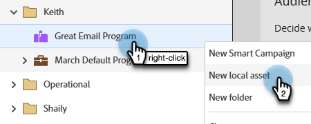
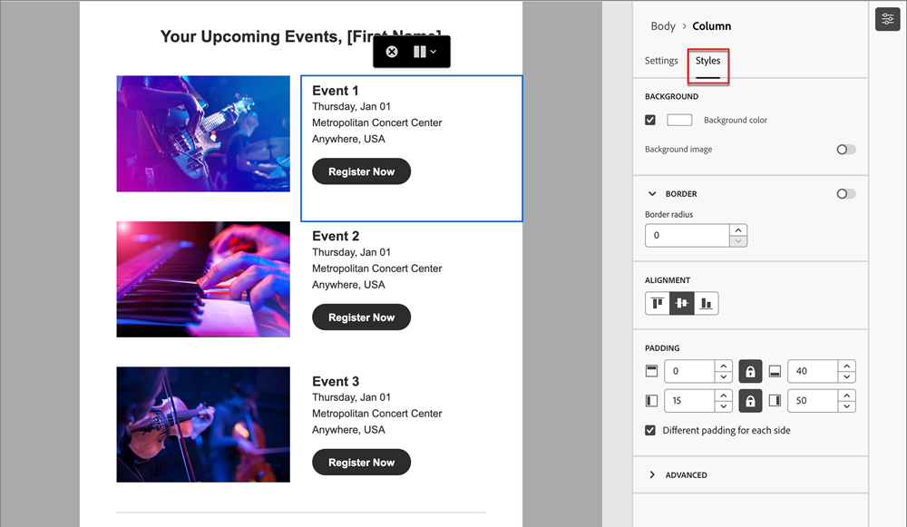
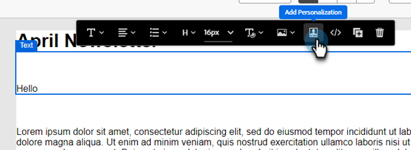

# メールオーサリング {#email-authoring}

新しいMarketo EngageメールDesignerでメールを作成、パーソナライズ、プレビューする方法について説明します。

>[!PREREQUISITES]
>
>新しい電子メールデザイナーにアクセスするには、Marketo Engageのサブスクリプションを [AdobeIdentity Management System （IMS） ](https://experienceleague.adobe.com/en/docs/marketo/using/product-docs/administration/marketo-with-adobe-identity/adobe-identity-management-overview) に移行する必要があります。 まだの場合は、迅速な対応をリクエストする際は、Adobeアカウントチーム （アカウントマネージャー）または [Marketo サポート ](https://nation.marketo.com/t5/support/ct-p/Support) にお問い合わせください。

## メールの作成 {#create-an-email}

メールDesignerからのメールは、Design Studio で作成してスマートキャンペーン/リストで参照したり、現時点ではメールプログラムで直接作成/使用したりすることのみ可能です。

>[!BEGINTABS]

>[!TAB デザインスタジオ]

1. [Adobe Experience Cloud](https://experiencecloud.adobe.com/){target="_blank"} を使用して、Marketo Engageにログインします。

1. My Marketoで、「**Design Studio**」を選択します。

   

1. ツリーで、「**メール （新しいエディター）**」を選択します。

   

1. 「**メールを作成** ボタンをクリックします。

   

1. メール名と件名を入力します。 「**作成**」をクリックします。

   

>[!TAB  メールプログラム ]

1. [Adobe Experience Cloud](https://experiencecloud.adobe.com/){target="_blank"} を使用して、Marketo Engageにログインします。

1. メールプログラムを検索および選択（または作成）します。

   

1. 新しいメールを作成するには、次の 2 つの方法があります。 メールプログラムの名前を右クリックして「**新しいローカルアセット**」を選択するか、ダッシュボードのメールボックスで「**+新しいメール**」ボタンをクリックします。 この例では、前者を行います。

   

1. **メール（新しいエディター）** を選択します。

   

1. メール名と件名を入力します。 「**作成**」をクリックします。

   

>[!ENDTABS]

作業は以上です。次に、メールをデザインします。

## コンテンツタイプを選択 {#choose-your-content-type}

1. 作成したメールで、「**メールコンテンツを追加**」をクリックします。

   

1. _メールを作成_ ページが読み込まれます。 次のいずれかのオプションを選択できます。

* ビジュアルメールエディターを使用した [ ゼロからのデザイン ](#design-from-scratch)

* HTMLまたは zip ファイルを使用した [ 独自のHTMLの読み込み ](#import-html)

* [ 既存のテンプレートを選択 ](#choose-a-template) （サンプルまたは既に保存したもの）

### ゼロからデザイン {#design-from-scratch}

メールエディターでゼロから開始する場合は、以下のオプションを使用してコンテンツを定義します。

1. _メールを作成_ ページで、「**ゼロからデザイン**」を選択します。

1. [ 構造とコンテンツ ](#add-structure-and-content) をメールに追加します。

1. [ 画像 ](#add-assets) を追加します。

1. コンテンツを [ パーソナライズ ](#personalize-content) します。

1. リンクを確認し、[ トラッキングを編集 ](#edit-url-tracking) します。

### HTML の読み込み {#import-html}

既存のHTMLコンテンツを読み込んでメールをデザインできます。 コンテンツには次のようなものがあります。

* スタイルシートが組み込まれたHTMLファイル

* HTMLファイル、スタイルシート（.css）および画像を含んだ.zip ファイル

>[!NOTE]
>
>.zip ファイル構造に制限はありません。ただし、.zip フォルダーのツリー構造に合わせて、相対参照を指定する必要があります。

1. テンプレートのデザインページで、「**HTMLを読み込む**」を選択します。

1. 目的のHTMLまたは.zip ファイルをドラッグ&amp;ドロップし（またはコンピューターからファイルを選択し）、「**読み込み**」をクリックします。

   

>[!NOTE]
>
>HTMLコンテンツがアップロードされると、コンテンツは互換モードになります。 このモードでは、テキストのパーソナライズ、リンクの追加、コンテンツへのアセットの追加のみを行うことができます。

[ 視覚的なメールエディターツール ](#add-structure-and-content) を使用して、読み込んだコンテンツに必要な変更を加えることができます。

### テンプレートを選択 {#choose-a-template}

テンプレートには、次の 2 種類があります。

* **サンプルテンプレート**:Marketo Engageには、4 つの標準メールテンプレートが用意されています。

* **保存済みのテンプレート**：これらは、「テンプレート」メニューを使用してゼロから作成したテンプレートか、作成してテンプレートとして保存することを選択したメールです。

>[!BEGINTABS]

>[!TAB  サンプルテンプレート ]

メールテンプレートデザインですぐに使える標準テンプレートを 1 つ選択します。

1. 「サンプルテンプレート」タブは、デフォルトで開いています。

1. 使用するテンプレートを選択します。

   

1. 「**このテンプレートを使用**」をクリックします。

   

1. ビジュアルコンテンツデザイナーを使用して、必要に応じてコンテンツを編集します。

>[!TAB  保存済みテンプレート ]

1. 「**保存済みのテンプレート**」タブをクリックし、目的のテンプレートを選択します。

   

1. 「**このテンプレートを使用**」をクリックします。

   

1. ビジュアルコンテンツデザイナーを使用して、必要に応じてコンテンツを編集します。

>[!ENDTABS]

## 構造とコンテンツを追加 {#add-structure-and-content}

1. コンテンツの作成または変更を開始するには、構造からキャンバスに項目をドラッグ&amp;ドロップします。 右側のパネルで設定を編集します。

   >[!TIP]
   >
   >n:n 列コンポーネントを選択して、列数（3～10）を任意に定義します。 また、列の下に矢印を移動して、各列の幅を定義することもできます。

   

   >[!NOTE]
   >
   >各列のサイズを構造コンポーネントの全幅の 10% 未満にすることはできません。 削除できるのは空の列のみです。

1. 「コンテンツ」セクションから、目的の項目をドラッグして、1 つ以上の構造コンポーネントにドロップします。

   

1. 各コンポーネントは、「設定」タブまたは「スタイル」タブでカスタマイズできます。 フォント、テキストスタイル、余白などを変更します。

### フラグメントを追加 {#add-fragments}

1. フラグメントにアクセスするには、左側のナビゲーションにある _フラグメント_ アイコン（）を選択します。

   {width="700" zoomable="yes"}

1. 任意のフラグメントを構造コンポーネントプレースホルダーにドラッグ&amp;ドロップします。

エディターは、メール構造のセクション/要素内でフラグメントをレンダリングします。 フラグメントのコンテンツは構造内で動的に更新され、コンテンツがメールにどのように表示されるかが表示されます。

>[!TIP]
>
>フラグメントをメール内の水平レイアウト全体に配置する場合は、1:1 列構造を追加してから、フラグメントをメール内にドラッグ&amp;ドロップします。

メールを保存すると、フラグメントの詳細ページの _[!UICONTROL 送信者]_ タブに表示されます。 メールテンプレートに追加されたフラグメントは、テンプレート内では編集できません。ソースフラグメントがコンテンツを定義します。

### Assetsを追加 {#add-assets}

Marketo Engageインスタンスの [ 画像とファイル ](/help/marketo/product-docs/demand-generation/images-and-files/add-images-and-files-to-marketo.md){target="_blank"} セクションに保存されている画像を追加します。

>[!NOTE]
>
>新しいデザイナーでは画像のみを追加でき、現時点では他のファイルタイプは追加できません。

1. 画像にアクセスするには、アセットセレクターアイコンをクリックします。

   

1. 目的の画像を構造コンポーネントにドラッグ&amp;ドロップします。

   

   >[!NOTE]
   >
   >既存の画像を置き換えるには、画像を選択し、右側の「設定」タブで **アセットを選択** をクリックします。

### レイヤー、設定、スタイル {#layers-settings-styles}

ナビゲーションツリーを開いて、特定の構造とその列/コンポーネントにアクセスし、より詳細な編集を行います。 アクセスするには、ナビゲーションツリーアイコンをクリックします。

次の例では、列で構成される構造コンポーネント内のパディングと垂直方向の整列を調整する手順を概説します。

1. キャンバスで構造コンポーネントの列を直接選択するか、左側に表示される _ナビゲーションツリー_ を使用して選択します。

1. 列ツールバーから _[!UICONTROL 列を選択]_ ツールをクリックし、編集する列を選択します。

   構造ツリーから選択することもできます。 その列の編集可能なパラメーターは、右側の _[!UICONTROL 設定]_ タブと _[!UICONTROL スタイル]_ タブに表示されます。

   

1. 列のプロパティを編集するには、右側の「_[!UICONTROL スタイル]_」タブをクリックし、必要に応じて変更します。

   * **[!UICONTROL 背景]** については、必要に応じて背景色を変更します。

     背景を透明にするには、このチェック ボックスをオフにします。 「**[!UICONTROL 背景画像]**」設定を有効にして、単色の代わりに画像を背景として使用します。

   * 「**[!UICONTROL 整列]**」では、「_上_」、「_中央_」または「_下_」アイコンを選択します。
   * **[!UICONTROL パディング]** については、すべての辺のパディングを定義します。

     パディングを調整する場合は、「**[!UICONTROL 各辺に異なるパディングを使用]**」を選択します。 _ロック_ アイコンをクリックして、同期を解除します。

   * 「**[!UICONTROL 詳細]**」セクションを展開すると、列のインラインスタイルを定義できます。

   

1. 必要に応じてこれらの手順を繰り返し、コンポーネント内の他の列の整列とパディングを調整します。

1. 変更を保存します。

### コンテンツのパーソナライズ {#personalize-content}

トークンは、古いバージョンで動作するのと同じように新しいエディターで動作しますが、アイコンの表示は異なります。 次の例では、代替テキストを使用した名トークンの追加について概説しています。

1. テキストコンポーネントを選択します。 トークンを表示する位置にカーソルを置き、「**パーソナライゼーションを追加** アイコンをクリックします。

   

1. 目的の [ トークンタイプ ](/help/marketo/product-docs/demand-generation/landing-pages/personalizing-landing-pages/tokens-overview.md){target="_blank"} をクリックします。

   

1. 目的のトークンを見つけて「**...**」アイコンをクリックします（「+」アイコンをクリックすると、代替テキストのないトークンが追加されます）。

   

   >[!NOTE]
   >
   >「代替テキスト」は、デフォルト値を表す新しいエディター用語です。 例：``{{lead.First Name:default=Friend}}``。選択したフィールドにその人物の値がない場合に備えてお勧めします。

1. 代替テキストを設定し、「**追加**」をクリックします。

   

1. 「**保存**」をクリックします。

### URL トラッキングを編集 {#edit-url-tracking}

メール内のリンクでMarketo トラッキング URL を有効にしたくない場合があります。 この情報は、表示先ページで URL パラメーターをサポートしていないためにページリンクエラーになる場合などに役立ちます。

1. リンクアイコンをクリックして、メール内のすべての URL を表示します。

   

1. 鉛筆アイコンをクリックして、目的のリンクのトラッキングを編集します。

1. **トラッキングタイプ** ドロップダウンをクリックし、選択を行います。

   

   <table><tbody>
     <tr>
       <td><b>mkt_tok を使用しないトラッキング</b></td>
       <td>宛先 URL の mkt_tok クエリ文字列パラメーターを使用せずに、URL のトラッキングをアクティブ化します</td>
     </tr>
     <tr>
       <td><b>mkt_tok を使用したトラッキング</b></td>
       <td>宛先 URL の mkt_tok クエリ文字列パラメーターを使用して、URL のトラッキングをアクティブ化します</td>
     </tr>
     <tr>
       <td><b>追跡しない</b></td>
       <td>URL のトラッキングを無効にします</td>
     </tr>
   </tbody>
   </table>

1. オプションで、URL にラベルを付けたり、タグを追加したりできます。

1. 終了したら「**保存**」をクリックします。

## アラートを確認 {#check-alerts}

コンテンツを設計する際、キー設定が見つからない場合は、画面の右上にアラートが表示されます。

アラートには次の 2 種類があります。

**警告**

警告は、次のような推奨事項やベストプラクティスを示しています。

* **メール本文にオプトアウトリンクがありません**：購読解除リンクは必須ですが、メール本文に追加するのがベストプラクティスです。

>[!NOTE]
>
>[ 運用中のメール ](/help/marketo/product-docs/email-marketing/general/functions-in-the-editor/make-an-email-operational.md) （マーケティング以外）に購読解除オプションの追加は必要ありません。

* **HTMLのテキストバージョンが空です**:HTMLコンテンツを表示できない場合に備えて、メール本文のテキストバージョンを定義する必要があります。

* **メールの本文に空のリンクが存在します**：メール内のすべてのリンクが正しいことを確認します。

* **メールのサイズが 100KB の制限を超えています**：配信を最適化するには、メールのサイズが 100KB を超えないようにしてください。

**エラー**

エラーは、解決されるまでメールの送信やテストを行うことはできません。

* **件名がありません**：電子メールの件名が必要です。

* **メッセージのメールバージョンが空です**：このエラーは、メールのコンテンツが設定されていない場合に発生します。

## メールのテスト {#test-your-email}

メッセージコンテンツを定義したら、テストプロファイルを使用してプレビュー、配達確認の送信、一般的なデスクトップ、モバイルおよび web ベースのクライアントでのレンダリング方法の制御を行うことができます。 パーソナライズされたコンテンツを挿入した場合は、テストプロファイルデータを使用して、メッセージでのコンテンツの表示方法を確認できます。

メールコンテンツをプレビューするには、「**コンテンツをシミュレート**」をクリックし、テストプロファイルを追加して、テストプロファイルデータを使用してメッセージを確認します。

## メールの参照 {#reference-an-email}

メールをメールプログラム内で作成した場合は、そのプログラムでのみ使用できます。 メールを Design Studio で作成した場合は、他のメールと同様に、スマートキャンペーンやスマートリストから参照できます。

* [ 通常の手順に従う ](/help/marketo/product-docs/core-marketo-concepts/smart-lists-and-static-lists/creating-a-smart-list/create-a-smart-list.md) ことによって、スマート・リストで参照します。

* スマートキャンペーンで参照するには [ 通常の手順に従います ](/help/marketo/product-docs/core-marketo-concepts/smart-campaigns/creating-a-smart-campaign/create-a-new-smart-campaign.md)。

>[!NOTE]
>
>参照できるのは、保存済みのメールのみです。 新しい電子メールデザイナーには「承認済み」ステータスはありません。

>[!MORELIKETHIS]
>
>[ メールテンプレート ](/help/marketo/product-docs/email-marketing/email-designer/email-template-authoring.md){target="_blank"}：新しいデザイナーでメールテンプレートを作成、デザインおよびアクセスする方法について説明します。
