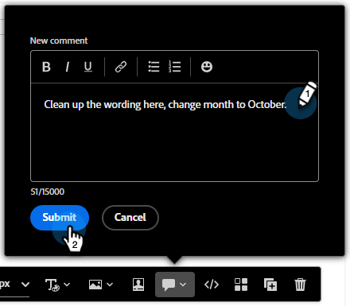

# メールの共同作業 {#email-collaboration}

メールの共同作業とコメント作成を使用すると、マーケティングチームは、Adobe Marketo EngageのメールDesigner内で、メールアセットをシームレスに確認、ディスカッションおよび最終決定することができます。 外部ツール（チャット、メールスレッド、スプレッドシートなど）でドラフトを共有する代わりに、リアルタイムでコメント、編集の提案、フィードバックの解決を行うことができます。 これにより、ワークフローが合理化され、エラーが減少し、メールキャンペーンが送信される前に関係者が調整されます。

## 権限 {#permissions}

メールアセットの編集権限を持つユーザーは、コメント、タグ付け、コメントの表示を行うことができます。 メールアセットに対する読み取り専用権限を持つユーザーは **コメントを追加または表示できません**。

## コメントを追加 {#add-comments}

1. メールDesignerでメールを作成または編集する際に、編集可能な任意のセクションの構造、列またはコンテンツ（テキスト、画像、ボタンなど）をクリックします。

   

1. コメントアイコンをクリックします。

   

1. フィードバック、質問、提案を入力します。

   

>[!NOTE]
>
>@mentions を使用してチームメイトにタグ付けします（「@John、冬のニュースレターを更新してください」）。

## すべてのコメントを表示 {#view-all-comments}

1. 右側の「_Collaboration_」アイコンをクリックします。

   

1. コメントに返信したり、コメントにリンクしたりします。

   

1. その他のアクションを表示するには、「**...**」アイコンをクリックします。

   

## コメントを解決する {#resolve-comments}

各コメントスレッドには次が含まれます。

* 返信：ディスカッションを続行します
* 解決：コメントを解決済みとしてマークします
* 未解決：さらに編集が必要な場合
* 削除：デザイン要素からコメントを削除します
* 削除：コメントを完全に削除します

>[!NOTE]
>
>解決されたスレッドはデフォルトでは非表示になっていますが、フィルターで目的のスレッドを選択することで再訪問できます。

## 通知 {#notifications}

タグ付けされたチームメンバーは、メールやパルス通知によって通知を受け取ります。

通知は、次のイベントに対してトリガーされます。

* 新しいコメント
* メンション （@username）
* 解決策

## ベストプラクティス {#best-practices}

* @mentions を使用して、フィードバックが適切なチームメンバーにすばやく届くようにします。

* 関連するフィードバックを、複数の散乱したメモではなく、単一のコメントスレッドにグループ化します。

* 対処が完了したコメントは必ず解決して、クリーンなワークフローを維持します。

* コンプライアンスや監査の目的で、最終的な承認済みバージョンを保存します。
