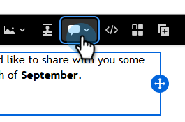
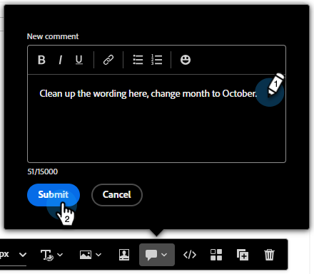

# メールでの共同作業 {#email-collaboration}

マーケティング部門は、メールの共同作業やコメント機能を利用して、Adobe Marketo Engage Email Designer内のメールアセットをシームレスに確認、議論、最終調整できます。 チャット、電子メール、スプレッドシートなど、外部ツールでドラフトを共有する代わりに、コメントを追加、編集を提案、フィードバックをリアルタイムで解決できます。 これにより、ワークフローが合理化され、エラーを減らし、関係者がメール施策の送信前に適切な対応をできるようになります。

## 権限 {#permissions}

メールアセットの編集権限を持つユーザーは、コメント、タグ付け、表示できるようになります。 メールアセットに対する読み取り専用の権限を持つユーザーは、**not**&#x200B;がコメントを追加または表示できるようになります。

## コメントを追加 {#add-comments}

1. 電子メールDesignerで電子メールを作成または編集する際に、構造、列またはコンテンツ（テキスト、画像、ボタンなど）をクリックします。 実際に作成することができます。

   

1. コメントアイコンをクリックします。

   

1. フィードバック、質問、提案を入力します。

   

>[!NOTE]
>
>@mentionsを使用してチームメイトにタグ付け（例：「@John、冬のニュースレターを更新してください」）。

## すべてのコメントを表示 {#view-all-comments}

1. 右側の&#x200B;_Collaboration_ アイコンをクリックします。

   

1. コメントに素早く返信したり、いいね！

   

1. その他のアクションについては、**...** アイコンをクリックしてください。

   

## コメントを解決 {#resolve-comments}

各コメントスレッドには次が含まれます。

* 返信：議論を続ける
* 解決済み：コメントを解決済みとしてマーク
* 未解決：さらに編集が必要な場合
* 削除：デザイン要素からコメントを削除します
* 削除：コメントを完全に削除します

>[!NOTE]
>
>解決されたスレッドはデフォルトでは非表示になっていますが、フィルターで目的のスレッドを選択することで再表示できます。

## 通知 {#notifications}

タグ付けされたチームメンバーは、電子メールやパルス通知で通知を受け取ります。

次の通知がトリガーされます：

* 新規コメント
* メンション（@username）
* 解決策

## ベストプラクティス {#best-practices}

* @mentionsを利用して、フィードバックを適切なチームメンバーに迅速に配信。

* 関連するフィードバックを、複数のメモをまとめて表示するのではなく、単一のコメントスレッドにグループ化します。

* クリーンなワークフローを維持するために、フィードバックを常に返信する。

* コンプライアンス/監査の目的で最終承認バージョンを保存します。
