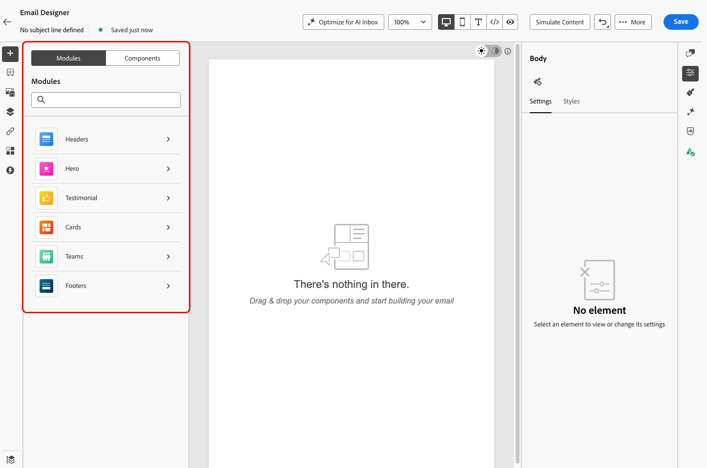
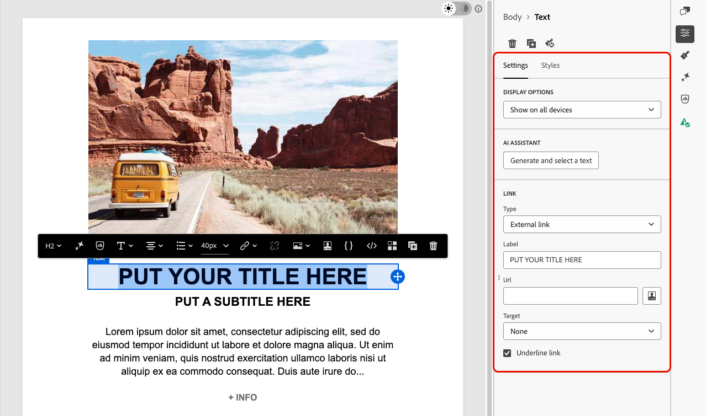

# E メールデザイナーのモジュールの使用 {#email-modules}

メールDesignerには、メール作成を高速化し、コミュニケーション全体でデザインの一貫性を高めるために設計された、すぐに使用できる構造化されたコンテンツブロックなどのモジュールが揃っています。

ゼロから設定する空のプレースホルダーである[ コンテンツコンポーネント ](/help/marketo/product-docs/email-marketing/email-designer/email-authoring.md#add-structure-and-content)とは異なり、モジュールは事前定義済みのセクション（ブランド化されたヘッダー、商品カードグリッド、オプトアウトリンク付きのフッターなど）で、キャンバスに直接ドロップして、そこからカスタマイズできます。

>[!NOTE]
>
>モジュールはフラグメントではありません。 デザインした電子メール内に存在します。 ただし、モジュールをニーズに合わせてカスタマイズした後は、[ ビジュアルフラグメント ](/help/marketo/product-docs/email-marketing/email-designer/fragments.md#visual-fragments)として保存して、他のメールやメッセージで再利用できます。

## モジュールへのアクセスと挿入 {#access-modules}

E メールデザイナーで使用可能なモジュールを表示し、活用するには、次の手順に従います。

1. 目的の電子メールを開きます。

1. 左側のパネルで、「**[!UICONTROL モジュール]**」タブをクリックします。

   

1. 使用可能なモジュールカテゴリを参照するか、検索バーを使用して名前でフィルタリングします。

1. カテゴリの横にある **>** 矢印をクリックして展開し、使用可能なレイアウトバリアントを表示します。

1. 使用するモジュールバリアントを見つけて、メールキャンバスに直接ドラッグ＆ドロップします。

   

1. モジュールは、デフォルトのコンテンツで挿入されます。 キャンバス上の任意の要素をクリックして、インラインでコンテンツの編集を開始します。 任意のテキスト領域をクリックして直接入力するか、画像をクリックしてアセットライブラリを使用して置き換えます。

   >[!NOTE]
   >
   >メールテーマがコンテンツに適用されると、モジュールは適用されたテーマスタイルを自動的に継承し、デザイン全体でブランドの一貫性を確保します。

1. 右側のパネルの&#x200B;**[!UICONTROL 設定]** タブと&#x200B;**[!UICONTROL スタイル]** タブを使用して、他のメール要素と同様に、プロパティとスタイル設定を調整します。

   {width="70%"}

1. [コンテンツコンポーネント](/help/marketo/product-docs/email-marketing/email-designer/email-authoring.md#add-structure-and-content)をモジュールに直接追加することもできます。 左側のパネルで「**[!UICONTROL コンポーネント]**」タブに切り替え、コンポーネントをモジュールにドラッグ＆ドロップします。 このコンポーネントはデフォルトでモジュールのスタイルを継承しますが、必要に応じて上書きできます。

   {width="60%"}

## 使用可能なモジュール {#available-modules}

次のモジュールカテゴリは、標準で使用できます。 1列、2列、3列のグリッドなど、各モジュールには複数のレイアウトバリアントが存在します。 モジュールカテゴリを展開して、レイアウトに合ったバリアントを選択します。

| モジュール | 説明 |
|---|---|
| **[!UICONTROL ヘッダー]** | ロゴ、ナビゲーションリンク、紹介テキストを含むブランド化されたメールヘッダー。 |
| **[!UICONTROL ヒーロー]** | 全角バナーセクション：プロモーション、お知らせ、キャンペーンオープナーに最適です。 |
| **[!UICONTROL お客様の声]** | 一貫性のあるスタイルの書式設定での顧客の見積もりやソーシャルプルーフ。 |
| **[!UICONTROL カード]** | 単一または複数列のグリッドレイアウト内の製品、記事、コンテンツ項目。 |
| **[!UICONTROL チーム]** | チームメンバー、作成者、写真、名前、役割を持つスピーカー。 |
| **[!UICONTROL フッター]** | ナビゲーションリンク、ソーシャルメディアアイコン、法的なコピー、必須のオプトアウトリンクとミラーページのリンクを含む完全なメールフッター。 |
