# メールテンプレートオーサリング {#email-template-authoring}

デザインプロセスを高速化および改善するために、スタンドアロンのメールテンプレートを作成して、カスタムコンテンツを簡単に再利用できます。

>[!NOTE]
>
>電子メールDesignerの電子メールテンプレートは、電子メールDesignerの電子メールの作成にのみ使用できます。 クラシックメールエディターでは参照できません。

## メールテンプレートの作成 {#create-an-email-template}

1. [Adobe Experience Cloud](https://experienceleague.adobe.com/ja){target="_blank"}経由でMarketo Engageにログインします。

1. My Marketoで、**Design Studio**&#x200B;を選択します。

   

1. ツリーで、**電子メールテンプレート（新しいエディター）**&#x200B;を選択します。

   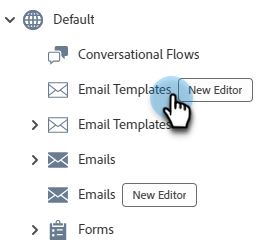

1. 「**テンプレートを作成**」ボタンをクリックします。

   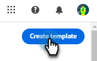

1. テンプレート名とオプションの説明を入力します。 「**作成**」をクリックします。

   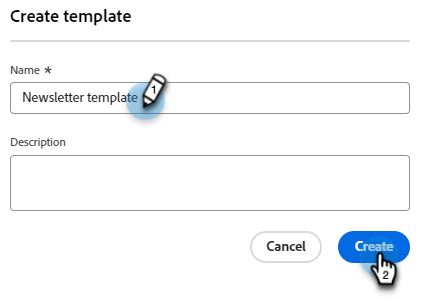

## テンプレートをデザイン {#design-your-template}

_テンプレートのデザイン_ ページでは、いくつかのオプションから選択できます。 [ ゼロからデザイン ](#design-from-scratch)、[独自のHTML](#import-html)を読み込むか、[既存のテンプレート ](#choose-a-template)を選択します（サンプルのいずれか1つ、または既に保存されたもの）。

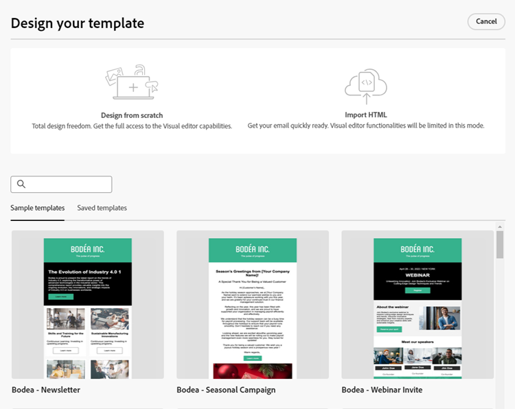

### ゼロからデザイン {#design-from-scratch}

シンプルなドラッグ&amp;ドロップ操作で構造要素を追加、移動することで、コンテンツを定義できます。

1. _テンプレートのデザイン_ ページで、**最初からデザイン**&#x200B;を選択します。

1. [構造とコンテンツ ](#add-structure-and-content)を追加します。

### HTMLの読み込み {#import-your-html}

既存のHTML コンテンツを読み込んで、メールテンプレートをデザインできます。 コンテンツには、次のものがあります。

* スタイルシートが組み込まれたHTML ファイル

* HTML ファイル、スタイルシート（.css）および画像を含む.zip ファイル

>[!NOTE]
>
>.zip ファイル構造に制限はありません。 ただし、.zip フォルダーのツリー構造に合わせて、相対参照を指定する必要があります。

1. _テンプレートのデザイン_ ページで、**HTMLの読み込み**&#x200B;を選択します。

1. 目的のHTMLまたは.zip ファイルをドラッグ&amp;ドロップし（またはコンピューターからファイルを選択）、**読み込み**&#x200B;をクリックします。

   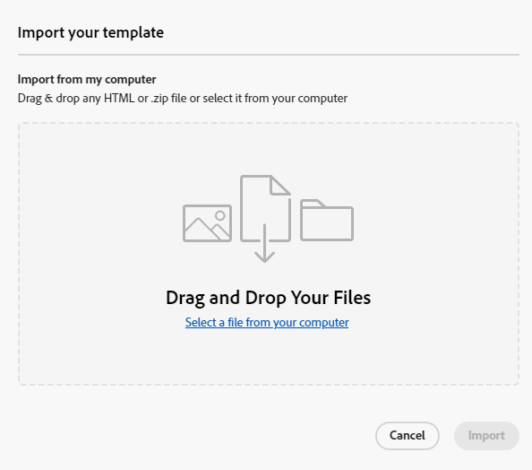

   >[!NOTE]
   >
   >HTML コンテンツがアップロードされると、コンテンツは互換性モードになります。 このモードでは、テキストのパーソナライズ、リンクの追加、コンテンツへのアセットの追加のみを行うことができます。

1. メール Designer コンテンツコンポーネントを利用するには、「**HTML converter**」タブをクリックし、「**Convert**」をクリックします。

   >[!CAUTION]
   >
   >`<table>` タグを HTML ファイルの最初のレイヤーとして使用すると、上部レイヤータグの背景や幅の設定などのスタイルが失われる可能性があります。

ビジュアルメールエディターを使用して、必要に応じてインポートしたファイルをパーソナライズできるようになりました。

### テンプレートの選択 {#choose-a-template}

テンプレートには2種類あります。

* **サンプルテンプレート**: Marketo Engageには、すぐに使える4つのメールテンプレートが用意されています。

* **保存したテンプレート**：テンプレート メニューを使用してゼロから作成したテンプレート、またはテンプレートとして保存するために作成した電子メールです。

>[!BEGINTABS]

>[!TAB  サンプルテンプレート ]

電子メールテンプレートデザインをすぐに始められるように、すぐに使えるテンプレートのひとつを選択しましょう。

1. 「サンプルテンプレート」タブはデフォルトで開いています。

1. 使用するテンプレートを選択します。

   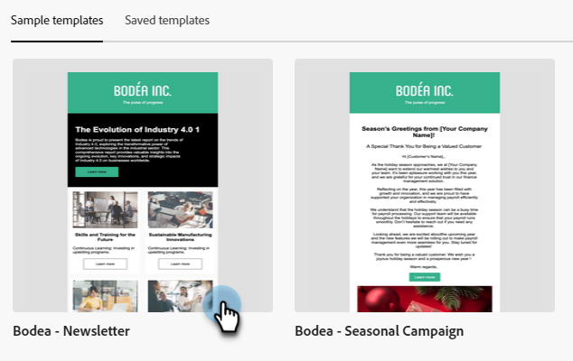

1. 「**このテンプレートを使用**」をクリックします。

   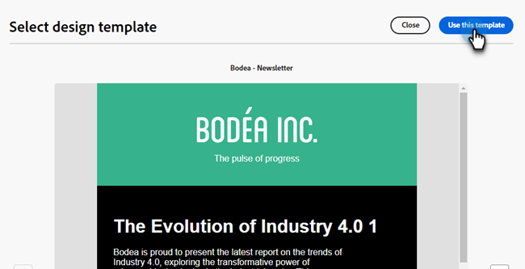

1. ビジュアルコンテンツデザイナーを使用して、必要に応じてコンテンツを編集します。

>[!TAB 保存されたテンプレート ]

1. 「**保存したテンプレート**」タブをクリックし、目的のテンプレートを選択します。

   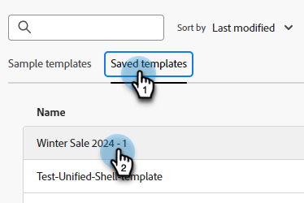

1. 「**このテンプレートを使用**」をクリックします。

   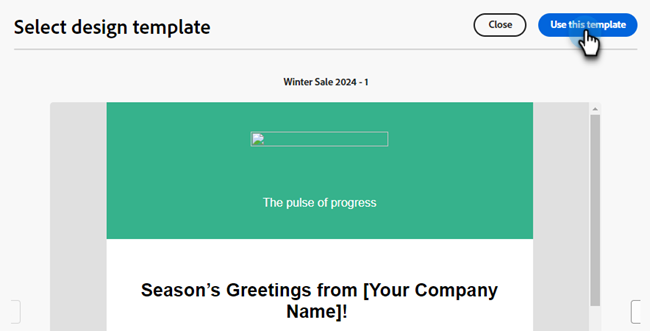

1. ビジュアルコンテンツデザイナーを使用して、必要に応じてコンテンツを編集します。

>[!ENDTABS]

## 構造とコンテンツの追加 {#add-structure-and-content}

1. コンテンツの作成または変更を開始するには、構造からアイテムをキャンバスにドラッグ&amp;ドロップします。 右側のペインで設定を編集します。

   >[!TIP]
   >
   >n:n列コンポーネントを選択して、選択した列数（3 ～ 10個）を定義します。 列の下にある矢印を移動して、各列の幅を定義することもできます。

   

   >[!NOTE]
   >
   >各列のサイズは、構造コンポーネントの全幅の10%未満にすることはできません。 削除できるのは空の列のみです。

1. 「コンテンツ」セクションから、目的の項目をドラッグして、1つ以上の構造コンポーネントにドロップします。

   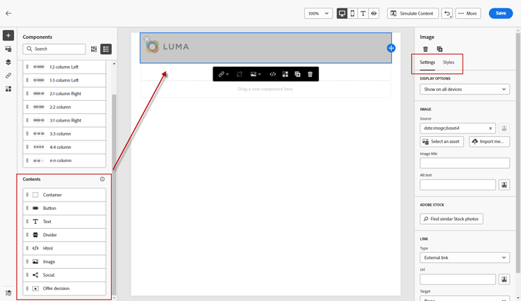

1. 各コンポーネントは、「設定」タブまたは「スタイル」タブでカスタマイズできます。 フォント、テキストスタイル、余白などを変更します。

### フラグメントを追加 {#add-fragments}

1. フラグメントにアクセスするには、左側のナビゲーションで「_フラグメント_」アイコン（）を選択します。

   {width="700" zoomable="yes"}

1. 任意のフラグメントを構造コンポーネントのプレースホルダーにドラッグ&amp;ドロップします。

エディターは、メール構造のセクション/エレメント内でフラグメントをレンダリングします。 フラグメントのコンテンツは、構造内で動的に更新され、コンテンツがメールにどのように表示されるかを示します。

>[!TIP]
>
>フラグメントをメール内の水平方向のレイアウト全体に配置する場合は、1:1列構造を追加してから、フラグメントをドラッグ&amp;ドロップします。

メールが保存されると、フラグメントの詳細ページの「_[!UICONTROL 使用者]_」タブに表示されます。 メールテンプレートに追加されたフラグメントは、テンプレート内では編集できません。ソースフラグメントがコンテンツを定義します。

### アセットの追加 {#add-assets}

Marketo Engage インスタンスの[画像とファイル ](/help/marketo/product-docs/demand-generation/images-and-files/add-images-and-files-to-marketo.md){target="_blank"} セクションに保存されている画像を追加します。

>[!NOTE]
>
>現時点では、画像はメールDesignerでのみ追加でき、他のファイルタイプは追加できません。

1. 画像にアクセスするには、アセットセレクターアイコンをクリックします。

   

1. 目的の画像を構造コンポーネントにドラッグ&amp;ドロップします。

   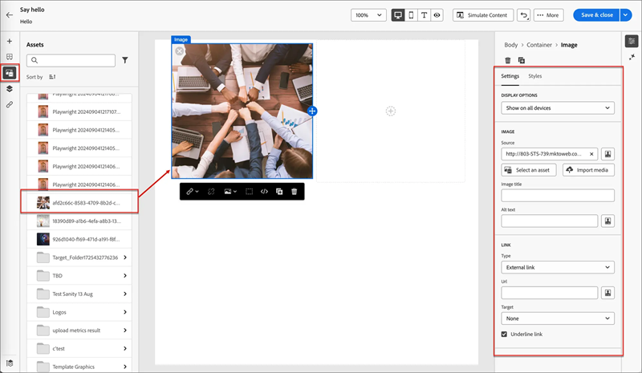

   >[!NOTE]
   >
   >既存の画像を置き換えるには、画像を選択し、右側の「設定」タブで「**アセットを選択**」をクリックします。

### レイヤー、設定、スタイル {#layers-settings-styles}

ナビゲーションツリーを開いて、特定の構造とその列/コンポーネントにアクセスし、より詳細な編集を行います。 アクセスするには、ナビゲーションツリーアイコンをクリックします。

次の例では、列で構成される構造コンポーネント内のパディングと垂直方向の整列を調整する手順の概要を示します。

1. 構造コンポーネントの列をキャンバスで直接選択するか、左側に表示されている&#x200B;_ナビゲーションツリー_&#x200B;を使用して選択します。

1. 列ツールバーで、_[!UICONTROL 列を選択]_ ツールをクリックし、編集するツールを選択します。

   構造ツリーから選択することもできます。 その列の編集可能なパラメーターは、右側の&#x200B;_[!UICONTROL 設定]_ タブと&#x200B;_[!UICONTROL スタイル]_ タブに表示されます。

   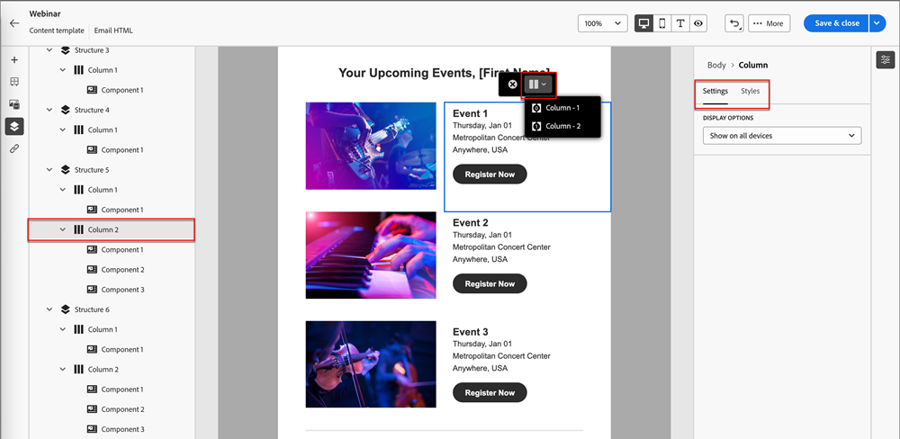

1. 列のプロパティを編集するには、右側の「_[!UICONTROL スタイル]_」タブをクリックし、必要に応じて変更します。

   * **[!UICONTROL 背景]**&#x200B;の場合、必要に応じて背景色を変更します。

     透明な背景の場合は、チェックボックスをオフにします。 **[!UICONTROL 背景画像]**&#x200B;設定を有効にして、単色の代わりに画像を背景として使用します。

   * **[!UICONTROL 線形]**&#x200B;の場合、_上位_、_中央_、または&#x200B;_下位_ アイコンを選択します。
   * **[!UICONTROL パディング]**&#x200B;の場合、すべての側面のパディングを定義します。

     パディングを調整する場合は、**[!UICONTROL 各辺の異なるパディング]**&#x200B;を選択します。 同期を解除するには、_ロック_ アイコンをクリックします。

   * **[!UICONTROL 詳細]** セクションを展開して、列のインラインスタイルを定義します。

   

1. 必要に応じてこれらの手順を繰り返し、コンポーネント内の他の列の整列とパディングを調整します。

1. 変更を保存します。

### コンテンツのパーソナライズ {#personalize-content}

トークンは、従来のエディターと同じようにメールDesignerで機能しますが、アイコンが異なります。 次の例では、フォールバックテキストを含む名トークンの追加の概要を示しています。

1. テキストコンポーネントを選択します。 トークンを表示する場所にカーソルを置き、**パーソナライゼーションを追加** アイコンをクリックします。

   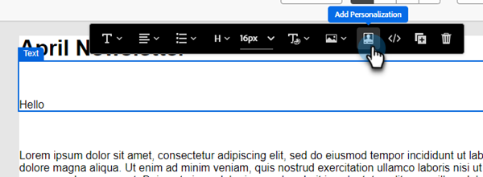

1. 目的の[ トークンタイプ ](/help/marketo/product-docs/demand-generation/landing-pages/personalizing-landing-pages/tokens-overview.md){target="_blank"}をクリックします。

   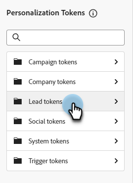

1. 目的のトークンを検索し、**...** アイコンをクリックします（「+」アイコンをクリックすると、フォールバックテキストのないトークンが追加されます）。

   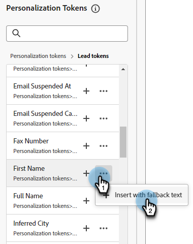

   >[!NOTE]
   >
   >「フォールバックテキスト」は、デフォルト値のメールDesigner用語です。 例：``{{lead.First Name:default=Friend}}``。 選択したフィールドにユーザーの値がない場合は、このオプションをお勧めします。

1. 代替テキストを設定し、**追加**&#x200B;をクリックします。

   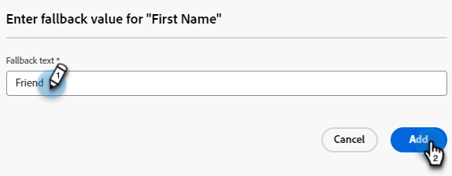

1. 「**保存**」をクリックします。

### URL トラッキングを編集 {#edit-url-tracking}

メール内のリンクでMarketo トラッキング URLを有効にできない場合があります。 この情報は、表示先ページで URL パラメーターをサポートしていないためにページリンクエラーになる場合などに役立ちます。

1. リンク アイコンをクリックして、メール内のすべてのURLを表示します。

   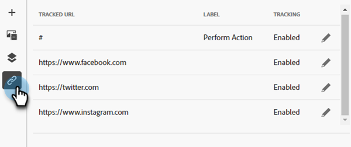

1. 鉛筆アイコンをクリックして、目的のリンクのトラッキングを編集します。

1. 「**トラッキングタイプ**」ドロップダウンをクリックし、選択します。

   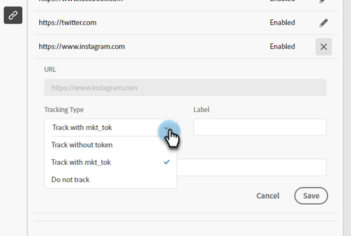

   <table><tbody>
     <tr>
       <td><b>mkt_tokを使用しないトラック</b></td>
       <td>宛先URLでmkt_tok クエリ文字列パラメーターを使用せずに、URLに対するトラッキングをアクティブ化します</td>
     </tr>
     <tr>
       <td><b>mkt_tokを使用したトラック</b></td>
       <td>宛先URLのmkt_tok クエリ文字列パラメーターを使用して、URLに対するトラッキングをアクティブ化します</td>
     </tr>
     <tr>
       <td><b>トラッキングしない</b></td>
       <td>URLのトラッキングを無効にします</td>
     </tr>
   </tbody>
   </table>

1. オプションで、URLにラベルを付けたり、タグを追加したりできます。

1. 終了したら「**保存**」をクリックします。

### 表示オプション {#view-options}

ビジュアルメールエディターで利用可能な表示およびコンテンツ検証オプションを活用します。

* プリセットのズームオプションを使用して、コンテンツをズームイン/ズームアウトします。

* デスクトップ、モバイル、またはテキストのみ/プレーンテキストでコンテンツを表示します。

   * デバイス間でコンテンツをプレビューするには、ライブビュー（目）アイコンをクリックします。

   * すぐに使用できるデバイスのいずれかを選択するか、カスタムディメンションを入力してコンテンツをプレビューします。

### 詳細オプション {#more-options}

コンテンツエディターの&#x200B;**詳細** オプションから、次のアクションを実行できます。

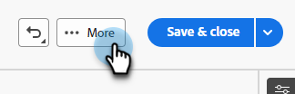

* **テンプレートをリセット**：これを選択すると、ビジュアルメールデザイナーのキャンバスが空白のスレートに消去され、コンテンツの作成が再開されます。

* **デザインを変更**: _テンプレートをデザイン_ ページに戻ります。 ここから、[ テンプレートのデザイン ](#design-your-template) セクションに記載されているアクションを実行できます。

* **HTMLを書き出し**: ビジュアルキャンバスのコンテンツを、zip ファイルとしてパッケージ化されたHTML形式でローカルシステムにダウンロードします。

## テンプレートの詳細を表示 {#view-template-details}

_電子メールテンプレート_&#x200B;のリストページで、電子メールテンプレートの名前をクリックして詳細を表示します。

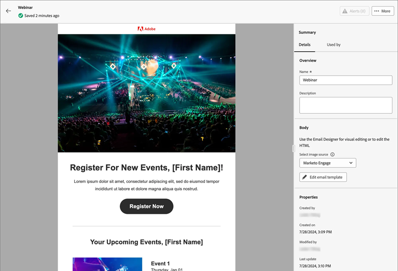

名前や説明などの基本的な詳細を編集できます。 編集したフィールドの外側をクリックして、変更を保存します。

**詳細**&#x200B;をクリックして、テンプレートを簡単に削除または複製します。

アクティブなアラート（メールテンプレートのエラー/警告）がある場合は、「アラート」をクリックして情報を表示します。

>[!NOTE]
>
>これらのアラートは、メール作成にメールテンプレートを使用することを禁止するものではありませんが、この情報により、何が機能しないか、メールを配信に使用する前に必要な更新が明らかになります。

## 使用した電子メールテンプレートの表示 {#email-template-used-by-references}

メールテンプレートの概要で、「**使用者**」タブをクリックして、このメールテンプレートがMarketo Engage内で使用されている場所の詳細を表示します。

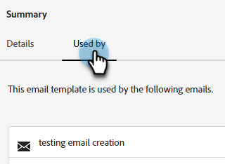

## メールテンプレートの編集 {#edit-email-templates}

このアクションは、次から実行できます。

* 詳細タブ – 「**メールテンプレートを編集**」をクリックします。

このアクションを実行すると、メールテンプレートの最後に保存されたステータスに基づいて、_テンプレートのデザイン_ ページまたはビジュアルコンテンツエディターページに移動します。 ここから、必要に応じてメールテンプレートコンテンツを編集できます。 編集オプションについて詳しくは、メールテンプレートの作成を参照してください。

## メールテンプレートの重複 {#duplicate-email-templates}

メールテンプレートを複製するには、次の2つの方法があります。

* 右側のメールテンプレートの詳細から、**詳細**&#x200B;をクリックし、**複製**&#x200B;を選択します。

  

* _電子メールテンプレート_&#x200B;のリストページで、目的の電子メールテンプレートのその他のアクションアイコン（3つのドット）をクリックし、**重複**&#x200B;を選択します。

ダイアログで、一意の名前とオプションの説明を入力します。 完了したら、「**複製**」をクリックします。

複製されたメールテンプレートは、_メールテンプレート_&#x200B;のリストページに表示されます。

## メールテンプレートの削除 {#delete-email-templates}

メールテンプレートを削除するには、2つの方法があります。

>[!CAUTION]
>
>メールテンプレートの削除を元に戻すことはできません。

* 右側のメールテンプレートの詳細から、**詳細**&#x200B;をクリックし、**削除**&#x200B;を選択します。

  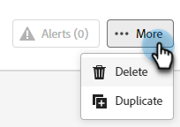

* _メールテンプレート_&#x200B;のリストページで、目的のメールテンプレートのその他のアクションアイコン（3つのドット）をクリックし、**削除**&#x200B;を選択します。

## 一括アクション {#bulk-actions}

_電子メールテンプレート_&#x200B;のリストページから、左側のチェックボックスを選択して、複数のテンプレートを選択します。 下部にバナーが表示されます。

**削除**：一度に最大20個のテンプレートを削除できます。 確認ダイアログでは、アクションを中止したり、削除を確認したりできます。

>[!MORELIKETHIS]
>
>[電子メールオーサリング ](/help/marketo/product-docs/email-marketing/email-designer/email-authoring.md){target="_blank"}
