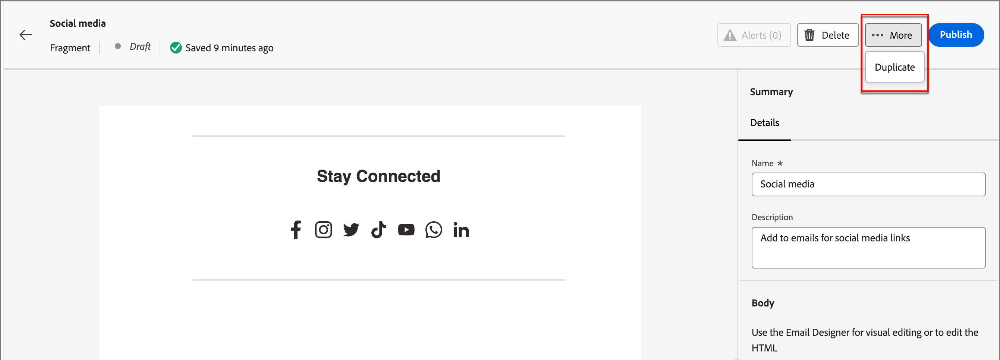

# フラグメント

フラグメントは、1 つ以上のメールおよびメールテンプレートで参照できる再利用可能なコンポーネントです。 通常は、コンテンツのブロック（テキスト、画像、またはその両方）をプロジェクトにすばやく挿入できます。 この機能を使用すると、複数のカスタムコンテンツブロックを事前に作成してメールコンテンツを組み合わせ、設計プロセスを改善できます。 一般的なユースケースとしては、メールのヘッダー/フッターコンテンツブロック、イベント招待バナー、季節ごとのメッセージなどがあります。

ワークフローでフラグメントを最大限に活用するには：

* _フラグメントの作成_ - ビジュアルコンテンツエディターからゼロから、またはコンテンツをフラグメントとして保存することで、ビジュアルフラグメントを作成します。
* _フラグメントを再利用_ - コンテンツで必要な回数だけ使用します。

## ビジュアルフラグメント {#visual-fragments}

ビジュアルフラグメントは、（ビジュアルコンテンツエディターを使用して）構築された事前定義済みのビジュアルブロックで、複数のメールまたはメールテンプレートで再利用できます。

## フラグメントへのアクセスと管理 {#access-and-manage-fragments}

ビジュアルフラグメントにアクセスするには、Marketo Engageの **Design Studio** に移動します。 左側のツリーで、「**[!UICONTROL フラグメント（新規）]**」をクリックします。

{width="600" zoomable="yes"}

デフォルトでは、テーブルは「_[!UICONTROL 変更済み]_ 列で並べ替えられます。 その他の列タイトルをクリックして、テーブルの並べ替え基準を変更します。 同じタイトルをもう一度クリックすると、昇順と降順が切り替わります。

### 検索とフィルター

検索バーを使用して、名前でフラグメントを検索します。 _フィルター_ アイコン（）をクリックして、使用可能なフィルターオプションを表示し、目的の設定を選択します。

{width="700" zoomable="yes"}

### 列のカスタマイズ {#customize-the-column-display}

右上の _テーブルをカスタマイズ_ アイコン（）をクリックして、テーブルに表示する列をカスタマイズします。

必要な列を選択し、「**[!UICONTROL 適用]**」をクリックします。

{width="400" zoomable="yes"}

### フラグメントステータス {#fragment-status}

フラグメントステータスは、メールまたはメールテンプレートで使用できるフラグメントの有無と、フラグメントに加えられる変更を決定します。

<table>
<tbody>
  <tr>
    <td width="25%"><b>下書き</b></td>
    <td width="70%">フラグメントを作成すると、そのステータスはドラフトになります。 メールまたはメールテンプレートで使用するために公開するまで、ドラフトのままです。
    
使用可能なアクション：
    <li>すべての詳細を編集</li>
    <li>ビジュアルデザイナーで編集</li>
    <li>公開</li>
    <li>複製</li>
    <li>削除</li>
  </td>
  <tr>
    <td><b>公開日</b></td>
    <td>フラグメントを公開すると、メールまたはメールテンプレートで使用できるようになります。 公開されたフラグメントコンテンツは、ビジュアルデザイナーでは変更できません。
    
使用可能なアクション：
    <li>説明を編集</li>
    <li>メールまたはテンプレートへの追加</li>
    <li>ドラフトバージョンを作成</li>
    <li>複製</li>
    <li>削除（使用中でない場合）</li>
    </td>
  </tr>
  <tr>
    <td><b>公開済み下書きあり</b></td>
    <td>公開済みフラグメントからドラフトを作成する場合、公開されたバージョンはメールまたはメールテンプレートで使用でき、ドラフトコンテンツはビジュアルデザイナーで変更できます。 ドラフトバージョンを公開すると、現在の公開バージョンが置き換えられ、コンテンツが使用中のメールおよびメールテンプレート <i> すべて </i> で更新されます。 
    
使用可能なアクション：
    <li>説明を編集</li>
    <li>メールまたはテンプレートへの追加</li>
    <li>ビジュアルデザイナーでのドラフトバージョンの編集</li>
    <li>ドラフトバージョンを公開</li>
    <li>複製</li>
    <li>削除（使用中でない場合）</li>
    </td>
  </tr>
</tbody></table>

## フラグメントを作成 {#create-fragments}

1. 新しいビジュアルフラグメントを作成するには、フラグメントリストページの右上にある **[!UICONTROL フラグメントを作成]** をクリックします。

   {width="700" zoomable="yes"}

1. フラグメントに **[!UICONTROL 名前]** とオプションの **[!UICONTROL 説明]** を入力します。

   _フラグメント要件_

   * 名前：最大 100 文字。一意である必要があります。大文字と小文字を区別しません
   * 説明：最大 300 文字
   * 文字：英数字および特殊文字は問題ありません
   * 予約文字は使用できません **_使用できません_**: `\ / : * ? " < > |`

   {width="400" zoomable="yes"}

1. 「**[!UICONTROL 作成]**」をクリックします。

   {width="400" zoomable="yes"}

   >[!NOTE]
   >
   >現時点では、フラグメントの **タイプ** を変更できません。

   ビジュアルデザイナーが空のキャンバスで開きます。

1. [ コンテンツデザインツール ](/help/marketo/product-docs/email-marketing/email-designer/email-authoring.md#add-structure-and-content){target="_blank"} を使用して、視覚的なフラグメントコンテンツを作成します。

1. **[!UICONTROL 保存]** をクリックすれば、いつでもドラフトフラグメントを保存できます。

1. フラグメントをメールまたはメールテンプレートで使用できるようにする準備が整ったら、「**[!UICONTROL 公開]**」をクリックします。

## フラグメントの詳細を表示 {#view-fragment-details}

リストページで任意のフラグメントの名前をクリックして、フラグメントの詳細ページを開きます。 フラグメントの編集、名前の変更または説明の更新を選択できます。 更新を行い、「名前」フィールドまたは「説明」フィールドの外側をクリックして変更を保存します。

>[!NOTE]
>
>公開されたフラグメントがメールまたはメールテンプレートで使用されている場合、その名前を変更したり、コンテンツを編集したりすることはできません。 フラグメントに変更を加える場合は、ドラフトバージョンを作成できます。

{width="600" zoomable="yes"}

**[!UICONTROL フラグメントを編集]** をクリックして、フラグメントをビジュアルコンテンツエディターで開きます。

左上の _戻る_ 矢印をクリックして、いつでもビューを終了できます。この矢印をクリックすると、_フラグメント_ リストページに戻ります。

## 参照別に使用されているフラグメントを表示 {#view-fragment-used-by-references}

フラグメントの詳細ページで、「**[!UICONTROL 使用者]**」タブをクリックして、Marketo Engage内でフラグメントが使用されている場所の詳細を表示します。

>[!IMPORTANT]
>
>メールまたはメールテンプレートで現在使用されているフラグメントは削除できません。

{width="600" zoomable="yes"}

リンクをクリックして、フラグメントが使用されている対応するメールまたはメールテンプレートを開きます。

## フラグメントの削除 {#delete-fragments}

メールまたはメールテンプレートで現在使用されているフラグメントは削除できないので、フラグメントの削除を開始する前に _使用_ 参照を必ず確認してください。 また、削除を取り消すことはできないので、削除操作を開始する前に確認します。

フラグメントを削除するには、次のいずれかの方法を使用します。

* 右側のフラグメントの詳細で、「**[!UICONTROL 削除]**」をクリックします。
* _[!UICONTROL フラグメント]_ リストページで、フラグメントの横にある省略記号をクリックし、「**[!UICONTROL 削除]**」を選択します。

この操作を実行すると、確認ダイアログが開きます。 **[!UICONTROL キャンセル]** をクリックするか、「**[!UICONTROL 削除]**」をクリックして削除を確定すると、プロセスを中止できます。

{width="400"}

## フラグメントの編集 {#edit-fragments}

フラグメントの編集は、現在のステータスに応じて異なります。

* フラグメントが _ドラフト_ ステータスの場合は、その詳細とビジュアルコンテンツを編集できます。
* フラグメントが _公開済み_ ステータスの場合、フラグメントの説明は編集できますが、名前は編集できません。 ビジュアルコンテンツは編集できません。
* フラグメントが _ドラフトで公開済み_ ステータスの場合、詳細の編集は説明に限定されます。 ドラフトバージョンの視覚的なコンテンツを編集することもできます。

>[!BEGINTABS]

>[!TAB  ドラフト ]

1. _[!UICONTROL フラグメント]_ リストページで、フラグメント名をクリックして開きます。

   ビジュアルコンテンツのプレビューが表示され、フラグメントの詳細が右側に表示されます。

1. 必要な編集を行います。

   {width="600" zoomable="yes"}

1. ビジュアルデザイナーでコンテンツを変更するには、「**[!UICONTROL フラグメントを編集]** をクリックします。 終了したら「**保存**」をクリックします。

1. **[!UICONTROL 保存]** または **[!UICONTROL 保存して閉じる]** をクリックして、フラグメントの詳細に戻ります。

1. フラグメントをメールまたはメールテンプレートで使用できるようにするには、「**[!UICONTROL 公開]**」をクリックします。

>[!TAB パブリッシュ済み]

1. _[!UICONTROL フラグメント]_ リストページで、フラグメント名をクリックして開きます。

   ビジュアルコンテンツのプレビューが表示され、フラグメントの詳細が右側に表示されます。

1. 必要に応じて、説明を変更します。

   公開済みのフラグメントの場合、その他の詳細はすべて変更できません。

1. コンテンツを更新する場合は、右上の **[!UICONTROL ドラフトバージョンを作成]** をクリックします。

   ダイアログで **[!UICONTROL OK]** をクリックして、ドラフトバージョンをビジュアルデザイナーで開きます。 必要に応じて、`image source` KG - リンクをここで変更できます。

   {width="300"}

1. **[!UICONTROL 保存]** または **[!UICONTROL 保存して閉じる]** をクリックして、フラグメントの詳細に戻ります。

1. フラグメントをメールまたはメールテンプレートで使用できるようにするには、「**[!UICONTROL 公開]**」をクリックします。

>[!NOTE]
>
>ドラフトバージョンを公開すると、現在の公開バージョンが置き換えられ、既に使用されているメールおよびメールテンプレートのコンテンツが更新されます。

>[!TAB  ドラフトで公開済み ]

_[!UICONTROL フラグメント]_ リストページからドラフトバージョンを開いて編集する方法は 2 つあります。

* フラグメント名の横にある _詳細_ アイコン（**...**）をクリックし、「**[!UICONTROL ドラフトバージョンを開く]**」を選択します。

  {width="300"}

* フラグメント名をクリックして開きます。 次に、右上の **[!UICONTROL ドラフトバージョンを開く]** をクリックします。

ドラフトバージョンのビジュアルコンテンツのプレビューが表示され、フラグメントの詳細が右側に表示されます。

コンテンツを更新するには：

1. 右上の **[!UICONTROL フラグメントを編集]** をクリックします。 終了したら「**保存**」をクリックします。

1. **[!UICONTROL 保存]** または **[!UICONTROL 保存して閉じる]** をクリックして、フラグメントの詳細に戻ります。

1. フラグメントをメールまたはメールテンプレートで使用できるようにするには、「**[!UICONTROL 公開]**」をクリックします。

>[!NOTE]
>
>ドラフトバージョンを公開すると、現在の公開バージョンが置き換えられ、既に使用されているメールおよびメールテンプレートのコンテンツが更新されます。

>[!ENDTABS]

## フラグメントを複製 {#duplicate-fragments}

次のいずれかの方法を使用して、フラグメントを複製できます。

* _[!UICONTROL フラグメント]_ リストページで、フラグメント名の横にある _詳細_ アイコン（**...**）をクリックし、「**[!UICONTROL 複製]**」を選択します。
* フラグメントの詳細ページの右上にある「**[!UICONTROL ..」をクリックします。詳細を表示して]** 「複製 **[!UICONTROL を選択]** ます。

{width="600" zoomable="yes"}

ダイアログで、一意の名前と説明（オプション）を入力します。 **[!UICONTROL 複製]** をクリックします。

{width="400"}

複製されたフラグメントは、_フラグメント_ リストに表示されます。

## メールまたはテンプレートコンテンツから新しいフラグメントを保存 {#save-a-new-fragment-from-email-or-template-content}

ビジュアルコンテンツエディターでメールまたはメールテンプレートを作成/編集する際に、コンテンツのすべてまたは一部をフラグメントとして保存して再利用できます。

1. コンテンツをフラグメントとして保存するには、「詳細 **[!UICONTROL をクリックして]** 「**[!UICONTROL フラグメントとして保存]**」を選択します。

1. フラグメントに含める様々な要素を選択します。

   Shift キーまたは Control ボタンを押しながら複数の構造を選択します。

   互いに隣接する構造のみを選択できます。

1. コンテンツを選択した状態で、右上の **[!UICONTROL 作成]** をクリックします。

1. ダイアログで、フラグメントの名前と説明（オプション）を入力し、「**[!UICONTROL 作成]**」をクリックします。

フラグメントは _フラグメント_ リストページに表示され、メールおよびメールテンプレート内で使用できます。

## メールコンテンツまたはテンプレートコンテンツへのビジュアルフラグメントの追加 {#add-visual-fragments-to-your-email-or-template-content}

フラグメントは再利用できるように設計されています。 メールまたはメールテンプレートには最大 30 個を追加でき、最大 1 レベルまでネストできます。

* [メールへのフラグメントの追加](/help/marketo/product-docs/email-marketing/email-designer/email-authoring.md#add-fragments)

* [メールテンプレートへのフラグメントの追加](/help/marketo/product-docs/email-marketing/email-designer/email-template-authoring.md#add-fragments)

フラグメントのコンテンツは、構造内で動的に更新され、コンテンツがメールにどのように表示されるかが視覚的に表示されます。

>[!TIP]
>
>フラグメントをメール内の水平レイアウト全体に配置する場合は、[!UICONTROL 1:1 列 ] 構造を追加して、フラグメントをメールにドラッグ&amp;ドロップします。

メール/メールテンプレートを保存した後、「_[!UICONTROL 使用者]_ タブを選択すると、フラグメントの詳細ページに表示されます。 追加されたフラグメントは、メールまたはテンプレート内では編集できません。公開されたソースフラグメントがコンテンツを定義します。

## メールおよびテンプレートのオーサリング中のフラグメントアクション {#fragment-actions-during-email-and-template-authoring}

フラグメントをメールまたはメールテンプレートに追加すると、そのコンテンツをメールまたはテンプレート内で編集することはできません。 ただし、次の操作を適用できます。

* **[!UICONTROL 削除]** – 現在のメールまたはメールテンプレートコンテンツからフラグメントを削除します（フラグメントソースは影響を受けません）。
* **[!UICONTROL 更新]** – 現在のメールまたはメールテンプレート内のフラグメントのコンテンツを更新します。 更新は、メールまたはメールテンプレートに追加した後に、フラグメントに対して最近の編集を反映する場合に便利です。
* **[!UICONTROL 複製]** - エディター内の同じメールまたはメールテンプレートにフラグメントを複製します。 複製されたフラグメントは元のフラグメントのすぐ下に追加されます。
* **[!UICONTROL フラグメントを開く]** - フラグメントエディターページと詳細を含む新しいブラウザータブが開きます。
* **[!UICONTROL 継承を解除]** - ソースからのフラグメントの継承（およびその変更）が解除されます。 フラグメントコンテンツを、メールまたはメールテンプレート内で独立した編集可能なコンテンツとして利用できるようにする場合は、このアクションを使用します。 また、このアクションは、元のフラグメントの _使用者_ 参照からメールまたはメールテンプレートも削除します。

エディターページでフラグメントを選択すると、これらのアクションはコンテキストツールバーと、右側のプロパティパネルから使用できます。

{width="600" zoomable="yes"}
