# フラグメント

フラグメントは、1つ以上のメールおよびメールテンプレートで参照できる再利用可能なコンポーネントです。 通常、プロジェクトにすばやく挿入できるコンテンツのブロック（テキスト、画像、またはその両方）です。 この機能を利用すれば、複数のカスタムコンテンツブロックを事前に構築してメールコンテンツを作成し、デザインプロセスを改善できます。 一般的なユースケースには、電子メールのヘッダー/フッターコンテンツブロック、イベント招待バナー、季節メッセージなどがあります。

>[!NOTE]
>
>フラグメントは、古いメールエディターの[ スニペット ](/help/marketo/product-docs/personalization/segmentation-and-snippets/snippets/create-a-snippet.md){target="_blank"}に相当します。

ワークフローでフラグメントを最大限に活用するには：

* _フラグメントを作成_ - ビジュアルコンテンツエディターからコンテンツをフラグメントとして保存するか、ゼロからビジュアルフラグメントを作成します。
* _フラグメントを再利用_ - コンテンツ内で必要な回数だけフラグメントを使用します。

## ビジュアルフラグメント {#visual-fragments}

ビジュアルフラグメントとは、複数の電子メールや電子メールテンプレートで再利用できる、（ビジュアルコンテンツエディターを使用して）事前に定義されたビジュアルブロックのことです。

## フラグメントへのアクセスと管理 {#access-and-manage-fragments}

ビジュアルフラグメントにアクセスするには、Marketo Engageの&#x200B;**Design Studio**&#x200B;に移動します。 左側のツリーで、「**[!UICONTROL フラグメント（新規）]**」をクリックします。

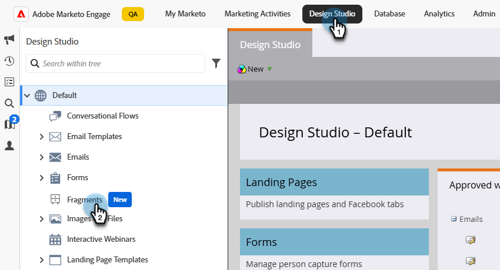{width="600" zoomable="yes"}

デフォルトでは、テーブルは&#x200B;_[!UICONTROL 変更済み]_&#x200B;列で並べ替えられます。 他の列タイトルをクリックして、表の並べ替え基準を変更します。 同じタイトルをもう一度クリックして、昇順と降順を切り替えます。

### 検索とフィルター

検索バーを使用して、名前でフラグメントを検索します。 _フィルター_ アイコン （）をクリックして、使用可能なフィルターオプションを表示し、目的の設定を選択します。

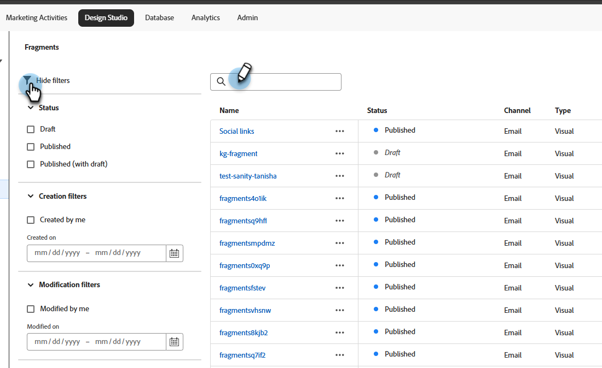{width="700" zoomable="yes"}

### 列のカスタマイズ {#customize-the-column-display}

右上の&#x200B;_テーブルをカスタマイズ_ アイコン （）をクリックして、テーブルに表示する列をカスタマイズします。

必要な列を選択し、**[!UICONTROL 適用]**&#x200B;をクリックします。

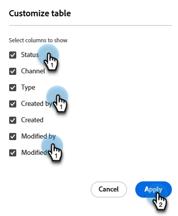{width="400" zoomable="yes"}

### フラグメントステータス {#fragment-status}

フラグメントのステータスによって、電子メールまたはメールテンプレートで使用できるフラグメントの可用性と、フラグメントに対して実行できる変更が決まります。

<table>
<tbody>
  <tr>
    <td width="25%"><b>下書き</b></td>
    <td width="75%">フラグメントを作成する場合、フラグメントはドラフトステータスになります。 電子メールまたは電子メールテンプレートで使用するために公開するまで、ドラフトのままになります。
    
使用可能なアクション：
    <li>すべての詳細を編集</li>
    <li>ビジュアルデザイナーで編集</li>
    <li>公開</li>
    <li>複製</li>
    <li>削除</li>
  </td>
  <tr>
    <td><b>公開日</b></td>
    <td>フラグメントを公開すると、フラグメントはメールまたはメールテンプレートで使用できるようになります。 公開されたフラグメントコンテンツは、ビジュアルデザイナーで変更できません。
    
使用可能なアクション：
    <li>説明を編集</li>
    <li>メールまたはテンプレートに追加</li>
    <li>ドラフトバージョンを作成</li>
    <li>複製</li>
    <li>削除（使用中でない場合）</li>
    </td>
  </tr>
  <tr>
    <td style="width:25%"><b>公開済み下書きあり</b></td>
    <td style="width:75%">公開したフラグメントからドラフトを作成しても、公開したバージョンは電子メールまたは電子メールテンプレートで使用でき、ドラフトコンテンツはビジュアルデザイナーで変更できます。 ドラフトバージョンを公開すると、現在の公開済みバージョンに置き換わり、コンテンツは使用中の電子メールと電子メールテンプレートの<i>all</i>で更新されます。
    
使用可能なアクション：
    <li>説明を編集</li>
    <li>メールまたはテンプレートに追加</li>
    <li>ビジュアルデザイナーでのドラフトバージョンの編集</li>
    <li>ドラフトバージョンを公開</li>
    <li>複製</li>
    <li>削除（使用中でない場合）</li>
    </td>
  </tr>
</tbody>
</table>

## フラグメントを作成 {#create-a-fragment}

1. 新しいビジュアルフラグメントを作成するには、フラグメントリストページの右上にある「**[!UICONTROL フラグメントを作成]**」をクリックします。

   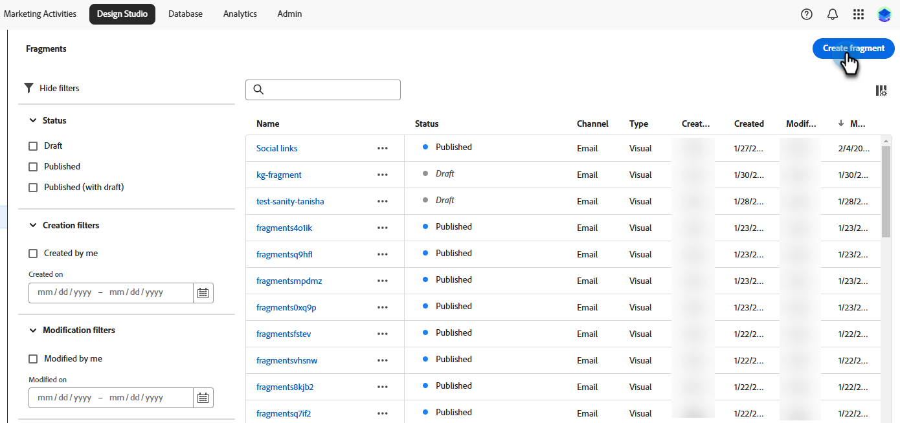{width="700" zoomable="yes"}

1. フラグメントに&#x200B;**[!UICONTROL 名前]**&#x200B;とオプションの&#x200B;**[!UICONTROL 説明]**&#x200B;を指定します。

   _フラグメントの要件_

   * 名前：最大100文字、大文字と小文字を区別しない一意にする必要があります
   * 説明：最大300文字
   * 文字：英数字、特殊文字でも構いません
   * 予約済みの文字は&#x200B;**_許可されていません_**: `\ / : * ? " < > |`

   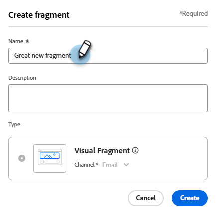{width="400" zoomable="yes"}

1. 「**[!UICONTROL 作成]**」をクリックします。

   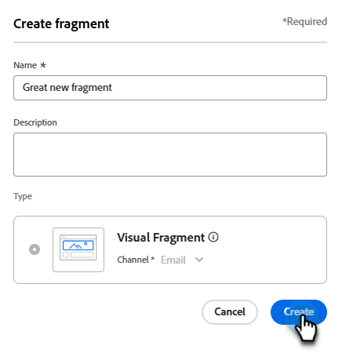{width="400" zoomable="yes"}

   >[!NOTE]
   >
   >現時点では、フラグメントの&#x200B;**Type**&#x200B;は変更できません。

1. _メールを作成_ モーダルが表示されます。 _テーマを使用_&#x200B;または&#x200B;_手動スタイル設定_&#x200B;を選択します。 このオプションでは、**テーマを使用**&#x200B;を選択しています。 終了したら「**確認**」をクリックします。

   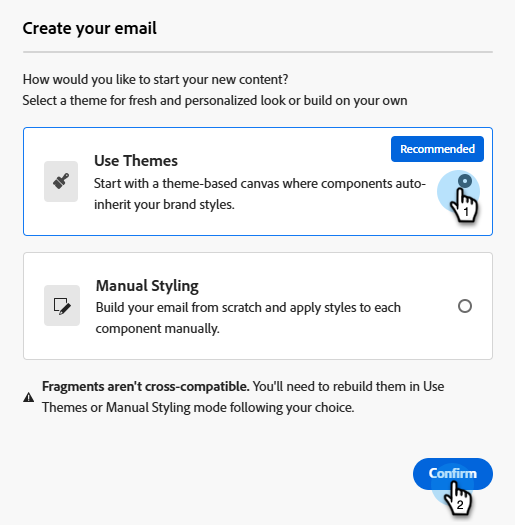

   >[!NOTE]
   >
   >手動スタイル設定を選択した場合は、[ コンテンツデザインツール ](/help/marketo/product-docs/email-marketing/email-designer/email-authoring.md#add-structure-and-content){target="_blank"}を使用して、ビジュアルフラグメントコンテンツを作成します。

1. 「_テーマ_」アイコンをクリックします。

   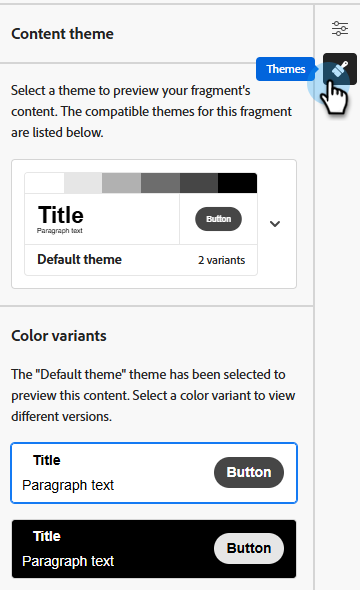

   >[!INFO]
   >
   >[ テーマ設定](/help/marketo/product-docs/email-marketing/email-designer/brands/brand-themes.md#settings){target="_blank"}の詳細をご覧ください。

1. いつでも&#x200B;**[!UICONTROL 保存]**&#x200B;をクリックして、ドラフトフラグメントを保存します。

1. フラグメントを電子メールまたは電子メールテンプレートで使用できるようにする準備ができたら、「**[!UICONTROL 公開]**」をクリックします。

## フラグメントの詳細を表示 {#view-fragment-details}

リストページで任意のフラグメントの名前をクリックして、フラグメントの詳細ページを開きます。 フラグメントを編集したり、名前を変更したり、説明を更新したりすることができます。 変更を加え、「名前」フィールドまたは「説明」フィールドの外側をクリックして変更を保存します。

>[!NOTE]
>
>公開されたフラグメントがメールまたはメールテンプレートで使用されている場合、名前を変更したり、コンテンツを編集したりすることはできません。 フラグメントを変更する場合は、ドラフトバージョンを作成できます。

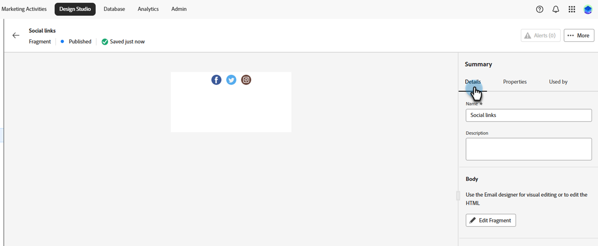{width="600" zoomable="yes"}

「**[!UICONTROL フラグメントを編集]**」をクリックして、ビジュアルコンテンツエディターでフラグメントを開きます。

左上の&#x200B;_戻る_&#x200B;矢印をクリックして、いつでもビューを終了すると、_フラグメント_&#x200B;のリストページに戻ります。

## 使用済み参照のフラグメントを表示 {#view-fragment-used-by-references}

フラグメントの詳細ページで、「**[!UICONTROL 使用者]**」タブをクリックして、Marketo Engage内でフラグメントが使用されている場所の詳細を表示します。

>[!IMPORTANT]
>
>メールまたはメールテンプレートで現在使用されているフラグメントは削除できません。

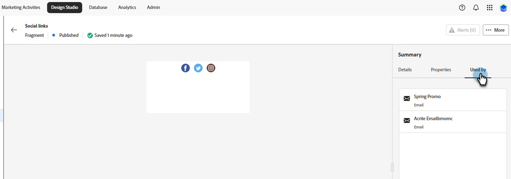{width="600" zoomable="yes"}

リンクをクリックして、フラグメントが使用されている対応する電子メールまたは電子メールテンプレートを開きます。

## フラグメントの削除 {#delete-fragments}

メールまたはメールテンプレートで現在使用されているフラグメントは削除できないので、フラグメントの削除を開始する前に、_used-by_&#x200B;の参照を必ず確認してください。 また、削除を元に戻すことはできませんので、削除アクションを開始する前に確認してください。

フラグメントは、次のいずれかの方法を使用して削除できます。

* 右側のフラグメントの詳細から、**[!UICONTROL 削除]**&#x200B;をクリックします。
* _[!UICONTROL フラグメント]_&#x200B;のリスト ページで、フラグメントの横にある省略記号をクリックし、**[!UICONTROL 削除]**&#x200B;を選択します。

このアクションを実行すると、確認ダイアログが開きます。 「**[!UICONTROL キャンセル]**」をクリックするか、「**[!UICONTROL 削除]**」をクリックして削除を確認することで、プロセスを中止できます。

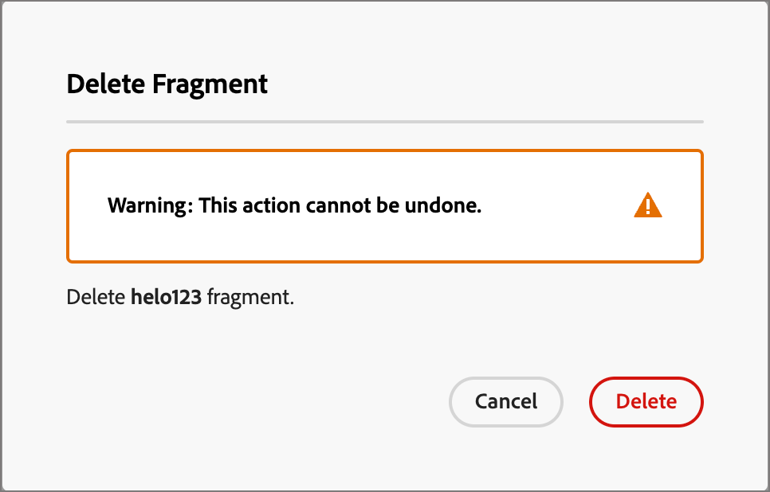{width="400"}

## フラグメントの編集 {#edit-fragments}

フラグメントの編集は、現在のステータスに応じて異なります。

* フラグメントのステータスが&#x200B;_ドラフト_&#x200B;の場合、その詳細とビジュアルコンテンツを編集できます。
* フラグメントのステータスが&#x200B;_公開済み_&#x200B;の場合、フラグメントの説明は編集できますが、名前は編集できません。 ビジュアルコンテンツは編集できません。
* フラグメントが&#x200B;_下書き_&#x200B;の状態で公開されている場合、詳細の編集は説明に限定されます。 ドラフトバージョンのビジュアルコンテンツを編集することもできます。

>[!BEGINTABS]

>[!TAB ドラフト]

1. _[!UICONTROL フラグメント]_&#x200B;のリストページで、フラグメント名をクリックして開きます。

   ビジュアルコンテンツのプレビューが表示され、右側にフラグメントの詳細が表示されます。

1. 必要に応じて編集します。

   {width="600" zoomable="yes"}

1. ビジュアルデザイナーでコンテンツに変更を加えるには、**[!UICONTROL フラグメントを編集]**&#x200B;をクリックします。 終了したら「**保存**」をクリックします。

1. 「**[!UICONTROL 保存]**」または「**[!UICONTROL 保存して閉じる]**」をクリックすると、フラグメントの詳細に戻ります。

1. フラグメントを電子メールまたは電子メールテンプレートで使用できるようにするには、**[!UICONTROL 公開]**&#x200B;をクリックします。

>[!TAB パブリッシュ済み]

1. _[!UICONTROL フラグメント]_&#x200B;のリストページで、フラグメント名をクリックして開きます。

   ビジュアルコンテンツのプレビューが表示され、右側にフラグメントの詳細が表示されます。

1. 必要に応じて、説明を変更します。

   公開されたフラグメントの場合、他のすべての詳細を変更することはできません。

1. コンテンツを更新する場合は、右上の「**[!UICONTROL ドラフトバージョンを作成]**」をクリックします。

   ダイアログで「**[!UICONTROL OK]**」をクリックして、ビジュアルデザイナーでドラフトバージョンを開きます。 必要に応じて、`image source` KG - LINK HEREを変更できます。

   {width="300"}

1. 「**[!UICONTROL 保存]**」または「**[!UICONTROL 保存して閉じる]**」をクリックすると、フラグメントの詳細に戻ります。

1. フラグメントを電子メールまたは電子メールテンプレートで使用できるようにするには、**[!UICONTROL 公開]**&#x200B;をクリックします。

>[!NOTE]
>
>ドラフトバージョンを公開すると、現在の公開済みバージョンに置き換わり、コンテンツは既に使用されているメールとメールテンプレートで更新されます。

>[!TAB 下書きで公開]

_[!UICONTROL フラグメント]_&#x200B;のリスト ページから編集用のドラフトバージョンを開くには、次の2つの方法があります。

* フラグメント名の横にある&#x200B;_詳細_ アイコン （**...**）をクリックし、「**[!UICONTROL ドラフトバージョンを開く]**」を選択します。

  {width="300"}

* フラグメント名をクリックして開きます。 次に、右上の「**[!UICONTROL ドラフトバージョンを開く]**」をクリックします。

下書きバージョンのビジュアルコンテンツのプレビューが表示され、右側にフラグメントの詳細が表示されます。

コンテンツを更新するには：

1. 右上の「**[!UICONTROL フラグメントを編集]**」をクリックします。 終了したら「**保存**」をクリックします。

1. 「**[!UICONTROL 保存]**」または「**[!UICONTROL 保存して閉じる]**」をクリックすると、フラグメントの詳細に戻ります。

1. フラグメントを電子メールまたは電子メールテンプレートで使用できるようにするには、**[!UICONTROL 公開]**&#x200B;をクリックします。

>[!NOTE]
>
>ドラフトバージョンを公開すると、現在の公開済みバージョンに置き換わり、コンテンツは既に使用されているメールとメールテンプレートで更新されます。

>[!ENDTABS]

## フラグメントの複製 {#duplicate-fragments}

次のいずれかの方法を使用して、フラグメントを複製できます。

* _[!UICONTROL フラグメント]_&#x200B;のリスト ページで、フラグメント名の横にある&#x200B;_詳細_ アイコン （**...**）をクリックし、**[!UICONTROL 複製]**&#x200B;を選択します。
* フラグメントの詳細ページの右上にある「**[!UICONTROL ...」をクリックします。詳細]**&#x200B;を選択し、**[!UICONTROL 複製]**&#x200B;を選択します。

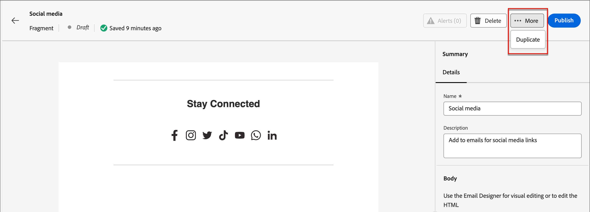{width="600" zoomable="yes"}

ダイアログで、一意の名前とオプションの説明を入力します。 「**[!UICONTROL 複製]**」をクリックします。

{width="400"}

複製されたフラグメントは、_フラグメント_&#x200B;のリストに表示されます。

## メールまたはテンプレートコンテンツから新しいフラグメントを保存する {#save-a-new-fragment-from-email-or-template-content}

ビジュアルコンテンツエディターで電子メールまたは電子メールテンプレートを作成または編集する際に、コンテンツの全体または一部をフラグメントとして保存して再利用できます。

1. コンテンツをフラグメントとして保存するには、**[!UICONTROL 詳細]**&#x200B;をクリックし、**[!UICONTROL フラグメントとして保存]**&#x200B;を選択します。

1. フラグメントに含めるさまざまな要素を選択します。

   Shift ボタンまたはControl ボタンを押しながら、複数の構造を選択します。

   隣接する構造のみを選択できます。

1. コンテンツを選択した状態で、右上の「**[!UICONTROL 作成]**」をクリックします。

1. ダイアログで、フラグメントの名前とオプションの説明を入力し、**[!UICONTROL 作成]**&#x200B;をクリックします。

その後、フラグメントは&#x200B;_フラグメント_ リストページに表示され、メールとメールテンプレート内で使用できます。

## 電子メールやテンプレートコンテンツへのビジュアルフラグメントの追加 {#add-visual-fragments-to-your-email-or-template-content}

フラグメントは再利用を考慮して設計されています。 1つのメールまたはメールテンプレートに最大30個まで追加でき、1つのレベルにのみネストできます。

* [メールへのフラグメントの追加](/help/marketo/product-docs/email-marketing/email-designer/email-authoring.md#add-fragments)

* [メールテンプレートへのフラグメントの追加](/help/marketo/product-docs/email-marketing/email-designer/email-template-authoring.md#add-fragments)

フラグメントのコンテンツは、構造内で動的に更新され、コンテンツがメールにどのように表示されるかを視覚的に表示します。

>[!TIP]
>
>フラグメントをメール内の水平レイアウト全体に配置する場合は、[!UICONTROL 1:1列]構造を追加し、フラグメントをドラッグ&amp;ドロップします。

電子メール/電子メールテンプレートを保存すると、「_[!UICONTROL 使用者]_」タブを選択すると、フラグメントの詳細ページに表示されます。 追加されたフラグメントは、メールまたはテンプレート内では編集できません。公開されたソースフラグメントがコンテンツを定義します。

## メールおよびテンプレートのオーサリング中にフラグメントがアクションを実行 {#fragment-actions-during-email-and-template-authoring}

フラグメントがメールまたはメールテンプレートに追加された場合、そのコンテンツはメールまたはテンプレート内で編集できません。 ただし、次のアクションを適用できます。

* **[!UICONTROL 削除]** – 現在の電子メールまたは電子メールテンプレートコンテンツからフラグメントが削除されます（フラグメントソースは影響を受けません）。
* **[!UICONTROL 更新]** – これにより、現在の電子メールまたは電子メールテンプレートのフラグメントのコンテンツが更新されます。 更新は、電子メールまたは電子メールテンプレートに追加した後で、フラグメントに最近編集した内容を反映する場合に便利です。
* **[!UICONTROL 重複]** – これは、エディター内の同じ電子メールまたは電子メールテンプレート内のフラグメントを複製します。 複製されたフラグメントは、元のフラグメントのすぐ下に追加されます。
* **[!UICONTROL フラグメントを開く]** – これにより、フラグメントエディターページと詳細を含む新しいブラウザータブが開きます。
* **[!UICONTROL 継承を解除]** – これにより、ソースからのフラグメント（およびその変更）の継承が解除されます。 このアクションを使用すると、フラグメントコンテンツを電子メールまたは電子メールテンプレート内で独立した編集可能なコンテンツとして利用できます。 このアクションは、元のフラグメントの&#x200B;_Used By_&#x200B;参照から電子メールまたは電子メールテンプレートも削除します。

>[!NOTE]
>
>メールで&#x200B;_HTML_&#x200B;との同期が無効になっている場合、行った変更（継承の解除を含む）はテキストコンテンツに反映されません。

エディターページでフラグメントを選択すると、これらのアクションはコンテキストツールバーと右側のプロパティパネルから使用できます。

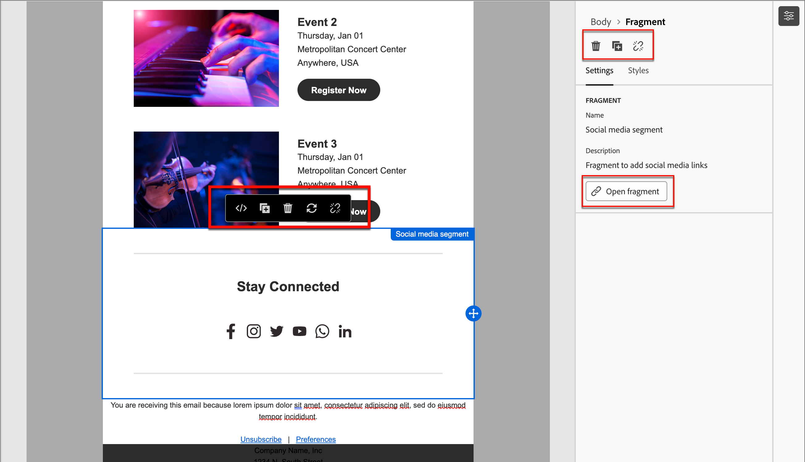{width="600" zoomable="yes"}

>[!MORELIKETHIS]
>
>[ カスタマイズ可能なフラグメント ](/help/marketo/product-docs/email-marketing/email-designer/customizable-fragments.md)
