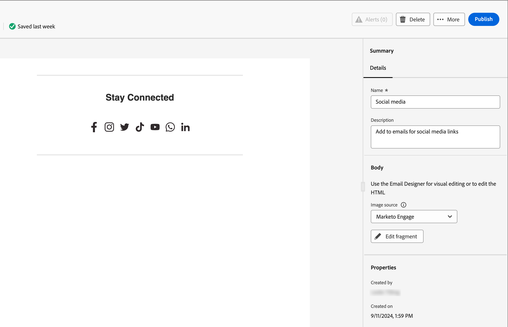

# フラグメント

フラグメントは、1 つ以上のメールおよびメールテンプレートで参照できる再利用可能なコンポーネントです。 通常は、コンテンツのブロック（テキスト、画像、またはその両方）を作成して、プロジェクトにすばやく挿入できます。 この機能を使用すると、複数のカスタムコンテンツブロックを事前に作成してメールコンテンツを組み合わせ、設計プロセスを改善できます。 一般的なユースケースとしては、メールのヘッダー/フッターコンテンツブロック、イベント招待バナー、季節ごとのメッセージなどがあります。

ワークフローでフラグメントを最大限に活用するには：

* _フラグメントの作成_ - ビジュアルコンテンツエディターからゼロから、またはコンテンツをフラグメントとして保存することで、ビジュアルフラグメントを作成します。
* _フラグメントを再利用_ - コンテンツで必要な回数だけ使用します。

## ビジュアルフラグメント {#visual-fragments}

ビジュアルフラグメントは、（ビジュアルコンテンツエディターを使用して）構築された事前定義済みのビジュアルブロックで、複数のメールまたはメールテンプレートで再利用できます。

## フラグメントへのアクセスと管理 {#access-and-manage-fragments}

ビジュアルフラグメントにアクセスするには、Design Studio に移動します。 左側のツリーで、「**[!UICONTROL フラグメント（新規）]**」をクリックします。

{width="600" zoomable="yes"}

デフォルトでは、テーブルは「_[!UICONTROL 変更済み]_ 列で並べ替えられます。 その他の列タイトルをクリックして、テーブルの並べ替え基準を変更します。 もう一度クリックすると、昇順と降順が切り替わります。

### フラグメントステータス {#fragment-status}

フラグメントステータスは、メールまたはメールテンプレートで使用できるフラグメントの有無と、フラグメントに加えられる変更を決定します。

<table>
<tbody>
  <tr>
    <td><b>下書き</b></td>
    <td>フラグメントを作成すると、そのステータスはドラフトになります。 メールまたはメールテンプレートで使用するために公開するまで、ドラフトのままです。
    
使用可能なアクション：
    <li>すべての詳細を編集</li>
    <li>ビジュアルデザイナーで編集</li>
    <li>公開</li>
    <li>複製</li>
    <li>削除</li>
  </td>
  <tr>
    <td><b>公開日</b></td>
    <td>フラグメントを公開すると、メールまたはメールテンプレートで使用できるようになります。 公開されたフラグメントコンテンツは、ビジュアルデザイナーでは変更できません。
    
使用可能なアクション：
    <li>説明を編集</li>
    <li>メールまたはテンプレートへの追加</li>
    <li>ドラフトバージョンを作成</li>
    <li>複製</li>
    <li>削除（使用中でない場合）</li>
    </td>
  </tr>
  <tr>
    <td><b>公開済み下書きあり</b></td>
    <td>公開済みフラグメントからドラフトを作成する場合、公開されたバージョンはメールまたはメールテンプレートで使用でき、ドラフトコンテンツはビジュアルデザイナーで変更できます。 ドラフトバージョンを公開すると、現在の公開バージョンが置き換えられ、コンテンツが使用中のメールおよびメールテンプレート <i> すべて </i> で更新されます。 
    
使用可能なアクション：
    <li>説明を編集</li>
    <li>メールまたはテンプレートへの追加</li>
    <li>ビジュアルデザイナーでのドラフトバージョンの編集</li>
    <li>Publishのドラフトバージョン</li>
    <li>複製</li>
    <li>削除（使用中でない場合）</li>
    </td>
  </tr>
</tbody></table>

### フラグメントリストのフィルタリング {#filter-the-fragments-list}

検索バーを使用して、名前でフラグメントを検索します。 _フィルター_ アイコン（）をクリックして、使用可能なフィルターオプションを表示し、必要な設定を選択します。

{width="700" zoomable="yes"}

### 列表示のカスタマイズ {#customize-the-column-display}

右上の _テーブルをカスタマイズ_ アイコン（）をクリックして、テーブルに表示する列をカスタマイズします。

ダイアログで、目的の列を選択し、「**[!UICONTROL 適用]**」をクリックします。

スクリーンショット

## フラグメントを作成 {#create-fragments}

右上の **[!UICONTROL フラグメントを作成]** をクリックして、新しいビジュアルフラグメントを作成します。

1. _[!UICONTROL フラグメントを作成]_ ダイアログで、**[!UICONTROL 名前]** とオプションの **[!UICONTROL 説明]** を入力します。

   フラグメント要件：

   * 名前 – 100 文字まで。一意である必要があります。大文字と小文字は区別されません
   * 説明 – 300 文字（最大）
   * Alpha、数字、特殊文字は問題ありません
   * 予約文字は使用できません **_使用できません_**: `\ / : * ? " < > |`

スクリーンショット

1. 「**[!UICONTROL 作成]**」をクリックします。

   ビジュアルデザイナーが空のキャンバスで開きます。

1. コンテンツデザインツールを使用して、ビジュアルフラグメントコンテンツを作成します。

   * [構造とコンテンツを追加](#add-structure-and-content)
   * [Assetsを追加](#add-assets)
   * [レイヤー、設定、スタイルの移動](#navigate-the-layers-settings-and-styles)
   * [コンテンツのパーソナライズ](#personalize-content)
   * [リンクされた URL トラッキングを編集](#edit-linked-url-tracking)

1. **[!UICONTROL 保存]** をクリックすれば、いつでもドラフトフラグメントを保存できます。

1. フラグメントをメールまたはメールテンプレートで使用できるようにする準備が整ったら、**[!UICONTROL Publish]** をクリックします。

### 構造とコンテンツを追加 {#add-structure-and-content}

{{$include /help/marketo/_includes/content-design-components.md}}

### アセットの追加

{{$include /help/_includes/content-design-assets.md}}

### レイヤー、設定、スタイルの移動

{{$include /help/_includes/content-design-navigation.md}}

### コンテンツのパーソナライズ

{{$include /help/_includes/content-design-personalization.md}}

### リンクされた URL トラッキングを編集

{{$include /help/_includes/content-design-links.md}}

## フラグメントの詳細を表示 {#view-fragment-details}

リストページで任意のフラグメントの名前をクリックして、フラグメントの詳細ページを開きます。 フラグメントの編集、名前の変更、フラグメントの説明の更新を選択できます。 更新を行い、「名前」フィールドまたは「説明」フィールドの外側をクリックして、変更を自動保存します。

>[!NOTE]
>
>公開されたフラグメントがメールまたはメールテンプレートで使用されている場合、その名前を変更したり、コンテンツを編集したりすることはできません。 フラグメントに変更を加える場合は、ドラフトバージョンを作成できます。

{width="600" zoomable="yes"}

**[!UICONTROL フラグメントを編集]** をクリックして、フラグメントをビジュアルコンテンツエディターで開きます。

左上の _戻る_ 矢印をクリックして、いつでもビューを終了できます。この矢印をクリックすると、_フラグメント_ リストページに戻ります。

## 参照別に使用されているフラグメントを表示 {#view-fragment-used-by-references}

フラグメントの詳細ページで、「**[!UICONTROL 使用者]**」タブをクリックして、Marketo Engage内でフラグメントが使用されている場所の詳細を表示します。

>[!IMPORTANT]
>
>メールまたはメールテンプレートで現在使用されているフラグメントは削除できません。

参照は、カテゴリ（_メール_ または _メールテンプレート_ に従って表示されます。 Journey Optimizer B2B editionのメールは、アカウントジャーニー内に埋め込まれて作成されるので、フラグメントを使用するメールの親ジャーニーは参照に表示されます。 &lt; – この部分はどうでしょう、NILESH

{width="600" zoomable="yes"}

リンクをクリックして、フラグメントが使用されている対応するメールまたはメールテンプレートを開きます。

## フラグメントの削除 {#delete-fragments}

メールまたはメールテンプレートで現在使用されているフラグメントは削除できないので、フラグメントの削除を開始する前に _使用_ 参照を必ず確認してください。 また、削除を取り消すことはできないので、削除操作を開始する前に確認します。

フラグメントを削除するには、次のいずれかの方法を使用します。

* 右側のフラグメントの詳細で、「**[!UICONTROL 削除]**」をクリックします。
* _[!UICONTROL フラグメント]_ リストページで、フラグメントの横にある省略記号をクリックし、「**[!UICONTROL 削除]**」を選択します。

この操作を実行すると、確認ダイアログが開きます。 **[!UICONTROL キャンセル]** をクリックするか、「**[!UICONTROL 削除]**」をクリックして削除を確定すると、プロセスを中止できます。

{width="400"}

## フラグメントの編集 {#edit-fragments}

フラグメントの編集は、現在のステータスに応じて異なります。

* フラグメントが _ドラフト_ ステータスの場合は、その詳細とビジュアルコンテンツを編集できます。
* フラグメントが _公開済み_ ステータスの場合、フラグメントの説明は編集できますが、名前は編集できません。 ビジュアルコンテンツは編集できません。
* フラグメントが _ドラフトで公開済み_ ステータスの場合、詳細の編集は説明に限定されます。 ドラフトバージョンの視覚的なコンテンツを編集することもできます。

>[!BEGINTABS]

>[!TAB  ドラフト ]

1. _[!UICONTROL フラグメント]_ リストページで、フラグメント名をクリックして開きます。

   ビジュアルコンテンツのプレビューが表示され、フラグメントの詳細が右側に表示されます。

1. 必要な編集を行います。

   {width="600" zoomable="yes"}

1. ビジュアルデザイナーでコンテンツを変更するには、「**[!UICONTROL フラグメントを編集]** をクリックします。

   必要に応じて、ビジュアルデザイナーのツールを使用します。

   * [構造とコンテンツを追加](#add-structure-and-content)
   * [Assetsを追加](#add-assets)
   * [レイヤー、設定、スタイルの移動](#navigate-the-layers-settings-and-styles)
   * [コンテンツのパーソナライズ](#personalize-content)
   * [リンクされた URL トラッキングを編集](#edit-linked-url-tracking)

   **[!UICONTROL 保存]** または **[!UICONTROL 保存して閉じる]** をクリックして、フラグメントの詳細に戻ります。

1. フラグメントが条件を満たしていて、メールまたはメールテンプレートで使用できるようにする場合は、**[!UICONTROL Publish]** をクリックします。

>[!TAB パブリッシュ済み]

1. _[!UICONTROL フラグメント]_ リストページで、フラグメント名をクリックして開きます。

   ビジュアルコンテンツのプレビューが表示され、フラグメントの詳細が右側に表示されます。

1. 必要に応じて、説明を変更します。

   公開済みのフラグメントの場合、その他の詳細はすべて変更できません。

1. コンテンツを更新する場合は、右上の **[!UICONTROL ドラフトバージョンを作成]** をクリックします。

   ダイアログで **[!UICONTROL OK]** をクリックして、ドラフトバージョンをビジュアルデザイナーで開きます。 必要に応じて、`image source` KG - リンクをここで変更できます。

   {width="300"}

   必要に応じて、ビジュアルデザイナーのツールを使用します。

   * [構造とコンテンツを追加](#add-structure-and-content)
   * [Assetsを追加](#add-assets)
   * [レイヤー、設定、スタイルの移動](#navigate-the-layers-settings-and-styles)
   * [コンテンツのパーソナライズ](#personalize-content)
   * [リンクされた URL トラッキングを編集](#edit-linked-url-tracking)

   **[!UICONTROL 保存]** または **[!UICONTROL 保存して閉じる]** をクリックして、フラグメントの詳細に戻ります。

1. ドラフトフラグメントが条件を満たしていて、変更をメールまたはメールテンプレートで使用できるようにする場合は、**[!UICONTROL Publish]** をクリックします。

   ドラフトバージョンを公開すると、現在の公開バージョンが置き換えられ、既に使用されているメールおよびメールテンプレートのコンテンツが更新されます。

>[!TAB  ドラフトで公開済み ]

_[!UICONTROL フラグメント]_ リストページからドラフトバージョンを開いて編集する方法は 2 つあります。

* フラグメント名の横にある _詳細_ アイコン（**...**）をクリックし、「**[!UICONTROL ドラフトバージョンを開く]**」を選択します。

  {width="300"}

* フラグメント名をクリックして開きます。 次に、右上の **[!UICONTROL ドラフトバージョンを開く]** をクリックします。

  ドラフトバージョンのビジュアルコンテンツのプレビューが表示され、フラグメントの詳細が右側に表示されます。

コンテンツを更新するには：

1. 右上の **[!UICONTROL フラグメントを編集]** をクリックします。 必要に応じて、ビジュアルデザイナーのツールを使用します。

   * [構造とコンテンツを追加](#add-structure-and-content)
   * [Assetsを追加](#add-assets)
   * [レイヤー、設定、スタイルの移動](#navigate-the-layers-settings-and-styles)
   * [コンテンツのパーソナライズ](#personalize-content)
   * [リンクされた URL トラッキングを編集](#edit-linked-url-tracking)

   **[!UICONTROL 保存]** または **[!UICONTROL 保存して閉じる]** をクリックして、フラグメントの詳細に戻ります。

1. ドラフトフラグメントが条件を満たしていて、変更をメールまたはメールテンプレートで使用できるようにする場合は、**[!UICONTROL Publish]** をクリックします。

   ドラフトバージョンを公開すると、現在の公開バージョンが置き換えられ、既に使用されているメールおよびメールテンプレートのコンテンツが更新されます。

>[!ENDTABS]

## フラグメントを複製 {#duplicate-fragments}

次のいずれかの方法を使用して、フラグメントを複製できます。

* _[!UICONTROL フラグメント]_ リストページで、フラグメント名の横にある _詳細_ アイコン（**...**）をクリックし、「**[!UICONTROL 複製]**」を選択します。
* フラグメントの詳細ページの右上にある「**[!UICONTROL ..」をクリックします。詳細を表示して]** 「複製 **[!UICONTROL を選択]** ます。

{width="600" zoomable="yes"}

ダイアログで、一意の名前と説明（オプション）を入力します。 「**[!UICONTROL 複製]**」をクリックして、アクションを完了します。

{width="400"}

複製されたフラグメントは、_フラグメント_ リストに表示されます。

## メールまたはテンプレートコンテンツから新しいフラグメントを保存 {#save-a-new-fragment-from-email-or-template-content}

ビジュアルコンテンツエディターでメールまたはメールテンプレートを作成または編集する際に、コンテンツのすべてまたは一部をフラグメントとして保存し、再利用できるようにすることができます。

1. コンテンツをフラグメントとして保存するには、「詳細 **[!UICONTROL をクリックして]** 「**[!UICONTROL フラグメントとして保存]**」を選択します。

1. フラグメントに含める様々な要素を選択します。

   Shift キーまたは Control ボタンを押しながら複数の構造を選択します。

   互いに隣接する構造のみを選択できます。インターフェイスでは、隣接しない要素は選択できません。

1. コンテンツを選択した状態で、右上の **[!UICONTROL 作成]** をクリックします。

1. ダイアログで、フラグメントの名前と説明（オプション）を入力します。 「**[!UICONTROL 作成]**」をクリックします。

   フラグメントは _フラグメント_ リストページに表示され、メールやメールテンプレート内でも使用できます。

## メールコンテンツまたはテンプレートコンテンツへのビジュアルフラグメントの追加 {#add-visual-fragments-to-your-email-or-template-content}

フラグメントは再利用できるように設計されており、メールまたはメールテンプレートに最大 30 個を追加できます。 フラグメントは 1 レベルまでネストできます。

>[!BEGINTABS]

>[!TAB  メールへのフラグメントの追加 ]

1. **[!UICONTROL アカウントジャーニー]** に移動し、既存のジャーニーを開くか、新しいジャーニーを作成します。 &lt; - メールまたはメールテンプレート内の場合のみ

-------- – ここで編集をやめました – --------

1. [_[!UICONTROL  メールを送信 ]_ノード ](./email-authoring.md#add-an-email-action-in-an-account-journey) を作成します。

1. [ ノードのメールコンテンツ ](./email-authoring.md#create-the-email-content) を作成または編集します。

1. **[!UICONTROL コンポーネント]** メニューから項目をドラッグ&amp;ドロップして、フラグメントの _構造_ を指定します。

1. 公開済みのフラグメントのリストを開くには、「_フラグメント_」アイコンをクリックします。

   次の操作が可能です。
   * リストを並べ替えます。
   * リストを参照、検索およびフィルタリングします。
   * カード表示（サムネール）とリスト表示を切り替えます。
   * 最近作成したフラグメントが反映されるように、リストを更新します。

スクリーンショット

1. 任意のフラグメントを構造コンポーネントプレースホルダーにドラッグ&amp;ドロップします。

   エディターは、メール構造のセクション/要素内でフラグメントをレンダリングします。

フラグメントのコンテンツは、構造内で動的に更新され、コンテンツがメールにどのように表示されるかが視覚的に表示されます。

>[!TIP]
>
>フラグメントをメール内の水平レイアウト全体に配置する場合は、[!UICONTROL 1:1 列 ] 構造を追加して、フラグメントをメールにドラッグ&amp;ドロップします。

メールを保存した後、「使用 _[!UICONTROL タブが選択されると、フラグメントの詳細ページに表示され]_ す。 メールに追加されたフラグメントは、メールまたはテンプレート内では編集できません。公開されたソースフラグメントがコンテンツを定義します。

>[!TAB  メールテンプレートへのフラグメントの追加 ]

1. 左側のナビゲーションから、**[!UICONTROL コンテンツ管理]**/**[!UICONTROL テンプレート]** をクリックします。

1. 新しいテンプレートを作成するか、既存のメールテンプレートを開いて、「**[!UICONTROL メールテンプレートを編集]**」をクリックします。

1. **[!UICONTROL コンポーネント]** メニューから項目をドラッグ&amp;ドロップして、フラグメントの _構造_ を指定します。

1. フラグメントリストを開くには、「_フラグメント_」アイコンをクリックします。

   次の操作が可能です。
   * リストを並べ替えます。
   * リストを参照、検索およびフィルタリングします。
   * カード表示（サムネール）とリスト表示を切り替えます。
   * 最近作成したフラグメントが反映されるように、リストを更新します。

スクリーンショット

1. 任意のフラグメントを構造コンポーネントプレースホルダーにドラッグ&amp;ドロップします。

   エディターは、メールテンプレート構造のセクション/要素内でフラグメントをレンダリングします。

1. 任意のフラグメントを構造コンポーネントプレースホルダーにドラッグ&amp;ドロップします。

   エディターは、メールテンプレート構造のセクション/要素内でフラグメントをレンダリングします。

>[!TIP]
>
>フラグメントをメールテンプレート内の水平レイアウト全体に配置する場合は、_[!UICONTROL 1:1 列]_ 構造を追加してから、フラグメントをドラッグ&amp;ドロップします。

メールテンプレートを保存した後、「使用 _[!UICONTROL タブを選択すると、フラグメントの詳細ページに表示され]_ す。 メールテンプレートに追加されたフラグメントは、テンプレート内では編集できません。公開されたソースフラグメントがコンテンツを定義します。

>[!ENDTABS]

## メールおよびテンプレートのオーサリング中のフラグメントアクション

フラグメントをメールまたはメールテンプレートに追加すると、メールまたはテンプレート内でフラグメントコンテンツを編集できません。 ただし、次の操作を適用できます。

* **[!UICONTROL 削除]** – このアクションは、現在のメールまたはメールテンプレートコンテンツからフラグメントを削除します（フラグメントソースは影響を受けません）。
* **[!UICONTROL 更新]** – このアクションは、現在のメールまたはメールテンプレート内のフラグメントのコンテンツを更新します。 更新は、メールまたはメールテンプレートに追加した後に、フラグメントに対して最近の編集を反映する場合に便利です。
* **[!UICONTROL 複製]** – このアクションでは、エディター内の同じメールまたはメールテンプレート内のフラグメントを同じディメンションで複製し、その下に追加します。
* **[!UICONTROL フラグメントを開く]** – このアクションを実行すると、フラグメントエディターページと詳細を含む新しいブラウザータブが開きます。
* **[!UICONTROL 継承を解除]** – このアクションは、ソースからのフラグメントの継承（およびその変更）を解除します。 フラグメントコンテンツを、メールまたはメールテンプレート内で独立した編集可能なコンテンツとして利用できるようにする場合は、このアクションを使用します。 また、このアクションは、元のフラグメントの _使用者_ 参照からメールまたはメールテンプレートも削除します。

エディターページでフラグメントを選択すると、これらのアクションはコンテキストツールバーと、右側のプロパティパネルから使用できます。

{width="600" zoomable="yes"}
