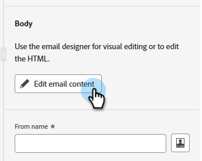
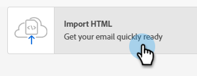
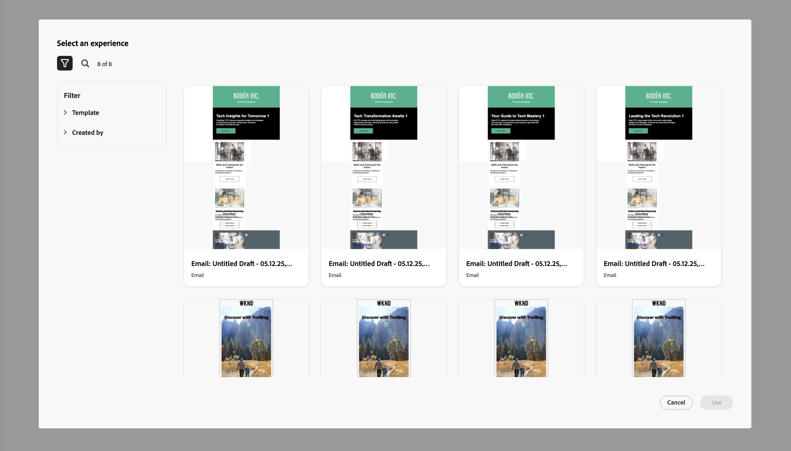

# Marketo Engage の GenStudio の統合 {#genstudio-integration-for-marketo-engage}

Adobe GenStudio for Performance Marketingは、独自の広告やメールを作成し、ブランド基準を満たし、企業のポリシーに準拠した、インパクトのあるパーソナライズされたマーケティング施策を推進できる、生成AIを活用したアプリケーションです。 コンテンツ制作の複雑さを簡素化する多くのツールを提供します。

>[!AVAILABILITY]
>
>この機能を利用するには：
>
>* IMS組織は、Marketo Engageと同じIMS組織でGenStudio for Performance Marketingを使用してプロビジョニングする必要があります（詳しくは、アカウントマネージャーにお問い合わせください）
>* GenStudio for Performance Marketingの使用権限（System Manager、Editor、または共同作業者の製品プロファイル）が必要です

>[!INFO]
>
>[GenStudio for Performance Marketing](https://experienceleague.adobe.com/ja/docs/genstudio-for-performance-marketing/user-guide/home){target="_blank"}の詳細をご覧ください。

## Marketo EngageのGenStudio機能を活用する {#leverage-genstudio-capabilities}

この統合により、Marketo Engageを使用してメールキャンペーンを開発および自動化するテクニカルマーケターは、GenStudioを使用してコンテンツを制作するパフォーマンスマーケターと協力することができます。 これにより、GenStudioのブランドに即したコンテンツをMarketo Engageに簡単に統合できます。

## Marketo EngageからGenStudioへのHTML テンプレートの書き出し {#export-an-html-template}

ブランドのガイドラインを含むテンプレートをGenStudio for Performance Marketingに簡単に書き出すことができます。

1. Marketo Engageで、メールの内容にアクセスします。

1. 電子メールDesignerで、「**詳細**」ボタンをクリックし、「**HTMLを書き出し**」を選択します。

   

1. [書き出したHTML](https://experienceleague.adobe.com/ja/docs/genstudio-for-performance-marketing/user-guide/content/templates/use-templates#templates-from-ajo-and-marketo){target="_blank"}のテンプレートをGenStudio for Performance Marketingにアップロードします。

1. GenStudioでは、このテンプレートを使用して、AI プロンプトを使用して[いくつかの電子メールのバリエーション ](https://experienceleague.adobe.com/ja/docs/genstudio-for-performance-marketing/user-guide/create/create-email-experience){target="_blank"}を作成し、保存します。

## Marketo EngageでのGenStudio体験の活用 {#leverage-genstudio-experiences}

Marketo Engageに読み込んで作成したGenStudio メールのバリエーションを活用するには、次の手順に従います。

1. Marketo Engageで、[電子メールを作成](/help/marketo/product-docs/email-marketing/email-designer/email-authoring.md#create-an-email)。

1. メールの詳細ページで、**メールコンテンツの編集**&#x200B;をクリックします。

   

1. 「**HTMLを読み込み**」を選択します。

   

1. 「**Adobe GenStudio for Performance Marketing**」ボタンをクリックします。

   

1. GenStudio エクスペリエンスを参照して、コンテンツの作成を開始します。 商品、ペルソナ、ブランド、さらには色などの基準でエクスペリエンスをフィルタリングすることができます。

1. エクスペリエンスを選択し、「**使用**」をクリックします。

   {width="800" zoomable="yes"}

1. 選択したコンテンツが E メールデザイナーに表示されます。

   {width="800" zoomable="yes"}

>[!NOTE]
>
>Marketo Engage テンプレートから作成されたGenStudio エクスペリエンスは、メールDesignerに直接読み込まれます。 Marketo Engage テンプレートなしで作成されたGenStudio エクスペリエンスは、互換モードで読み込まれます。

[ メールコンテンツ編集ツール ](/help/marketo/product-docs/email-marketing/email-designer/email-authoring.md#add-structure-and-content){target="_blank"}と[ パーソナライゼーションフィールド ](/help/marketo/product-docs/email-marketing/email-designer/email-authoring.md#personalize-content){target="_blank"}を使用して、必要に応じてメールを編集します。
