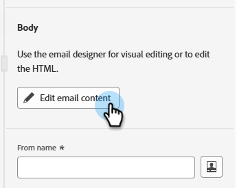

# Marketo Engage の GenStudio の統合 {#genstudio-integration-for-marketo-engage}

Adobe GenStudio for Performance Marketingは、独自の広告やメールを作成し、ブランド標準を満たし、企業ポリシーに準拠した、インパクトのあるパーソナライズされたマーケティングキャンペーンを推進できる、ジェネレーティブ AI ファーストのアプリケーションです。 コンテンツ作成の複雑さを簡素化する多くのツールを提供します。

>[!AVAILABILITY]
>
>この機能を活用するには、次の手順に従います。
>
>* IMS 組織は、Marketo Engageと同じ IMS 組織でGenStudio for Performance Marketingをプロビジョニングする必要があります（詳しくは、アカウントマネージャーにお問い合わせください）
>* GenStudio for Performance Marketing（システムマネージャー、編集者または共同作業者）のユーザー資格が必要です

>[!INFO]
>
>[GenStudio for Performance Marketing](https://experienceleague.adobe.com/ja/docs/genstudio-for-performance-marketing/user-guide/home){target="_blank"} の詳細情報。

## Marketo EngageでのGenStudio機能の活用 {#leverage-genstudio-capabilities}

この統合により、Marketo Engageを使用してメールキャンペーンの開発と自動化を行うテクニカルマーケターは、GenStudioを使用してコンテンツを作成するパフォーマンスマーケターと共同作業ができるようになります。 これにより、GenStudioのオンブランドコンテンツをMarketo Engageに簡単に統合できます。

## Marketo EngageからGenStudioへのHTML テンプレートの書き出し {#export-an-html-template}

ブランドのガイドラインを含んだテンプレートをGenStudio for Performance Marketingに簡単に書き出すことができます。

1. Marketo Engageで、メールのコンテンツにアクセスします。

1. E メールDesignerで「**詳細**」ボタンをクリックし、「**HTMLを書き出し**」を選択します。

   

1. 書き出したテンプレートをGenStudio for Performance Marketingに [HTMLをアップロード &#x200B;](https://experienceleague.adobe.com/ja/docs/genstudio-for-performance-marketing/user-guide/content/templates/use-templates#templates-from-ajo-and-marketo){target="_blank"} します。

1. GenStudioでは、このテンプレートを使用して、AI プロンプトとともに [&#x200B; 複数のメールのバリエーションを作成 &#x200B;](https://experienceleague.adobe.com/ja/docs/genstudio-for-performance-marketing/user-guide/create/create-email-experience){target="_blank"} し、それらを保存します。

## Marketo EngageでのGenStudio Experience の活用 {#leverage-genstudio-experiences}

Marketo Engageに読み込むことで作成したGenStudio メールのバリエーションを活用するには、次の手順に従います。

1. Marketo Engageで [&#x200B; メールを作成 &#x200B;](/help/marketo/product-docs/email-marketing/email-designer/email-authoring.md#create-an-email) します。

1. メールの詳細ページで、「**メールコンテンツを編集**」をクリックします。

   

1. **HTMLを読み込み** を選択します。

   

1. 「**Adobe GenStudio for Performance Marketing**」ボタンをクリックします。

   

1. GenStudio エクスペリエンスを参照して、コンテンツの作成を開始します。エクスペリエンスは、条件（製品、ペルソナ、ブランド、さらにカラーなど）に基づいてフィルタリングできます。

1. エクスペリエンスを選択し、「**使用**」をクリックします。

   {width="800" zoomable="yes"}

1. 選択したコンテンツが E メールデザイナーに表示されます。

   {width="800" zoomable="yes"}

>[!NOTE]
>
>Marketo Engage テンプレートから作成されたGenStudio エクスペリエンスは、電子メールDesignerに直接読み込まれます。 GenStudio テンプレートを使用せずに作成されたMarketo Engage エクスペリエンスは、互換モードで読み込まれます。

[&#x200B; メールコンテンツ編集ツール &#x200B;](/help/marketo/product-docs/email-marketing/email-designer/email-authoring.md#add-structure-and-content){target="_blank"} および [&#x200B; パーソナライゼーションフィールド &#x200B;](/help/marketo/product-docs/email-marketing/email-designer/email-authoring.md#personalize-content){target="_blank"} を使用して、必要に応じてメールを編集します。
