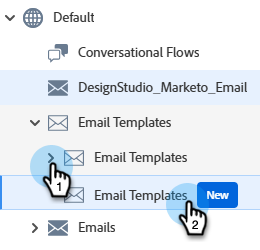
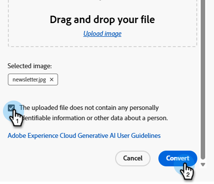
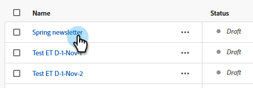
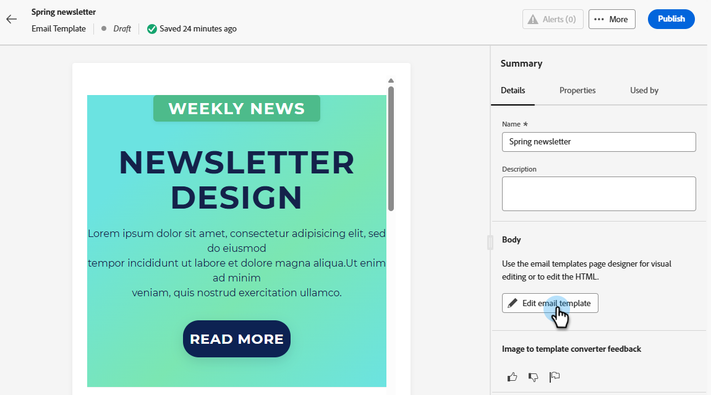

# HTML テンプレートへの画像の変換 {#image-to-html}

## 概要 {#overview}

Image to HTML converterは、静止画像を、完全にカスタマイズ可能なモジュール式のHTML メールコンテンツテンプレートに変換することで、メール作成を大幅に高速化します。 このノーコードツールを利用すれば、グラフィックデザイナーやデザインツールのビジュアルデザインを、レスポンシブで編集可能なメールテンプレートに変換して、何度でも再利用できます。

生成AI テクノロジーを活用して、画像からHTMLへのコンバーターは、画像内のレイアウト、タイポグラフィ、カラー、ビジュアル要素を分析し、デザインの忠実性を維持しながら、メールHTMLとの完全な編集可能性と互換性を確保する、クリーンでモジュール化されたDesignerコードを生成します。

>[!PREREQUISITES]
>
>* 最初に、メール Designerで生成AI機能を使用するための[Core Gen-AI条件と補足条件](https://www.adobe.com/legal/terms/enterprise-licensing/genai-ww.html){target="_blank"}に同意する必要があります。 詳しくは、Adobe アカウントチーム（アカウントマネージャー）にお問い合わせください。
>* Marketo ロール [&#128279;](https://experienceleague.adobe.com/ja/docs/marketo/using/product-docs/administration/users-and-roles/managing-user-roles-and-permissions#edit-a-role)でを有効にするには、_電子メールテンプレートにアクセス_&#x200B;と&#x200B;_電子メールテンプレートを編集/生成_&#x200B;権限が必要です。

## 画像の変換 {#convert-an-image}

画像を完全にカスタマイズ可能なHTML メールテンプレートに変換するには、次の手順に従います。

>[!NOTE]
>
>最適な結果を得るには、明確な視覚要素と読みやすいテキストを含む高品質の画像を使用します。 画像の幅は、標準的なメールディメンションに一致させて 600～800 ピクセルにするのが理想的です。

1. _デザインスタジオ_&#x200B;で、**電子メールテンプレート**&#x200B;をクリックし、**電子メールテンプレート（新規）**&#x200B;をクリックします。

   

1. 「**[!UICONTROL 画像をテンプレートに変換]**」をクリックします。

   

1. _テンプレート名_&#x200B;とオプションの説明を入力します。 オプションで、ブランドのスタイルを選択することもできます。 目的の画像をアップロードまたはドラッグ&amp;ドロップします。

   

1. 下にスクロールして、「_アップロードファイルに含まれていません…_」チェックボックスを選択します。 「**変換**」をクリックします。

   

   >[!NOTE]
   >
   >生成プロセスは、画像デザインの複雑さとサイズに応じて、最大5分かかります。 AI 処理はバックグラウンドで行われるので、コンバージョンの進行中にこの画面から離れて他のタスクに取り組むことができます。 _メールテンプレート_ ライブラリ画面を更新して、ステータスの変更を確認する必要がある場合があります。

1. 変換が完了すると、テンプレートはドラフトとして自動的に保存されます。 表示/編集するには、名前をクリックします。

   

1. 変換したテンプレートは、完全な編集機能を含む E メールデザイナーで開きます。 次ができるようになりました。

   * テキストコンテンツを編集し、パーソナライゼーションを適用
   * 画像を変更し、リンクを追加
   * カラー、フォント、スタイルを調整
   * コンテンツコンポーネントを追加、削除、並べ替え
   * 他のテンプレートと同様に、E メールデザイナーのすべての機能を活用

   {width="800" zoomable="yes"}

1. 必要に応じて調整することで、テンプレートを微調整し、ブランドガイドラインに適合させることができます。

1. テンプレートに問題がなければ、「**[!UICONTROL 保存して閉じる]**」、「**公開**」の順にクリックします。

テンプレートは&#x200B;_電子メールテンプレート_ ライブラリで利用できるようになりました。電子メールの作成時に使用できます。

## よくあるユースケース {#use-cases}

画像から HTML へのコンバーターは、次の場合に最適です。

* **プラットフォームの移行**：別のメールマーケティングプラットフォームから移行しますか？ ゼロから再構築することなく、既存のメールデザインをMarketo Engage対応のHTMLテンプレートに変換できます
* **デザインモックアップのコンバージョン**：Photoshop、Figma、その他のデザインソフトウェアなどのツールから作成したデザインモックアップを、機能的なメールテンプレートに変換します
* **迅速なテンプレートの作成**：開発者リソースを待つことなく、時間的制約のあるキャンペーン用のメールテンプレートを迅速に生成します
* **テンプレートライブラリの作成**：技術者以外のチームメンバーがカスタマイズおよびデプロイできる、ブランドの一貫性のあるテンプレートの包括的なライブラリを作成します

## ベストプラクティス {#best-practices}

**事前準備**

* **既存のコンテンツを保存**：画像を HTML に変換すると、メール内の既存のコンテンツがすべて置き換えられます。 この機能を使用する前に、現在の作業内容を常に保存します。
* **ワークフローの計画**: メール作成プロセスの最初に画像からHTMLへのコンバーターを使用するか、現在のすべてのコンテンツを置き換える準備ができていることを確認します。

**画像の準備**

* **解像度**：高解像度の画像を使用して、テキスト認識と要素の検出を向上させます。
* **明瞭度**: テキストが明確に読みやすく、視覚的な要素が明確に定義されていることを確認します。
* **幅**：一般的な電子メールクライアントの要件に合わせて、標準の電子メール幅（600 ～ 800 px）で画像をデザインします。
* **ファイル形式**:JPEGまたはPNG形式を使用します。圧縮された画像や低画質の画像は避けてください。
* **完全なデザイン**：完全な電子メールデザインを1つの画像（ヘッダーからフッターまで）に含めます。

**デザインに関する考慮事項**

* **シンプルなレイアウト**：シンプルで構造化されたレイアウトは、非常に複雑なデザインよりも正確に変換されます。
* **標準要素**：一般的なメール デザイン パターン（ヘッダー、本文セクション、CTA、フッター）を使用します。
* **テキストの読みやすさ**: テキストと背景の間に十分なコントラストを確保します。
* **Web セーフフォント**：共通のweb セーフフォントを使用するデザインの忠実度が高くなります。
* **重なり合う要素を避ける**: デザイン要素を明確に分離して、構造認識を向上させます。

**コンバージョン後**

* **ドラフトを確認**：コンバージョンが完了すると、テンプレートは自動的にドラフトとして保存されます。 時間をかけて、生成されたHTMLの正確性を慎重に検証します。
* **徹底的にテスト**：様々な電子メールクライアントとデバイスで電子メールをテストします。 より高速な結果を得るには、[Litmus統合](/help/marketo/product-docs/email-marketing/email-designer/test-email-rendering.md)を利用します。
* **手動で調整**：電子メール Designerのフル編集機能を使用して、必要に応じて調整します。
* **ブランドの整列**：色、フォント、スタイル設定がブランドガイドラインに一致することを確認します。
* **Personalization**：必要に応じて、動的コンテンツとパーソナライゼーショントークンを追加します。
* **アクセシビリティ**：必要に応じてアクセシビリティ機能を確認し、強化します。

## 制限と考慮事項 {#limitations}

Image to HTML コンバータを使用する場合は、次の制限に注意してください。

* **AIの解釈**: AIは、画像の視覚的な解釈に基づいてHTMLを生成します。 複雑なデザインや通常ではないデザインでは、コンバージョン後に手動で調整が必要になる場合があります。

* **テキストの正確性**：AI はテキストを正確に認識および再現しようとしますが、テキストコンテンツを常に確認し、必要に応じて修正を行います。

* **動的コンテンツ**：コンバージョンプロセスでは、画像に基づいて静的な HTML が作成されます。 コンバージョン後には、パーソナライゼーション、動的コンテンツ、トラッキングを手動で追加する必要があります。

* **複雑なレイアウト**：複雑なレイヤー、通常ではないシェイプ、非標準の要素を含む非常に複雑なデザインは、完全に変換されない場合があります。 一般的に、よりシンプルなデザインがより良い結果を得られます。

* **処理時間**：画像の複雑さとサイズによっては、変換プロセスに最大5分かかる場合があります。 AI の処理はバックグラウンドで行われるので、画面を開いたままにすることなく他のタスクを実行できます。 変換が完了すると、テンプレートはドラフトとして自動的に保存されます。

>[!NOTE]
>
>画像から HTML へのコンバーターは、メール作成の強力な出発点となるようにデザインされています。 生成されたHTMLは、要件を満たしていることを確認するために、メールDesignerを使用してレビューおよび調整する必要があります。

## よくある質問 {#faq}

+++画像から HTML へのコンバーターを使用すると、既存のメールコンテンツはどうなりますか？

コンバージョン用に画像をアップロードすると、メール内の既存のコンテンツはすべて削除され、新しく生成したテンプレートに置き換えられます。 この機能を使用する前に、重要なコンテンツを保存してください。 メール作成プロセスの最初に、画像からHTMLへのコンバーターを使用することをお勧めします。

+++

+++サポートされているファイル形式は何ですか？

画像から HTML へのコンバーターは、JPEG（.jpg、.jpeg）および PNG（.png）画像形式をサポートしています。

+++

+++コンバージョンプロセスにはどのくらいの時間がかかりますか？

画像デザインの複雑さとサイズによっては、変換に最大5分かかる場合があります。 AIの処理はバックグラウンドで行われるため、移動しなくても他のタスクに取り組むことができます。画面を開いたままにしておく必要はありません。 変換が完了すると、ファイルは自動的にドラフトとして保存され、レビューして編集できます。

+++

+++生成したテンプレートを編集できますか？

はい、あります。 生成した HTML テンプレートは、完全な編集機能を含む E メールデザイナーで開きます。 テキスト、画像、スタイル、レイアウト、構造など、テンプレートのすべての側面を変更できます。

+++

+++コンバージョンがデザインと完全に一致しない場合はどうなりますか？

AIはデザインを正確に解釈するよう最善を尽くしますが、場合によっては手動での絞り込みが必要になることがあります。 微調整が必要な要素は、E メールデザイナーを使用して調整してください。

+++

+++この機能をランディングページやその他のコンテンツタイプに使用できますか？

画像から HTML へのコンバーターは現在、メール テンプレート専用にデザインされています。 その他のコンテンツタイプの場合は、E メールデザイナーで使用できる標準のデザインおよび読み込みオプションを使用します。

+++

+++コンバージョンしたテンプレートを複数のメール施策で再利用できますか？

はい、あります。 画像からHTMLへのコンバーターで作成されたテンプレートは、_メールテンプレート_ ライブラリに自動的に保存されます。 後ほど任意のメールでアクセスして再利用できます。

+++
