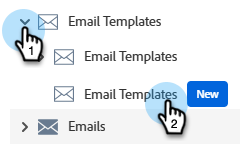
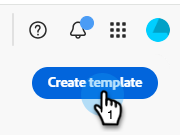
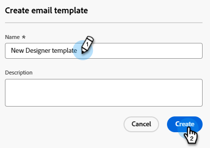
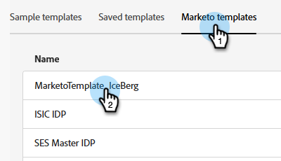
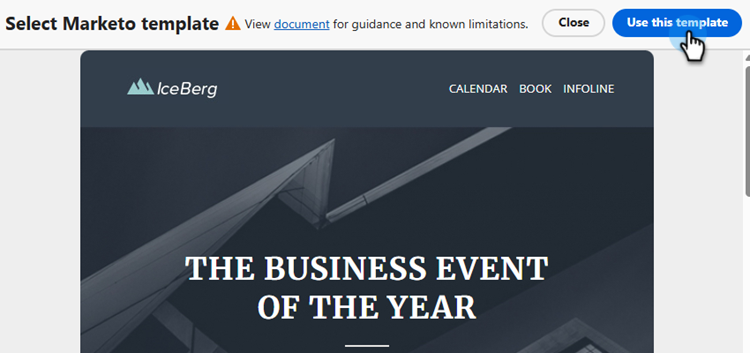
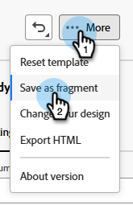
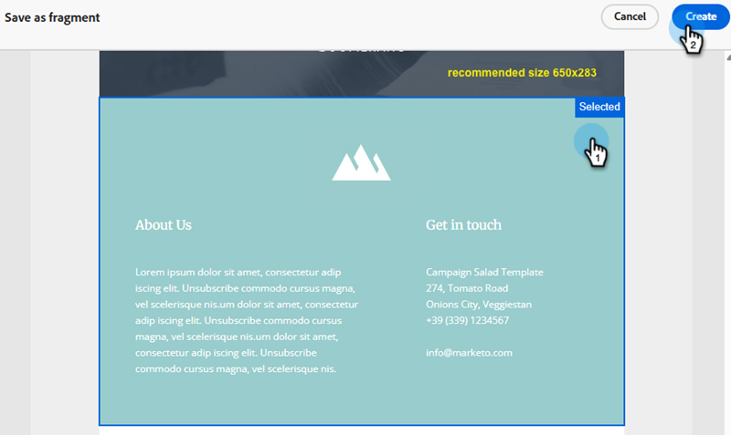
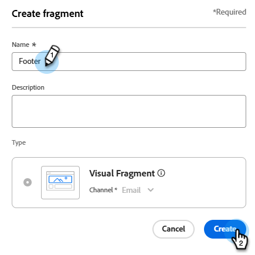

# テンプレートインポート {#template-import}

既存のメールテンプレートをクラシックエディターから新しいメールDesignerに簡単にインポートできます。これにより、デザインを保持し、使い慣れた再利用可能な構造のテンプレートを作成できます。 [ ベストプラクティス ](#best-practices)を確認し、[の制限と救済策](#limitations-and-remedies)について説明します。

>[!NOTE]
>
>従来のメールテンプレートはフリースタイルのHTMLを使用して開発されているので、このインポーターがすべてのコンポーネントを完全にインポートするとは限りません。 インポートしたテンプレートを確認して、すべてのセクションが編集可能で正しくマッピングされていることを確認してください。 領域が選択できない場合は、最適な結果を得るために再作成します。

## テンプレートの読み込み {#import-a-template}

1. **Design Studio** に移動します。

   

1. 「**メールテンプレート**」をクリックし、「**メールテンプレート （新規）**」を選択します。

   

1. 「**テンプレートを作成**」をクリックします。

   

1. _名前_&#x200B;と（オプション） _説明_&#x200B;を入力します。

   

1. 「**Marketoテンプレート**」タブをクリックし、クラシックメールエディターで作成された既存のテンプレートから選択します。

   

   >[!NOTE]
   >
   >現在のワークスペースと共有されている承認済みテンプレートとテンプレートのみが読み込み可能です。

1. 「**このテンプレートを使用**」をクリックします。

   

1. インポートしたテンプレートがメールDesignerで開きます。

1. Designerを使用して、適切なコンバージョンのコンポーネントを確認し、必要な調整をおこないます。 テンプレートに問題がなければ、メールでの使用を承認します。

## フラグメントを作成 {#create-fragments}

後で使用するために、繰り返し可能なセクションのフラグメントを作成することをお勧めします。

1. 上部の「**...More**」ボタンをクリックし、**フラグメントとして保存**&#x200B;を選択します。

   

1. コンポーネントまたは構造を選択し、**作成**&#x200B;をクリックします。

   

1. 名前（およびオプションの説明）を入力し、**保存**&#x200B;をクリックします。

   

## ベストプラクティス {#best-practices}

* 従来のメールテンプレートはフリースタイルのHTMLを使用して開発されているので、このインポーターがすべてのコンポーネントを完全にインポートするとは限りません。 インポートしたテンプレートを確認して、すべてのセクションが編集可能で正しくマッピングされていることを確認してください。 領域が選択できない場合は、最適な結果を得るために再作成します。

* インポート後、再利用可能なセクションをフラグメントとして保存し、メール作成者が使用できるように承認できます。 ブランドのテーマを適用して、一貫性とコンプライアンスを維持。

* 引き続きVelocity スクリプトを使用できます。また、フラグメントと条件付きコンテンツを組み合わせて古いスニペットを再実装し、柔軟性と制御を向上させることもできます。

## 制限と救済 {#limitations-and-remedies}

<table><thead>
  <tr>
    <th>制限事項</th>
    <th>理由</th>
    <th>レメディ</th>
  </tr></thead>
<tbody>
  <tr>
    <td>クラシックメールエディターで定義された変数は、メールレベルでは使用できません。</td>
    <td>これらの変数は、元々、WYSIWYGの機能がエディターで提供されていない場合に、メール編集を簡素化するために設計されました。 電子メールDesignerでは、使用可能なコントロールを使用して、同様の柔軟性を実現できます。 インポーターは、既存のテンプレートの構造とコンポーネントを保持し、メールDesignerで効率的にテンプレートを再作成するのに役立ちます。</td>
    <td>Designerで実行する必要があります。 

    モジュールの場合は、異なるセグメントをフラグメントとして保存できます。 承認されたフラグメントは、メールレベルで使用できます。</td>
  </tr>
  <tr>
    <td>ソース HTMLにネストされたブロックが含まれている場合、より深いレイヤーはDesignerでアドレス指定できません。</td>
    <td>メール Designerでは、ネストされたコメントはサポートされていません。</td>
    <td>Designerでは、ネストされた構造を編集できませんが、正確にレンダリングする必要があります。 まず、テンプレートをテストしてください。

    Gridを使用して構造を再作成します。</td>
  </tr>
  <tr>
    <td>ボタンが単純なコンテナとして取り込まれ、内部にテキストが含まれている場合があります。</td>
    <td>HTMLを使用する実装スタイルの一部は、読み込み中に誤解される可能性があります。</td>
    <td>Designerでボタンを再作成します。</td>
  </tr>
  <tr>
    <td>ボタンが大きすぎることもあります。</td>
    <td>Marketo メールのCSSと他の下位レベルの要素との競合（<code>&lt;span&gt;</code>）</td>
    <td>Designerのボタンの余白と余白を調整してみてください。</td>
  </tr>
  <tr>
    <td>箇条書きポイントはネイティブではサポートされていません。</td>
    <td>現時点では、メールDesignerには箇条書き機能はありません。</td>
    <td>別の手法を使用して箇条書きを再作成することを検討してください。</td>
  </tr>
  <tr>
    <td>コンテナのコンテンツがvalign属性値を尊重しない場合、垂直方向の整列が歪みます。</td>
    <td><code>valign</code> テンプレートで定義されたコンテナ内では機能しません。</td>
    <td>電子メールDesignerのボタンのマージンとパディングを調整してみてください。</td>
  </tr>
  <tr>
    <td>テンプレートレベルのプログラムレベルのPersonalization トークン（マイトークン）で、検証エラーが発生する場合があります。</td>
    <td>メールテンプレートは、プログラムレベルのトークンをサポートしていません。</td>
    <td>テンプレート内の他のトークンタイプに置き換え、個々のメール内のマイトークンに置き換えます。</td>
  </tr>
  <tr>
    <td>ディバイダのコンポーネントを選択できない場合があります。</td>
    <td>ディバイダーコンポーネントは、リリースではカバーされていません。</td>
    <td>該当なし</td>
  </tr>
  <tr>
    <td>元のHTMLに不正な形状の構造がある場合、それらは引き継がれる可能性があります。</td>
    <td>元のHTMLの問題。</td>
    <td>問題はインポートの前に修正する必要があります。</td>
  </tr>
  <tr>
    <td>読み込まれたコンテンツの場合、コンテンツプレビューの使用は信頼性の高いインジケーターではありません。</td>
    <td>Designerのプレビュー機能は、カスタム HTMLをサポートしていません。</td>
    <td><i> コンテンツをシミュレート </i>画面の<b> プルーフを送信</b> オプションを使用して電子メールをテストすることをお勧めします。</td>
  </tr>
  <tr>
    <td>古いテンプレートのスニペットは、メールDesignerでは機能しません。</td>
    <td>メール Designerはスニペットをサポートしていません。</td>
    <td>スニペットを条件付きコンテンツと組み合わせたフラグメントとして再作成します。</td>
  </tr>
</tbody></table>
